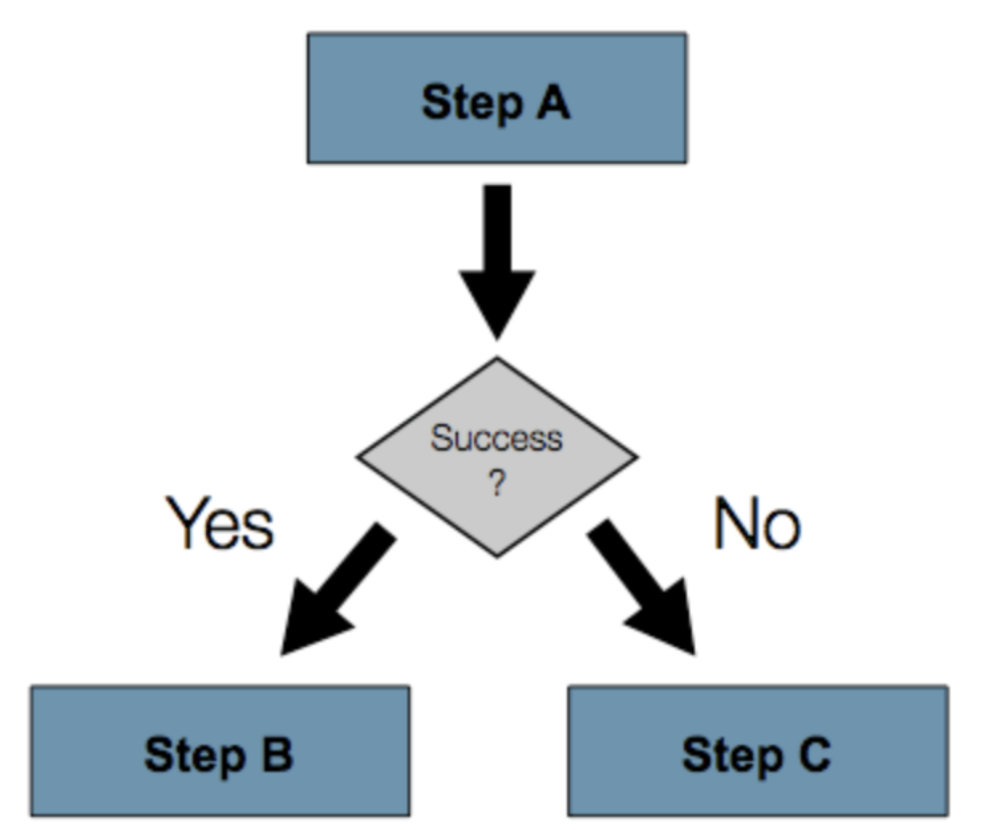
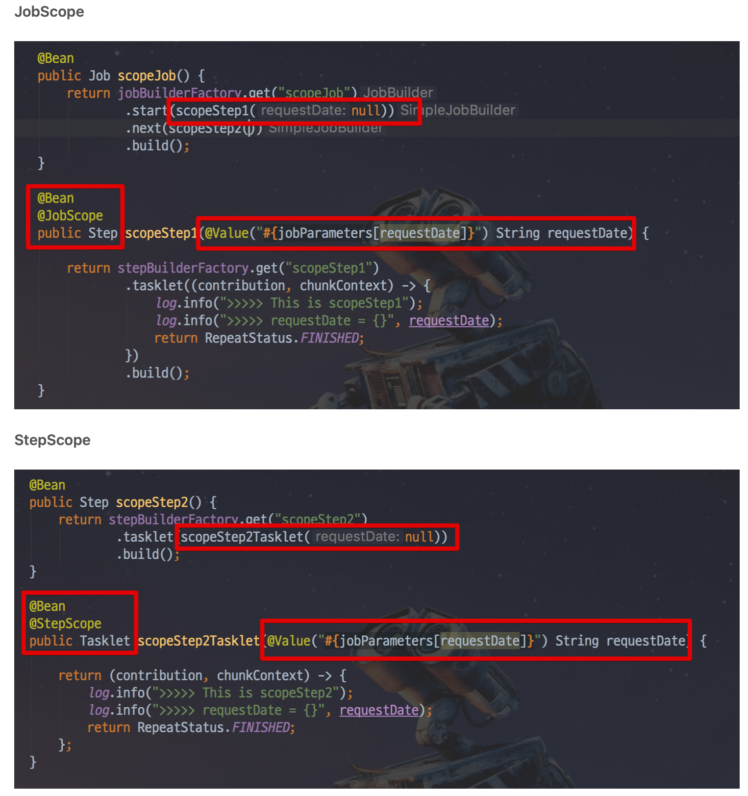

# Spring Batch

```
# BatchApplication.java

package com.laonstory.poc_be_batch;

import org.springframework.batch.core.configuration.annotation.EnableBatchProcessing;
import org.springframework.boot.SpringApplication;
import org.springframework.boot.autoconfigure.SpringBootApplication;

@EnableBatchProcessing// 배치 기능 활성화
@SpringBootApplication
public class PocBeBatchApplication {

    public static void main(String[] args) {
        SpringApplication.run(PocBeBatchApplication.class, args);
    }

}

```
@EnableBatchProcessing : 이 어노테이션을 선언하면, Spring Batch의 여러 기능들을 사용할 수 있게 됩니다. 
선언하지 않으시면 Spring Batch 기능을 사용할 수 없기 때문에 필수로 선언하셔야만 합니다.

설정이 끝나셨으면 패키지 아래에 job 패키지를 생성하고, SimpleJobConfiguration.java 파일을 생성합니다.
___
```
#SimpleJobConfiguration

@Slf4j // log 사용을 위한 lombok 어노테이션
@RequiredArgsConstructor // 생성자 DI를 위한 lombok 어노테이션
@Configuration
public class SimpleJobConfiguration {
    private final JobBuilderFactory jobBuilderFactory; // 생성자 DI 받음
    private final StepBuilderFactory stepBuilderFactory; // 생성자 DI 받음

    @Bean
    public Job simpleJob() {
        return jobBuilderFactory.get("simpleJob")
                .start(simpleStep1())
                .build();
    }

    @Bean
    public Step simpleStep1() {
        return stepBuilderFactory.get("simpleStep1")
                .tasklet((contribution, chunkContext) -> {
                    log.info(">>>>> This is Step1");
                    return RepeatStatus.FINISHED;
                })
                .build();
    }
}
```
@Configuration
Spring Batch의 모든 Job은 @Configuration으로 등록해서 사용합니다.
jobBuilderFactory.get("simpleJob")
simpleJob 이란 이름의 Batch Job을 생성합니다.
job의 이름은 별도로 지정하지 않고, 이렇게 Builder를 통해 지정합니다.
stepBuilderFactory.get("simpleStep1")
simpleStep1 이란 이름의 Batch Step을 생성합니다.
jobBuilderFactory.get("simpleJob")와 마찬가지로 Builder를 통해 이름을 지정합니다.
.tasklet((contribution, chunkContext))
Step 안에서 수행될 기능들을 명시합니다.
Tasklet은 Step안에서 단일로 수행될 커스텀한 기능들을 선언할때 사용합니다.
여기서는 Batch가 수행되면 log.info(">>>>> This is Step1") 가 출력되도록 합니다.
___

## BATHC_JOB INSTANCE 테이블
- BATCH_JOB_INSTANCE 테이블은 Job Parameter에 따라 생성되는 테이블입니다. 
이 Job Parameter가 생소할텐데요. 
간단하게 말씀드리면, Spring Batch가 실행될때 외부에서 받을 수 있는 파라미터입니다.

- 예를 들어, 특정 날짜를 Job Parameter로 넘기면 Spring Batch에서는 해당 날짜 데이터로 조회/가공/입력 등의 작업을 할 수 있습니다.

- 같은 Batch Job 이라도 Job Parameter가 다르면 Batch_JOB_INSTANCE에는 기록되며, Job Parameter가 같다면 기록되지 않습니다.
___
# BATCH_JOB_EXECUTION 테이블
- JOB_EXECUTION와 JOB_INSTANCE는 부모-자식 관계입니다. 
JOB_EXECUTION은 자신의 부모 JOB_INSTACNE가 성공/실패했던 모든 내역을 갖고 있습니다. 

- Job Parameter requestDate=20180807로 생성된 BATCH_JOB_INSTACNE (id=4) 가 2번 실행되었고, 첫번째는 실패, 두번째는 성공했다는 것을 알 수 있습니다.

여기서 재밌는 것은 동일한 Job Parameter로 2번 실행했는데 같은 파라미터로 실행되었다는 에러가 발생하지 않았다는 점입니다. 
Spring Batch는 동일한 Job Parameter로 성공한 기록이 있을때만 재수행이 안된다는 것을 알 수 있습니다. 
___
# BATCH_JOB_EXECUTION_PARAM 테이블

- BATCH_JOB_EXECUTION 테이블이 생성될 당시에 입력 받은 Job Parameter를 담고 있습니다.
  
___
### next()

```
@Slf4j
@Configuration
@RequiredArgsConstructor
public class StepNextJobConfiguration {

    private final JobBuilderFactory jobBuilderFactory;
    private final StepBuilderFactory stepBuilderFactory;

    @Bean
    public Job stepNextJob() {
        return jobBuilderFactory.get("stepNextJob")
                .start(step1())
                .next(step2())
                .next(step3())
                .build();
    }

    @Bean
    public Step step1() {
        return stepBuilderFactory.get("step1")
                .tasklet((contribution, chunkContext) -> {
                    log.info(">>>>> This is Step1");
                    return RepeatStatus.FINISHED;
                })
                .build();
    }

    @Bean
    public Step step2() {
        return stepBuilderFactory.get("step2")
                .tasklet((contribution, chunkContext) -> {
                    log.info(">>>>> This is Step2");
                    return RepeatStatus.FINISHED;
                })
                .build();
    }

    @Bean
    public Step step3() {
        return stepBuilderFactory.get("step3")
                .tasklet((contribution, chunkContext) -> {
                    log.info(">>>>> This is Step3");
                    return RepeatStatus.FINISHED;
                })
                .build();
    }
}
```
next()는 순차적으로 Step들 연결시킬때 사용됩니다. 
step1 -> step2 -> stpe3 순으로 하나씩 실행시킬때 next() 는 좋은 방법입니다.
___
***번외***
-  --> 방금 작성한 StepNextConfiguration만 실행시키고 싶지만
아까 작성한 SimpleJob.java도 함께 실행 되었다
해결법 :

 - application.yml에 아래 코드도 추가해준다 
  ```
  spring.batch.job.names: ${job.name:NONE}
  ```
 -  추가된 옵션이 하는 일은 간단합니다. 
Spring Batch가 실행될때, Program arguments로 job.name 값이 넘어오면 해당 값과 일치하는 Job만 실행하겠다는 것입니다. 
여기서 ${job.name:NONE}을 보면 :를 사이에 두고 좌측에 job.name이, 우측에 NONE이 있는데요. 
이 코드의 의미는 job.name이 있으면 job.name값을 할당하고, 없으면 NONE을 할당하겠다는 의미입니다. 
중요한 것은! spring.batch.job.names에 NONE이 할당되면 어떤 배치도 실행하지 않겠다는 의미입니다. 
즉, 혹시라도 값이 없을때 모든 배치가 실행되지 않도록 막는 역할입니다.

___

## 조건별 흐름 제어

- 자 Next()가 순차적으로 Step의 순서를 제어한다는 것을 알게 됐습니다. 
여기서 중요한 것은, 앞의 step에서 오류가 나면 나머지 뒤에 있는 step 들은 실행되지 못한다는 것입니다.

하지만 상황에 따라 정상일때는 Step B로, 오류가 났을때는 Step C로 수행해야할때가 있습니다.


이럴 경우를 대비해 Spring Batch Job에서는 조건별로 Step을 사용할 수 있습니다. 
새로운 클래스 StepNextConditionalJobConfiguration 를 생성해서 살펴보겠습니다.
```
@Slf4j
@Configuration
@RequiredArgsConstructor
public class StepNextConditionalJobConfiguration {

    private final JobBuilderFactory jobBuilderFactory;
    private final StepBuilderFactory stepBuilderFactory;

    @Bean
    public Job stepNextConditionalJob() {
        return jobBuilderFactory.get("stepNextConditionalJob")
                .start(conditionalJobStep1())
                    .on("FAILED") // FAILED 일 경우
                    .to(conditionalJobStep3()) // step3으로 이동한다.
                    .on("*") // step3의 결과 관계 없이 
                    .end() // step3으로 이동하면 Flow가 종료한다.
                .from(conditionalJobStep1()) // step1로부터
                    .on("*") // FAILED 외에 모든 경우
                    .to(conditionalJobStep2()) // step2로 이동한다.
                    .next(conditionalJobStep3()) // step2가 정상 종료되면 step3으로 이동한다.
                    .on("*") // step3의 결과 관계 없이 
                    .end() // step3으로 이동하면 Flow가 종료한다.
                .end() // Job 종료
                .build();
    }

    @Bean
    public Step conditionalJobStep1() {
        return stepBuilderFactory.get("step1")
                .tasklet((contribution, chunkContext) -> {
                    log.info(">>>>> This is stepNextConditionalJob Step1");

                    /**
                        ExitStatus를 FAILED로 지정한다.
                        해당 status를 보고 flow가 진행된다.
                    **/
                    contribution.setExitStatus(ExitStatus.FAILED);

                    return RepeatStatus.FINISHED;
                })
                .build();
    }

    @Bean
    public Step conditionalJobStep2() {
        return stepBuilderFactory.get("conditionalJobStep2")
                .tasklet((contribution, chunkContext) -> {
                    log.info(">>>>> This is stepNextConditionalJob Step2");
                    return RepeatStatus.FINISHED;
                })
                .build();
    }

    @Bean
    public Step conditionalJobStep3() {
        return stepBuilderFactory.get("conditionalJobStep3")
                .tasklet((contribution, chunkContext) -> {
                    log.info(">>>>> This is stepNextConditionalJob Step3");
                    return RepeatStatus.FINISHED;
                })
                .build();
    }
}
```
- .on()
캐치할 ExitStatus 지정일 경우 모든 ExitStatus가 지정된다.
- to()
다음으로 이동할 Step 지정
- from()
일종의 이벤트 리스너 역할
상태값을 보고 일치하는 상태라면 to()에 포함된 step을 호출합니다.
step1의 이벤트 캐치가 FAILED로 되있는 상태에서 추가로 이벤트 캐치하려면 from을 써야만 함
- end()
end는 FlowBuilder를 반환하는 end와 FlowBuilder를 종료하는 end 2개가 있음
  - on("*")뒤에 있는 end는 FlowBuilder를 반환하는 end
  - build() 앞에 있는 end는 FlowBuilder를 종료하는 end
FlowBuilder를 반환하는 end 사용시 계속해서 from을 이어갈 수 있음
___
***번외***
위에서 나온 조건별 흐름 제어를 설명할때 잠깐 언급했지만, BatchStatus와 ExitStatus의 차이를 아는 것이 중요합니다.

BatchStatus는 Job 또는 Step 의 실행 결과를 Spring에서 기록할 때 사용하는 Enum입니다. 
BatchStatus로 사용 되는 값은
__COMPLETED, STARTING, STARTED, STOPPING, STOPPED, FAILED, ABANDONED, UNKNOWN__ 있는데요. 
대부분의 값들은 단어와 같은 뜻으로 해석하여 이해하시면 됩니다.
___

## Decide
- 이번에는 다른 방식의 분기 처리를 알아 보겠습니다. 
위에서 진행했던 방식은 2가지 문제가 있습니다.

  - Step이 담당하는 역할이 2개 이상이 됩니다.
실제 해당 Step이 처리해야할 로직외에도 분기처리를 시키기 위해 ExitStatus 조작이 필요합니다.
  - 다양한 분기 로직 처리의 어려움
ExitStatus를 커스텀하게 고치기 위해선 Listener를 생성하고 Job Flow에 등록하는 등 번거로움이 존재합니다.
- 명확하게 Step들간의 Flow 분기만 담당하면서 다양한 분기처리가 가능한 타입이 있으면 편하겠죠? 
그래서 Spring Batch에서는 Step들의 Flow속에서 분기만 담당하는 타입이 있습니다. 
JobExecutionDecider 라고 하며, 이를 사용한 샘플 코드를 한번 만들어보겠습니다. 
```
@Slf4j
@Configuration
@RequiredArgsConstructor
public class DeciderJobConfiguration {
    private final JobBuilderFactory jobBuilderFactory;
    private final StepBuilderFactory stepBuilderFactory;

    @Bean
    public Job deciderJob() {
        return jobBuilderFactory.get("deciderJob")
                .start(startStep())
                .next(decider()) // 홀수 | 짝수 구분
                .from(decider()) // decider의 상태가
                    .on("ODD") // ODD라면
                    .to(oddStep()) // oddStep로 간다.
                .from(decider()) // decider의 상태가
                    .on("EVEN") // ODD라면
                    .to(evenStep()) // evenStep로 간다.
                .end() // builder 종료
                .build();
    }

    @Bean
    public Step startStep() {
        return stepBuilderFactory.get("startStep")
                .tasklet((contribution, chunkContext) -> {
                    log.info(">>>>> Start!");
                    return RepeatStatus.FINISHED;
                })
                .build();
    }

    @Bean
    public Step evenStep() {
        return stepBuilderFactory.get("evenStep")
                .tasklet((contribution, chunkContext) -> {
                    log.info(">>>>> 짝수입니다.");
                    return RepeatStatus.FINISHED;
                })
                .build();
    }

    @Bean
    public Step oddStep() {
        return stepBuilderFactory.get("oddStep")
                .tasklet((contribution, chunkContext) -> {
                    log.info(">>>>> 홀수입니다.");
                    return RepeatStatus.FINISHED;
                })
                .build();
    }

    @Bean
    public JobExecutionDecider decider() {
        return new OddDecider();
    }

    public static class OddDecider implements JobExecutionDecider {

        @Override
        public FlowExecutionStatus decide(JobExecution jobExecution, StepExecution stepExecution) {
            Random rand = new Random();

            int randomNumber = rand.nextInt(50) + 1;
            log.info("랜덤숫자: {}", randomNumber);

            if(randomNumber % 2 == 0) {
                return new FlowExecutionStatus("EVEN");
            } else {
                return new FlowExecutionStatus("ODD");
            }
        }
    }
}
```
분기 로직에 대한 모든 일은 OddDecider가 전담하고 있습니다. 
아무리 복잡한 분기로직이 필요하더라도 Step과는 명확히 역할과 책임이 분리된채 진행할 수 있게 되었습니다.

___

## JobParameter & Scope
- Job Parameter를 사용하기 위해선 항상 Spring Batch 전용 Scope를 선언해야만 하는데요. 
크게 __@StepScope 와 @JobScope__ 2가지가 있습니다. 
사용법은 아래와 같이 SpEL로 선언해서 사용하시면 됩니다
```
@Value("#{jobParameters[파라미터명]}")
```


__@JobScope는 Step__ 선언문에서 사용 가능하고, __@StepScope는 Tasklet이나 ItemReader, ItemWriter, ItemProcessor에서 사용할 수 있습니다.__

현재 Job Parameter의 타입으로 사용할 수 있는 것은 Double, Long, Date, String 이 있습니다. 
아쉽지만 LocalDate와 LocalDateTime이 없어 String 으로 받아 타입변환을 해서 사용해야만 합니다.

