# OS 와 일반적인 지식


## [1] 운영 체제란?
운영체제(Operating System)는 사용자가 컴퓨터를 사용하기 위해 필요한 소프트웨어이다. 우리가 일반적으로 컴퓨터를 사용하면서 실행한 모든 프로그램들은 운영체제에서 관리하고 제어한다.

대표적인 운영체제는 Windows, Linux, Mac OSX, iOS 등이 있다.
### (1) 운영체제의 목적
운영체제를 사용하는 가장 주된 목적은 __컴퓨터의 하드웨어를 관리__ 하는 것이다. 컴퓨터에는 수 많은 하드웨어가 존재한다. CPU, 메모리, 디스크, 키보드, 마우스, 모니터, 네트워크 등이 있으며 이를 잘 관리해주어야 컴퓨터를 효율적으로 사용할 수 있다. 운영체제의 성능이 좋을수록 컴퓨터의 성능 역시 좋아진다고 할 수 있다.

운영체제는 __사용자에게 편의를 제공__ 하는 목적도 가지고 있다. 운영체제가 없다면 위에서 말한 하드웨어에 관한 모든 관리를 사용자가 해야한다는 점과 같이 컴퓨터를 사용하는데 매우 불편함을 겪을 것이다. 하지만 현재 많은 발전을 거쳐온 운영체제가 설치된 컴퓨터는 사용하기에 매우 편리하다는 것을 느낄 수 있다. 대표적으로 스마트폰이 있다. 스마트폰 역시 컴퓨터의 일종이고 운영체제가 설치되어 있다. 그리고 스마트폰은 남녀노소 누구나 할 것 없이 사용법을 빠르게 익힐 수 있다.

정리하면 운영체제는 컴퓨터의 성능을 높이고(__performance__), 사용자에게 편의성 제공(__Convenience__)을 목적으로 하는 __컴퓨터 하드웨어 관리하는 프로그램__ 이다.
</br>

### (2) 부팅(Booting)
컴퓨터의 구조를 단순화하면 아래의 그림과 같다.

Processor는 일반적으로 CPU를 말한다. main memory를 보면 ROM과 RAM으로 나누어져 있다.

- **ROM: 비휘발성** 으로 메모리에서 극히 일부를 차지한다.(수 KB)
- **RAM: 휘발성** 으로 메모리의 대부분을 차지하며 실제 프로그램이 할당되는 곳이다.(수 MB ~ 수 GB)

ROM은 하드디스크와 같이 비휘발성으로 전원이 꺼져도 그 안의 내용이 계속 유지된다. RAM은 휘발성이므로 전원이 꺼지면 메모리안의 모든 내용이 지워진다.

컴퓨터의 전원이 켜지면 프로세서(CPU)에서 ROM에 있는 내용을 읽는다. ROM안에는 POST(Power-On Self-Test), 부트 로더(boot loader)가 저장되어 있다. POST는 전원이 켜지면 가장 처음에 실행되는 프로그램으로 현재 컴퓨터의 상태를 검사한다. POST 작업이 끝나면 부트 로더가 실행된다. 부트 로더는 하드디스크에 저장되어 있는 운영체제를 찾아서 메인 메모리(RAM)에 가지고 온다. 이러한 부트 로더의 과정을 부팅이라고 한다.

위 그림은 부트 로더가 진행하는 모습이다. 위와 같은 상태가 되면 운영체제가 수행할 준비를 마친 것이다. 운영체제가 종료하는 시점은 컴퓨터의 전원이 꺼지는 시점이다.

운영체제는 크게 __커널(kernel)__ 과 __명령어 해석기(Command interpreter, shell)__ 로 나뉜다.

</br>

### (3) 운영 체제의 위치

__사용자 프로그램(Application)__ 은 특정 운영체제에 맞춰서 만든다. 그러므로 한 애플리케이션은 서로 다른 운영체제에서 수행할 수 없다. (하드웨어가 같은 것은 전혀 상관이 없다.) 예를 들면 Windows에서 수행하는 프로그램을 그대로 Linux에 옮기면 수행되지 않는다.

애플리케이션은 위의 그림과 같이 운영체제 위에서 수행한다. 즉, 하드웨어 자원을 직접적으로 사용하지 않고 운영체제가 제공하는 자원만을 사용할 수 있다.

운영체제는 실제 세상의 정부(Goverment)와 유사하다. 정부가 하는 일은 다음과 같다.

- 국토, 인력, 예산과같은 자원이 존재하며 이를 효율적으로 사용해야한다.
- 효율적인 자원 관리를 위해 행정부, 국토부, 교육부, 국방부 등 부서로 나눠 관리한다.
- 각 부서들은 국민들에게 자원을 요청받고 적절히 배분한다.

운영체제가 하는 일은 다음과 같다.

- 프로세스, 메모리, 하드디스크 등 하드웨어 자원이 존재하고, 이를 효율적으로 사용해야한다.
- 자원 관리를 위해 프로세스 관리, 메모리 관리, 디스크 관리, 네트워크, 보안 등 기능이 나눠져 있다.
- 애플리케이션들의 요청에 따라 각 기능들이 수행하여 적절히 자원을 분배한다.

</br>
</br>
</br>

## 🔥[2] 리눅스 터미널 명령어 모음
 '터미널'은 사전적 의미로 종단, 끝을 의미한다. 
이 의미를 컴퓨터로 빗대어 보면 데이터를 송수신 하는 목적지나 출발점의 의미가 될 수 있다.
따라서 리눅스에서 사용하는 '터미널'은 명령을 내려 컴퓨터를 제어하는 곳이라고 생각하면 된다.


 
터미널 사용방법
 기초 터미널 명령어
grep, awk, sed, lsof, curl, wget, tail, head, less, find, ssh, kill
<hr>

 
__passwd [옵션] [계정]__
- 사용자 계정의 패스워드를 등록하거나 변경하는 경우 이용하는 명령어이다.
- 슈퍼 유저는 다른 유저의 패스워드도 변경 가능하다.

옵션
-S : 계정의 상태를 표시한다.(PS : 정상, NP : 패스워드가 없음, LK : Lock상태 혹은 NP 상태)
-d : 계정의 패스워드를 삭제한다. 패스워드 없이 로그인이 가능해진다.
-l : 계정을 Lock 상태로 변경한다.
-u : 계정의 Lock 상태를 해제한다.


<hr>

__ls [옵션] [파일명]__
- 현재 디렉토리 내의 파일과 디렉토리 정보를 출력한다.
- 윈도우 cmd 창의 'dir'과 같은 명령이다.
- [옵션]에는 -를 붙여 아래와 같은 옵션을 부여 할 수 있으며 두 개 이상의 옵션도 가능하다.
- [파일명]에는 파일명이나 디렉토리명을 적을 수 있다

옵션
-a : 디렉토리에 있는 모든 파일들(.으로 시작하는 파일 포함)을 출력한다.
-i : 파일의 아이노드(inode, 색인번호) 번호를 출력한다. 
-h : 파일 크기를 사람이 보기 쉬운 단위로 출력한다.(k : 킬로바이트, m : 메가바이트)
-l : 파일의 다양한 정보(상세정보)를 함께 출력한다.(소유자, 권한, 크기, 날짜)
-m : 파일을 쉼표로 구분하여 가로로 출력한다.
-s : kb 단위의 파일 크기를 출력한다.
-t : 최근 생성된 시간 순으로 파일을 출력한다.
-F : 파일 종류 별로 파일 끝에 특수 문자 표시.(일반파일 : 표시없음, 실행파일 : *, 디렉토리 : /, 심볼링크 : @, FIFO파일 : |, 소켓파일 : =)
-R : 지정한 디렉토리 아래에 있는 하위 디렉토리와 파일들을 포함하여 출력한다.
-S : 파일 크키가 큰 순서대로 출력한다.
--help : 도움말을 출력한다.


<hr>

__cd [디렉토리명]__
- Change Directory.
- 디렉토리를 이동할 때 사용한다.

옵션
cd [엔터], cd ~, cd ~/, cd $HOME : 사용자의 홈 디렉토리로 이동한다.
cd . : 현재 디렉토리로 이동한다.
cd / : 최상위 디렉토리로 이동한다.
cd $변수명 : 변수에 지정된 경로로 이동한다.
cd ~계정명 : 입력한 사용자의 홈디렉토리로 이동한다.
cd - : 이전 경로로 이동한다.

<hr>

__cp [옵션] [원본파일명] [대상파일명/디렉토리명]__
- 윈도우 cmd의 'copy' 명령과 같다.
- 하나 이상의 [원본파일]을 [대상파일]이나 [디렉토리]로 복사한다.
- [원본파일명]에는 하나 이상의 파일을 지정할 수 있다.

옵션
-i : 파일 복사 시, 동일한 파일명이 있을 경우 사용자에게 덮어 쓸 것인지 물어본다.
-f : 동일한 파일명이 있을 경우에도 강제로 지우고 복사한다.
-p : 원본 파일 소유주, 그룹, 권한, 시간 정보들이 그대로 보존되어 복사한다.
-r : [원본파일명]이 경로일 경우, 그 경로에 있는 모든 하위 디렉토리들을 포함하여 모두 복사한다. 일반 파일일 경우는 그냥 복사한다.
-u : 복사 대상이 이미 존재하며 파일의 날짜가 같거나 더 최신이면 복사하지 않는다.


<hr>

__mkdir [옵션] [파일명]__
- 새로운 디렉토리를 생성한다.
- 읽기 권한(Write Permission)이 허용되어야만 디렉토리를 생성할 수 있다.

옵션
-m : 디렉토리의 권한을 지정한다.(기본값 : 755) ex) mkdir -m 700 dir -> dir 디렉토리의 권한을 700으로 설정하여 생성한다.
-p : 생성하려는 디렉토리의 상위 디렉토리가 없는 경우 상위 디렉토리까지 같이 만든다.


<hr>

__rmdir [옵션] [파일명]__
- 빈 디렉토리를 제거한다.
- 읽기 권한(Write Permission)이 허용되어야만 디렉토리를 삭제할 수 있다.

옵션
-p : 상위 경로도 삭제한다.


<hr>

__mv [옵션] [원본파일] [이동위치]__
- 파일의 이름이나 위치를 변경할 때 사용한다.

옵션
-f : 이동할 위치에 파일 이름이 겹치면 강제로 이동한다.
-i : 이동할 위치에 파일 이름이 겹치면 사용자에게 물어본다.
-u : 원본파일이 복사본 파일보다 최신이거나 복사본에 파일에 원본 파일 및 디렉토리가 없을 경우 이동하는 옵션 입니다
-v : 진행 작업을 표시해는 옵션입니다.
-b : 이동위치에 파일이 이미 있는경우 백업파일을 생성하는 옵션 입니다.

<hr>

__find [옵션] [디렉토리] [표현식]__
- 파일을 이름, 수정 날짜, 소유주, 허가 등을 기준으로 검색하게 해준다.

**옵션**
-empty : 비어있는 파일을 찾는다.
-user [사용자명] : 지정한 사용자가 소유하고 있는 파일을 찾는다.
-group [그룹명] : 지정한 그룹이 소유하고 있는 파일을 찾는다.
-nouser : 소유주가 없는 파일을 찾는다(사용자 계정을 삭제했을 경우 사용자가 생성한 파일들을 남기는 경우가 있다).
-nogroup : 소유그룹이 없는 파일을 검색한다.

-name [파일명] : 지정한 패턴을 갖는 파일을 찾는다(파일명 또는 확장명을 기준으로 검색한다).
-newer [파일명] : [파일명]보다 최근에 생성된 파일을 찾는다.
-anewer [파일명] : [파일명]보다 최근에 읽기(접근)가 수행된 파일을 찾는다.
-cnewer [파일명] : [파일명]보다 최근에 상태가 변경(수정)된 파일을 찾는다.
-perm [권한] : 권한과 일치하는 파일을 찾는다.
-type [파일타입] : [파일타입]에 맞는 파일을 찾는다. [파일타입]은 아래와 같다.
d : 디렉토리(Directory)
c : 캐릭터 특수 파일(Character Device)
f : 일반파일(File)
b : 블록 특수 파일(Block Device)
l : 심볼릭 링크(Link)
p : 파이프(Pipe)
s : 소켓(Socket)
-atime [+n/-n/n] : 최근 n일 이전에 access된 파일을 찾는다(Access Time).
+n : n일 전부터 접근하지 않은 파일
-n : n일 동안 접근한 파일
n : n일 전에 접근한 파일
-ctime [+n/-n/n] : 파일의 퍼미션(권한)을 마지막으로 변경한 파일을 찾는다(Changed Time).
+n : n일 전부터 퍼미션을 변경하지 않은 파일
-n : n일 동안 퍼미션을 변경한 파일
n : n일 전에 퍼미션을 변경한 파일
-mtime [+n/-n/n] : data를 마지막으로 수정한 파일을 찾는다.(Modified Time).
+n : n일 전부터 수정하지 않은 파일
-n : n일 동안 수정한 파일
n : n일 전에 수정한 파일
-size : 저장한 파일 크기로 파일을 찾는다.
-depth : 별도로 지정할 필요가 없으며 서브 디렉토리까지 찾는 옵션이다.
-mount : 다른 파일 시스템의 디렉토리는 검색하지 않는다.
-prune : 서브 디렉토리로 내려가지 않고 현재 디렉토리에서만 검색한다.
-samefile [파일명] : 링크된 파일을 찾는다(하드 링크).
-lname "*이름" : 링크된 파일을 찾는다(심볼릭 링크).
-inum [inode번호] : inode 번호로 파일을 찾는다.

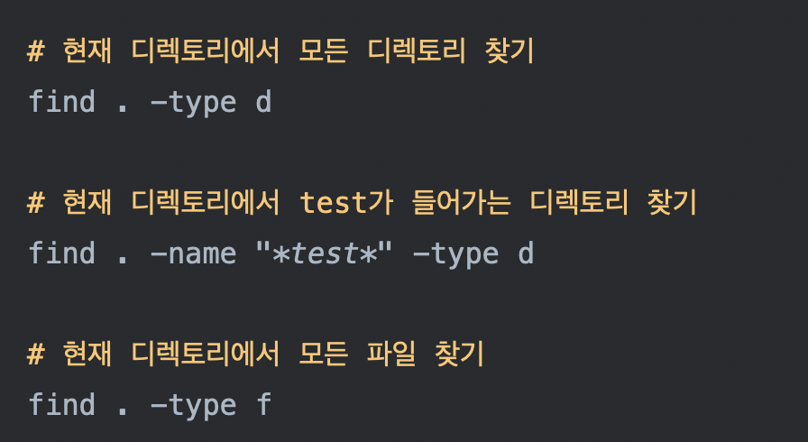
<hr>


__head [-count] [파일이름], tail [-count] [파일이름]__
- head [-count] [파일이름] : 첫 번째 라인부터 number 라인까지 출력한다. 설정하지 않을 경우 10번째 라인까지 출력한다.
- tail [-count] [파일이름] : 마지막 라인부터 number 라인까지 출력한다. 설정하지 않을 경우 10번째 라인까지 출력한다.
- tail -f [파일이름] : 실시간으로 파일에 추가되는 내용을 확인한다. 보통 log파일을 관찰할 때 자주 사용한다.

<hr>

__cat [옵션] [파일이름]__
- 파일의 내용을 볼 수 있는 명령어이다.
- cat > [파일이름] 형태로 명령어를 작성했을 경우, 파일 생성 및 데이터 입력도 가능하다.
* 파일 저장 : Ctrl + d, 파일 종료 : Ctrl + z
- cat [파일명] | more : 엔터키를 입력할 때마다 한 줄씩 내려가면서 확인이 가능하다.
- cat [파일명] | less : 화살표 위, 아래키로 페이지 올림, 내림이 가능하다.
* more과 less 상태에서 q를 누르면 종료가 된다.

옵션
-n : 파일을 출력할 때, 라인에 번호를 붙여 출력한다.
-b : 공백 외의 글자가 있는 라인에 번호를 붙여 출력한다.


<hr>

__gzip [옵션] [파일명]__
- 리눅스에 설치되어 있는 기본 압축 프로그램이다.
* gzip 명령어를 찾을 수 없다고 나온다면, 'apt-get install gzip' 으로 설치하면 된다.
- 리눅스에서 사용하는 압축 프로그램이다.
- 속도나 압축률 면에서 상당히 좋은 프로그램이다.
- 파일을 압축할 경우 사용하는 명령어이다.
- 압축된 파일은 .gz라는 확장자를 갖는다.
- 성공적으로 압축이 수행되었을 경우, 압축을 수행한 원본 파일은 삭제된다.


옵션
-d : 압축을 해제한다(Decompress).
-f : 압축을 하거나 해제할 때, 같은 이름의 파일이 존재할 경우 덮어쓰기 한다.
-l : 압축 파일의 정보를 보여준다.
-r : 압축 파일의 디렉토리까지 압축을 수행한다.


<hr>

__tar [옵션] [파일명]__
- 여러 파일을 하나로 묶을 경우 사용되는 명령어이다.
- 확장자는 .tar 이다.

옵션
-c : 파일을 tar로 묶어 생성한다.
-x : 기존의 tar파일의 압축을 해제할 경우 사용한다.
-v : 압축할 때나 압축을 해제할 때, 과정을 화면으로 출력한다.
-f : 파일 이름을 지정한다.
-C : 파일 경로를 지정한다.
-z : gzip으로 압축하거나 해제한다.


<hr>

__kill [시그널 번호/시그널 이름] [프로세스]__
- 특정 프로세스에 특정한 Signal을 보내는 명령어이다.
- 보통 실행중인 프로세스를 종료시키고자 할 때 사용한다.
- 가끔 중지시킬 수 없는 프로세스가 발생하는 경우가 있는데, 이때 강제 종료 시키기 위해 kill 명령어를 사용한다.

옵션
-i : 프로세스 종료 전 사용자에게 물어본다.
-v : 진행 현황을 확인 할 수 있다.
-w : 지정한 프로세스들이 모두 종료 될 때까지 종료 시도를 한다.

<hr>

__su [-] [사용자ID]__
- 다른 사용자 계정으로 서브 쉘을 생성하는 명령어이다.
- 현재 계정을 로그아웃 하지 않고 다른 계정으로 전환 할 때 사용한다.
- su는 'Super User'가 아니며 'Substitute User'를 의미한다.
- su만 입력했을 경우, su root와 같다.

옵션
-c : 쉘을 실행하지 않고 주어진 명령만 수행한다.
-, -l, -login : 지정한 사용자의 환경변수를 적용해 로그인한다.
-s : 지정된 쉘로 로그인한다.

<hr>

__shutdown [옵션] 시간 [메시지]__
- halt, init과 함께 시스템을 종료하는 명령어 중 하나이다.
- [메시지]를 통해 현재 접속 중인 모든 사용자에게 시스템이 종료된다는 메시지를 보낼 수 있다.

옵션
-r : 시스템 종료 후 재 부팅한다.
-h : shutdown이 완료된 후 시스템을 종료한다.
-c : 진행 중인 shutdown 명령어를 취소한다.
-k : 경고 메시지만 출력하고 실제로는 shutdown 하지 않는다('Just Kidding'의 의미).


[basic command description](https://www.thomas-krenn.com/en/wiki/Cmd_commands_under_Windows)
</br>
</br>
</br>
## 🔥[3] 운영체제의 구조 및 동작원리
### (1). 운영체제의 구조
예전 DOS 시절 운영체제에서는 자원의 효율성이 굉장히 떨어졌었는데요.


예전에는 메모리에 여러 가지  작업들이 올라가지 못하였습니다. 
예를 들어 수행해야 할 작업-1과 작업-2가 있다고 생각해봅시다.

작업-1은 CPU를 사용한 후 I/O 장치를 사용하고,
작업-2는 CPU만을 사용하는 작업이라고 예를 들어 보겠습니다.

작업-1이 먼저 수행이 되면서 CPU를 사용하고 I/O를 사용하는 동안 CPU는 놀고 있음에도 불구하고 작업-2는 메모리에 올라가있지 않기 때문에 작업-1의 전체적인 작업이 끝나기 전까지 작업을 시작하지 못하였습니다. (  I/O 장치를 사용할 때도 마찬가지입니다. )
이러한  유연하지 않은 구조는 컴퓨터 전체의 효율성을 떨어뜨렸습니다. 
그래서 생각해낸 것이 CPU와 I/O를 바쁘게 하자!이고 그것이 바로 Multiprogramming입니다.

</br>
- ####  {1-1}. Multiprogramming

  - Multiprogramming은 여러 작업들이 동시에 메모리에 올라가게 됩니다.
그리고 위와 같이 작업-1이 수행되는 동안 CPU가 대기 상태로 들어가고 I/O를 수행할 때 작업-2는 
대기 상태인 CPU를 사용하게 함으로써 유연성을 제공하여 효율성을 높이는 방법입니다. 반대로 I/O가 대기 상태일 때는
I/O가 필요한 작업에게 그 자원을 할당해줍니다.

</br>
- ####  {1-2}. Multitasking

  - Multiprogramming에도 단점이 있었는데요! 그것은 바로 작업들마다 자원의 사용에 시간 차이가 생기기 때문입니다.
예를 들어보겠습니다. 만약에 작업-1이 CPU를 사용하고 I/O를 사용하게 되면 CPU는 작업-2에게 할당되어 작업-2는 
CPU를 사용하게 됩니다. 하지만 만약 작업-1의 I/O 사용시간이 길어지면 작업-2가 CPU를 이용한 작업을 끝내도 I/O 작업으로 
들어가지 못하고 계속 대기하게 됩니다. 그럼 이때도 역시 위와 마찬가지의 CPU 자원의 낭비가 일어나게 되는 것입니다. 
이러한 낭비는 효율성을 떨어뜨리는 결과를 가져옵니다.

그래서 등장한 것이 Multitasking입니다.
Multitasking은 Multiprogramming의 논리의 확장이라고 보면 됩니다.
각각의 작업에 시간을 부여하고 CPU를 작업하다가 그 시간이 지나가면 다른 작업에게 CPU 자원을 할당해줍니다.
그러므로 위와 같은 시간 지연으로 인한 낭비를 줄일 수 있으며 주어 진 시간은 굉장히 짧아서 빈번한 switching이 발생하게 됩니다.

 1. 만약 여러 작업들이 메모리에 올라갈 준비가 되어있다면 Job Scheduling을 통해 메모리에 올리고
 2. 메모리에 올라와 있는 여러 작업들이 실행될 준비가 되어있다면 CPU Scheduling을 통해 조정합니다
 3. 그리고 작업의 process가 메모리에 맞지 않는다면 swapping out되어 다른 작업이 swapping in 됩니다.

</br>
### (2).  운영체제의 동작원리

운영체제는 이전 포스팅에서 설명하였듯이 interrupt(event)-driven 방식입니다.
-  1. H/W interrupts
-  2. S/W interrupts - trap( or exception)
      - S/W errors : 흔히 프로그래밍하면서 나올 수 있는 error ( divide by zero, stack overflows...)
      - 운영체제 services 들에 대한 요청 -> System Call 

운영체제는 한 작업의 error로 인해 자원을 계속해서 점유하는 일과같이 효율성과 컴퓨터의 동작을 저해하는 행위를
보호해야 할 수단을 필요로 합니다. 그러한 방법에는 크게
 Dual-Mode Execution, Timer 
두 가지가 존재합니다. 

</br>
#### {1}. Dual-Mode Execution

조건은 H/W의 지원이 요구됩니다. 시스템을 보다 안전하게 하는 것이 목표이죠.
이 방법은 Mode-Bit라는 것을 필요로 하는데, Mode에는 Kernel Mode와 User Mode 두 가지가 있습니다.

프로그램이 메모리에 올라가서 작업들을 수행할 때 명령어들을 하나씩 읽어와 수행하게 되는데요
하지만 사용자가 Kernel 상의 작업, 즉 컴퓨터의 Core에 해당하는 작업들을 직접 건드려 명령하고 수행을 하게 된다면
자칫 잘못하다는 시스템 전체에 큰 악영향을 끼칠 수 있게 됩니다. 그것을 방지하고자 이러한 방법을 도입하게 되었는데요

각각 명령어에 Mode-bit를 심어 해당 명령어의 Mode-bit와 현재 시스템 상의 Mode-bit가 
같을 시에만 해당 명령어를 수행하게끔 하는 것입니다.  
예를 들어보겠습니다.
```
printf("출력");
```

위의 코드는 C에서 콘솔 창에 특정 문구를 출력하는 코드입니다.
모니터를 통해 콘솔 창에 출력하는 행위는 I/O를 이용하여 출력을 하게 됩니다.
이러한 I/O 작업은 OS만 접근이 가능해야 하는데요.
위의 함수의 내용을 열어보면 여러 가지 명령어들이 있고 그중에 INT 80이라는 명령어를 찾아볼 수 있습니다.
위의 명령어는 특수 명령어로서 현재 Mode를 바꿔주는 역할을 합니다. 
즉 이전까지 수행되던 명령어들은 User-Mode였다면 화면에 출력하기 위해서는 Kernel-Mode가 필요하므로 
위의 명령어를 통해 Mode를 Kernel-Mode로 변환 후 I/O 장치에 출력을 하는 명령을 OS가 내리게 됩니다.
그리고 함수가 끝날 때는 다시 User-Mode로 돌아게 되겠죠!

이러한 bit를 바꾸는 행위를 System-Call이라고 합니다. 굉장히 중요한 개념이죠!
이렇게 Kernel에서 수행되어야 하는 몇 가지 중요한 명령어들이 있습니다. 위에서 언급한 운영체제의 Services들이죠
그 예를 들어보자면
  1. Turn off interrupts 
  2. Access I/O devices 
  3. Set value of timer
등이 있고 이외에도 여러 가지 명령어들이 있습니다.

System Call이 일어나게 되면 앞선 포스팅에서 Interrupt Vector Table과 Interrupt Vector Routine의 동작원리와 같이
해당 System Call에 대한 번호를 Table에서 찾아 Routine을 실행하게 됩니다. 이러한 작업은 운영체제에서 일어나게 되죠.
밑의 사진은 System Call의 이해를 조금 더 도울 수 있을 것 같습니다.


</br>
#### {2}. Timer

Timer는 간단하게 설명해드리겠습니다. 이름에서 와 닿듯이 Timer는 infinite loop 나 자원의 독점을 막습니다.
Timer는 특정 시간이 지나면 Interrupt를 발생시키고 운영체제는 그 시간을 감소시키면서 Interrupt를 기다립니다.
운영체제는 Timer가 끝난 작업을 종료시키고 또한 실행되기 전 Scheduling 작업 전에 Timer를 작동시킵니다.
확실히 Dual-Mode Execution보다는 쉽게 와 닿으실 거라고 기대해봅니다
이제 전체적으로 정리를 해보고 중요한 것은 조금 더 알아보는 시간을 갖도록 하겠습니다!

운영체제는 무슨 일을 하는가!
  1. Process management
  2. Memory management
  3. Storage management
  4. Protection and Security

Program vs Process
 Program은 현재 Memory에 올라와 있는 Process들 중 실행 중인 Process입니다.
  Process는 CPU time, Memory, files, I/O 등 여러 자원을 필요로 합니다.
  
운영체제의 Process Management 
  - Process와 Thread의 CPU 위의 작업들을 Scheduling.
 - User와 System의 Process를 생성하거나 삭제.
  - Process의 동기화 작업이나 Communication 작업의 mechanisms을 제공. 

운영체제의 Memory Management
  - 명령어들이 순서에 맞게 실행되도록 관리.
  - 모든 Data들이 실행되기 전 Memory에 올라갈 수 있도록 관리.
  - Memory 공간을 할당하고 회수.
  - 언제 어떤 것이 Memory에 올라갈지 결정.

운영체제의 Services
  사용자에게 도움을 주는 Services
- UI 제공
- I/O 작업 수행
- Error Detection
- 파일 시스템 관리
시스템의 운영의 효율성을 제공하는 Services
- 자원(Resources) 할당
- Accounting
- Protection & Security

System Call
직접적으로 사용하지 않으며 High-Level Language로 작성된 API가 제공된다.
각 System Call에 대한 번호와 루틴은 Table의 형태로 저장된다.
루틴이 끝난 뒤 System Call의 상태와 결괏값을 반환한다.

-직접 System Call을 만들어보는 방법-
1. System Call 함수 정의
2. System Call 번호 할당
3. System Call 함수 Table에 등록
4. Kernel Rebuild & Test

System Call의 종류
- Process Control
- File Manipulation
- Device Manipulation
-Information Maintenance
- Communication
-Protection
</br>
</br>
</br>

## 🔥[4] 프로세스 관리

### (1). 프로세스
프로세스는 메인 메모리에 할당되어 **실행중인 상태**인 프로그램을 말한다. 프로그램은 일반적으로 하드디스크(보조기억장치)에 저장되어 아무 일도 하지 않는 상태이다. 프로세스는 실행하면서 stack pointer, data, text, register 등이 끊임없이 변한다. 프로세스는 job, task 등으로 불리기도 한다.

</br>
#### {1-1}. 프로세스 상태
- New : 프로그램이 메인 메모리에 할당된다.
- Ready : 할당된 프로그램이 초기화와 같은 작업을 통해 실행되기 위한 모든 준비를 마친다.
- Running : CPU가 해당 프로세스를 실행한다.
- Waiting : 프로세스가 끝나지 않은 시점에서 I/O로 인해 CPU를 사용하지 않고 다른 작업을 한다. (해당 작업이 끝나면 다시 CPU에 의해 실행되기 위해 ready 상태로 돌아가야 한다.)
- Terminated : 프로세스가 완전히 종료된다.

위 그림은 **프로세스 상태 전이도**의 모습이다. new에서부터 프로세스가 어떤 작업에 의해 상태가 변하는지 나타낸다. running에서 ready로 변할 때는 time sharing system에서 해당 프로세스가 CPU시간을 모두 소진하였을 때 인터럽트에 의해 강제로 ready상태로 변하고, CPU는 다른 프로세스를 실행시킨다.

</br>

#### {1-2}. PCB(Process Control Block)

PCB는 프로세스에 대한 모든 정보가 모여있는 곳으로, Task Control Block(TCB) 이라고도 한다. PCB안에는 프로세스의 상태, 프로세스 번호(PID), 해당 프로세스의 program counter(pc), register값, MMU정보, CPU점유 시간 등이 포함되어 있다. PCB는 운영체제 내부의 프로세스를 관리하는 코드 부분에 저장되어 있다.

CPU는 한 프로세스가 종료될 때까지 수행하는 것이 아니라 여러 프로세스를 중간 중간에 바꿔가면서 수행한다. 그러므로 CPU는 수행중인 프로세스를 나갈 때, 이 프로세스의 정보를 어딘가에 저장하고 있어야 다음에 이 프로세스를 수행할 때 이전에 수행한 그 다음부터 이어서 작업할 수 있다. 이러한 정보를 저장하는 곳이 PCB이다.

</br>

#### {1-3}. 프로세스 큐(Queue)
프로세스는 수행하면서 상태가 여러 번 변하는데 이에 따라 서비스를 받아야하는 곳이 다르다. 그리고 프로세스는 일반적으로 여러 개가 한 번에 수행되므로 그에 따른 순서가 필요하다. 이러한 순서를 대기하는 곳을 **큐(queue)**라고 부른다.

- Job Queue : 하드디스크에 있는 프로그램이 실행되기 위해 메인 메모리의 할당 순서를 기다리는 큐이다.
- Ready Queue : CPU 점유 순서를 기다리는 큐이다.
- Device Queue : I/O를 하기 위한 여러 장치가 있는데, 각 장치를 기다리는 큐가 각각 존재한다.
  
위와 같이 여러 큐가 존재하는데, 각 큐 내부에 저장된 실제 데이터는 각 프로세스의 **PCB**가 저장되어 있다. 그리고 이러한 순서를 기다리는 공간이 있다면 이 순서를 정해주는 알고리즘이 있어야 한다. 이러한 알고리즘을 **스케줄링(Scheduling)** 이라 한다.
- Job Queue - Job Scheduler(Long-term scheduler)
- Ready Queue - CPU Scheduler(Short-term scheduler)
- Device Queue - Device Scheduler
  
Job queue의 순서를 정해주는 job scheduler를 long-term scheduler라고도 하는데, 이는 이 스케줄링이 발생하는 시간이 비교적 오래걸리기 때문이다.(대략 초~분) 반면에 ready queue의 스케줄러를 short-term scheduler라고도 하는데, 이는 스케줄링이 발생하는 시간이 매우 짧기 때문이다. CPU scheduling은 말 그대로 프로세스가 CPU를 점유하는 순서를 정해주는데 이는 매우 빠른 시간안에 이루어져야한다. 현대 컴퓨터가 여러 프로그램을 동시에 사용하는 것과 같은 효과를 주는 이유가 이 스케줄링 속도가 매우 빠르게 이루어지기 때문이다.
</br>

### (2). 멀티프로그래밍(Multiprogramming)
멀티프로그래밍은 단일 프로세서(CPU) 환경에서 여러 **개의 프로세스가 동시에 실행**되는 것을 말한다.(실제로 동시에 실행되지는 않음) 여러 프로세스가 실행되려면 이 프로세스들은 모두 메인 메모리에 존재하고 있어야 한다. 멀티프로그래밍에 관한 몇 가지 용어와 개념에 대해 살펴보자.
</br>

#### {2.1}. Degree of multiprogramming
Degree of multiprogramming 는 현재 메모리에 할당되어 있는 프로세스 개수를 말한다.
</br>

#### {2.2}. I/O bound process VS CPU bound process
프로세스는 I/O bound process 와 CPU bound process 로 나뉜다.

- I/O bound process: 해당 프로세스에서 I/O(입출력) 작업이 차지는 비중이 높은 프로세스를 말한다.
- CPU bound process: 해당 프로세스에서 CPU 작업(계산)이 차지는 비중이 높은 프로세스를 말한다.

운영체제, 정확히 말하면 job scheduler 는 I/O bound process와 CPU bound process를 적절히 분배해서 메모리에 할당해주어야 한다.
</br>

#### {2.3}. Medium-term scheduler

Medium-term scheduler는 말그대로 short-term보다는 덜 발생하지만, long-term보다는 자주 발생하는 scheduler이다. 하는 일은 운영체제가 실행하는 동안 주기적으로 메인 메모리에 있는 전체 프로세스를 검사하여 보조기억장치로 옮길 프로세스를 찾아 옮긴다. 옮기는 기준은 여러가지 있겠지만 대표적으로 장기간 사용하지 않는 프로세스가 있다.

이 기준으로 동작하는 것이 **Swapping**이다. 이는 메인 메모리에서 장시간 사용하지 않는 프로세스를 하드디스크(**Swap device** = Backing store, 일반적으로 하드디스크는 File system + Backing store 로 구성되어 있다.)로 옮겨주고(**Swap out**), 나중에 이 프로세스가 다시 사용되려고 하면 하드디스크에서 해당 프로세스를 다시 메인 메모리에 할당해준다.(**Swap in**)

Swap out을 통해 메인 메모리의 공간이 생기므로 이를 더욱 효율적으로 사용할 수 있다. 만약 swap out된 프로세스가 다시 swap in으로 메인 메모리에 할당하려고 할 때 **이전의 공간으로 할당되는 것을 보장하지는 않는다**. 왜냐하면 위에 말했듯이 swap out으로 생긴 메모리 공간은 다른 프로세스가 사용할 수 있기 때문이다.
</br>

#### {2.4}. Context Switching(문맥 전환)
Context switching은 CPU가 한 프로세스에서 다른 프로세스로 옮겨가는 것을 말한다. 즉, 한 프로세스가 실행중인 것을 멈추고 다른 프로세스가 실행되는 것이다.

- Scheduler : 여기서 스케줄러는 CPU Scheduler를 말하며, CPU가 어느 프로세스를 선택할지 정한다.
- Dispatcher : 실제 context switching이 발생하면 CPU의 내부 데이터를 이전 프로세스 데이터에서 새로 시작되는 데이터로 바꿔준다. 다시 말해서 현재 CPU 데이터는 이전 프로세스의 PCB에 갱신하고, 새로 시작되는 프로세스의 PCB 데이터를 CPU로 복원(restore) 해준다.
- __Context switching overhead__ : Context switching이 발생할 때마다, dispatcher에서 수행하는 작업을 매번 수행해야하며 이 모든 것은 overhead이다. 그리고 문맥 전환은 매우 자주 발생하는 작업이므로 overhead를 줄이기 위해서는 dispatcher를 구현하는 코드에 대한 효율을 최대한 높여주어야한다.
</br>
</br>
</br>

## 🔥[5] 쓰레드 
### (1). 프로세스와 생성과 종료

프로세스는 프로세스에 의해 만들어진다. 컴퓨터가 부팅이 되면 운영체제가 메모리에 올라오는데 운영체제가 처음으로 수행하는 일 중에 하나는 최초의 프로세스를 생성하는 것이다. 이렇게 처음 만들어진 프로세스가 다른 프로세스를 만들고 그 프로세스가 또 다른 프로세스를 만드는 과정을 반복한다.
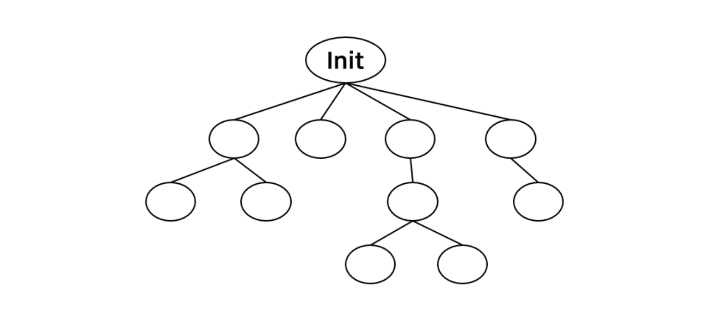
위와 같이 최초의 프로세스는 **Init**이다. 이 이름은 운영체제마다 다르고, init은 UNIX 운영체제 기준 이름이다. 여기서 여러 다른 프로세스들이 생성되면 위와 같은 그림처럼 **트리 모양**으로 나타낼 수 있다.여기서 프로세스를 생성한 쪽을 **부모 프로세스**, 만들어진 프로세스를 **자식 프로세스**라고 한다. 같은 부모를 갖는 자식 프로세스 끼리는 서로 Sibling(형제) 프로세스라고 한다.

프로세스는 각각 고유의 번호를 갖는데 이를 **PID(Process Identifirer)** 라고 한다. PID는 일반적으로 정수형(integer)으로 표현한다. PPID는 부모의 PID를 말한다.
</br>

#### {1-1}. 프로세스 생성

새로운 프로세스를 만드는 시스템 콜이 존재하는데, 이는 fork() 라 한다. 만들어진 프로세스에서 어떠한 파일을 실행하려면 exec() 시스템 콜을 사용한다.
</br>

#### {1-2}. 프로세스 종료

프로세스를 종료하는 시스템 콜은 exit() 이다. 한 프로세스가 종료되면 해당 프로세스가 사용한 모든 자원(메모리, 파일, I/O 등)을 회수해야한다. 이러한 회수된 자원과 권한은 모두 운영체제로 되돌아가야한다.
</br>

### (2). 쓰레드(Thread)
쓰레드는 프로그램 **내부의 흐름(맥)** 이다.
```
int main(void)
{
  int n = 0;
  int m = 10;
  printf("%d\n", n * m);
  while(n < m)
    n++;
  printf("END\n");
}
```

위와 같은 코드는 하나의 흐름을 가지고 있고 이를 쓰레드라고 부른다. 일반적으로 하나의 프로그램은 하나의 쓰레드를 갖는다.
</br>

#### {2-1}. 다중 쓰레드(Mulitithreads)

하나의 프로그램에 쓰레드가 __2개 이상__ 존재하는 것을 다중 쓰레드라고 한다. 이렇게 한 프로그램에 여러 개의 쓰레드 즉, 흐름이 있을 수 있는 이유는 쓰레드가 빠른 시간 간격으로 스위칭되기 때문이다. 이러한 동작으로 사용자는 여러 쓰레드가 동시에 실행되는 것처럼 보인다.

이처럼 CPU가 하나인 환경에서 여러 쓰레드가 스위칭에 의해 동시에 수행되는 효과를 **concurrent**라 한다. 반면에 여러 CPU 환경에서 여러 쓰레드가 실제로 동시에 수행되는 것은 **simultaneous**라고 한다.

다중 쓰레드를 사용하는 대표적인 예는 Web browser 이다. 화면을 출력하는 쓰레드와 데이터를 읽어오는 쓰레드가 기본적으로 따로 수행하고 있다. 그 외에도 Word processor, Media player 등 현재 대부분의 프로그램은 다중 쓰레드로 동작한다.

이전의 CPU 스케줄링에서 하나의 프로세스가 수행하다가 다른 프로세스로 넘어간다고 하였는데, 이는 예전의 방식이다. 현재 운영체제에서는 대부분 다중 쓰레드를 지원하기 때문에 하나의 프로세스 안에서 여러 쓰레드를 수행하다가 다른 프로세스로 넘어가서 그 프로세스의 쓰레드를 수행한다. 그러므로 현대 운영체제의 __context switching 단위는 프로세스가 아닌 쓰레드 단위이다.__
</br>

#### {2-2}. Thread VS Precess

한 프로세스에는 기본적으로 하나의 쓰레드가 존재한다. 프로세스는 __code, data__ 메모리 공간이 존재하는데, 이는 여러 쓰레드가 공유한다. 이외에도 프로세스의 자원인 file, I/O 등은 여러 쓰레드가 공유하지만, 각 쓰레드가 고유하게 가지고 있는 것은 PC(Program Counter), SP(Stack Pointer), registers, __stack__ 등이 있다.
</br>


## 🔥[6] 동시성과 병렬성 이해하기
Concurrency와 Parallelism은 헷갈리기 쉬운 개념입니다. 이름도 Concurrency(동시성)과 Parallelism(병렬성)으로 이름만 들었을 때는 이 둘의 차이를 구분하기 어렵습니다. Concurrency와 Parallelism의 특징을 정리하면 다음과 같습니다.
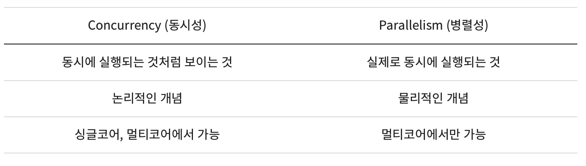
표만 봤을 때는 내용이 잘 와닿지 않습니다. Concurrency와 같은 경우 "동시에 실행되는 것처럼 보이는 것은 뭐지?"라는 생각이 들 수 있습니다. 그림과 함께 그리고 동기화 관점에서 Concurrency가 왜 동시에 실행되는 것처럼 보이는 것인지 정리해보려 합니다.
</br>

### (1) Parallelism
Parallelism은 여러 코어에서 여러 작업을 동시에 수행하는 것입니다. 코어가 하나밖에 없다면 병렬적으로 프로그램을 실행할 수 없습니다.

CPU는 single core의 성능을 올리는 데 한계를 느끼고 multi-core 체제로 넘어갔습니다. 여러 코어에서 여러 작업을 동시에 수행하면서 성능을 올리려 한 것입니다.
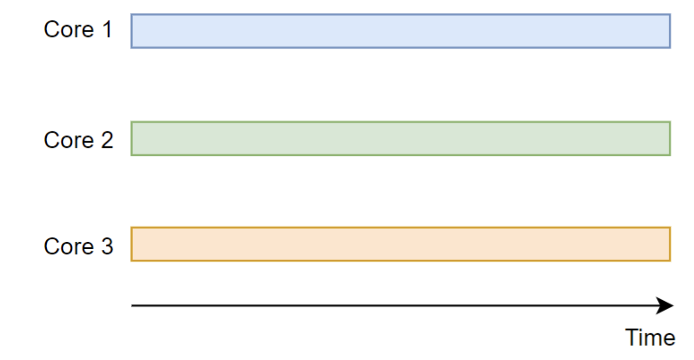
하나의 코어에서 하던 작업을 세 개의 코어에서 나누어 하니 이론적으로는 성능이 3배까지 좋아질 수 있습니다. 모든 작업을 병렬적으로 수행하기는 어려우니 3배의 성능 향상을 기대하긴 어렵지만 기존 보다는 성능이 향상될 것입니다. 하지만 여러 작업을 동시에 수행하니 race condition 혹은 동기화 문제가 발생할 수 있습니다. 
</br>

### (2) Concurrency
Concurrency는 빠르게 전환하며 여러 작업을 수행하여 동시에 여러 작업이 실행되는 것처럼 보이는 것입니다. 한 개의 코어에서도 여러 작업을 Concurrent하게 실행할 수 있고 작업 간에는 context switch가 일어납니다.
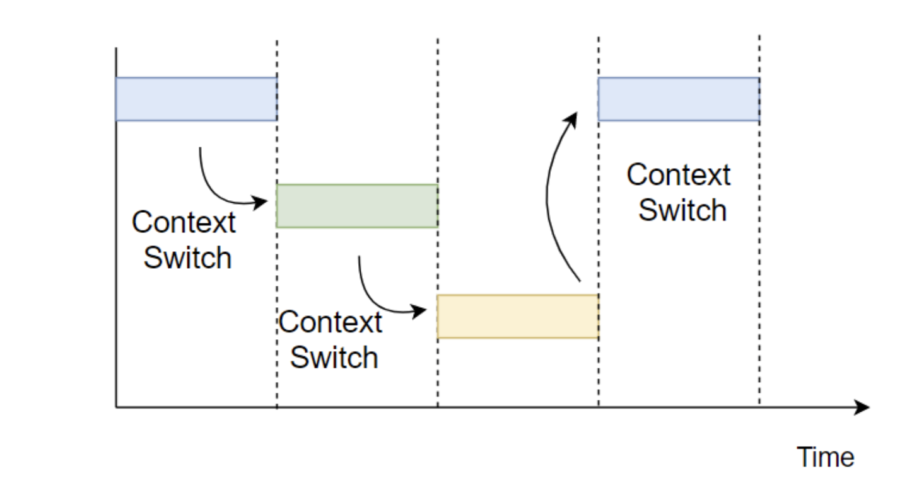
Concurrent하게 실행되는 Task들은 운영체제의 스케줄링 정책에 의해 실행되며 서로 복잡하게 엉켜있습니다. 이들이 어떻게 엉켜있는지 생각하는 건 어려우니 동시에 실행된다고 생각하는 게 Concurrency 입니다. 그렇기 때문에 Task가 동시에 수행될 때 생길 수 있는 문제점, 대표적으로 동기화 문제가 발생할 수 있습니다.

### (3) 동기화 문제는 Concurrent한 Task 사이에서 발생한다
동기화 문제는 여러 작업이 동시에 공유된 자원에 접근하려 할 때 발생합니다. 동시에라는 말 때문에 멀티코어에서만 발생할 것 같지만 한 코어에서 concurrent하게 동작하는 task 사이에서도 동기화 문제가 발생합니다. 

한 코어에서 실행되는 Task1과 Task2가 동시에 공유자원인 data에 접근하려 합니다.
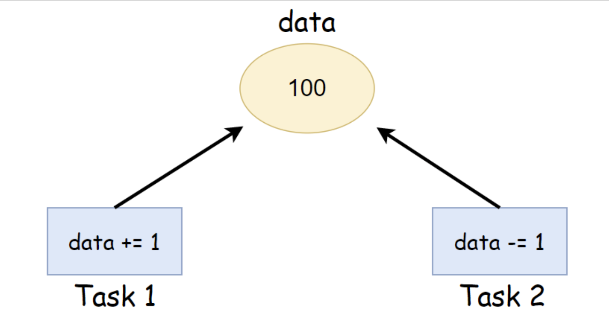
원래대로 라면 data에 1을 더하고 다시 1을 뺐으니 작업이 끝난 후 data에 100이 들어가 있어야 합니다. 하지만 동기화 문제가 발생하면 data에 99나 101이 들어있을 수 있습니다.
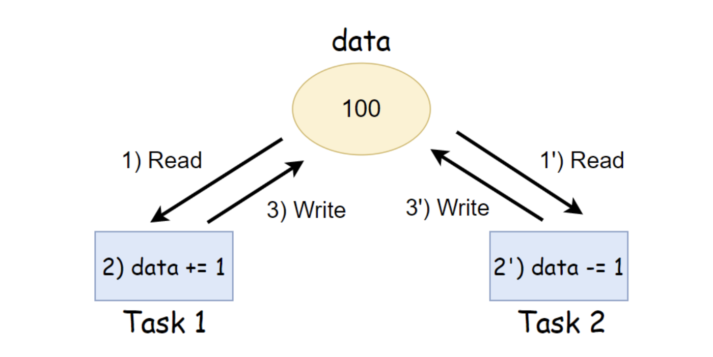
Task1이 data에 100을 읽어 1을 더하고 있는 사이(1) Task2에서도 data를 읽어(1') 갑니다. 이 때는 아직 Task1이 data를 101로 업데이트 하기 전이기 때문에 Task2도 100이라는 값을 읽게 됩니다. Task1은 data += 1을 실행(2)하고 data를 101로 업데이트(3) 합니다. Task2는 data를 100으로 읽었으므로 100에서 1을 뺀(2') 99로 data 값을 업데이트(3') 합니다. 동기화 문제가 발생하면 예상되는 결과와 다른 결과가 생길 수 있습니다. 이렇듯 Concurrent Task 사이에는 동기화 문제가 발생할 수 있기 때문에 이를 막기 위한 동기화 기법을 사용해주어야 합니다.
</br>

### (4) 결론
concurrency를 이해하면 동기화를 이해하는 데 도움이 됩니다. 동기화에 대한 설명을 보다보면 Concurrent라는 단어를  자주 만나게 됩니다. Concurrent하게 동작하는 프로세스나 쓰레드가 동기화 문제를 일으키기 때문이겠죠.

Concurrent access to shared data may result in data inconsistency.

Concurrent를 제대로 이해하지 못했을 때 이를 단순히 동시에 라고 해석하고 '그럼 단일 프로세서에서는 동기화 문제가 안생기나?'라고 생각하곤 했습니다. 그러나 이제는 빠르게 전환하며 실행되며 동시에 실행되는 것처럼 보이는 것이라 이해하고 이러한 종류로 실행되는 것들이 동기화 문제를 발생시킬 수 있다는 점을 염두할 수 있습니다. 이 점이 concurrency를 이해해야 하는 이유가 아닌가  생각이 드네요.
</br>

## 🔥[7] 메모리 관리란? - 이유, 방법
메모리 관리
#### ※ 메모리란?
: 메인 메모리, RAM을 뜻한다. 프로그램 실행 시 필요한 주소, 정보들을 저장하고 가져다 사용할 수 있게 만드는 공간. 
 즉, 작업을 위해 사용되는 공간.
 #### 메모리 관리가 필요한 이유는?

: 각각의 프로세스는 독립된 메모리 공간을 갖고, 운영체제 혹은 다른 프로세스의 메모리 공간에 접근할 수 없는 제한이 걸려있다. 단지, 운영체제 만이 운영체제 메모리 영역과 사용자 메모리 영역의 접근에 제약을 받지 않기 때문에 운영체제에서 메모리를 관리한다. 또한, 멀티프로그래밍 환경으로 변화하면서 한정된 메모리를 효율적으로 사용해야 했고, 운영체제가 이를 어떻게 관리하는지에 대한 관리방법이 중요해졌다!
 
##### 운영체제의 역할
실행파일이 로더에 의해 메모리에 올라오고 운영체제는 이 실행파일을 메모리에 어느 부분에 올릴지 결정한다.
 
+ 자바는 OS의 메모리 영역에 직접적으로 접근하지 않고 JVM이라는 가상 머신을 이용해서 간접적으로 접근한다 

#### Swapping

:메모리의 관리를 위해 사용되는 기법. 메모리에 적재되어 있으나 현재 사용되지 않고 있는 프로세스를 관리하는 역할.
표준 Swapping 방식으로는 round-robin 과 같은 스케줄링의 다중 프로그래밍 환경에서 CPU 할당 시간이 끝난 프로세스의 메모리를 backing store(보조기억장치 , e.g 하드디스크)로 내보내고 다른 프로세스의 메모리를 불러 들일 수 있다.. 
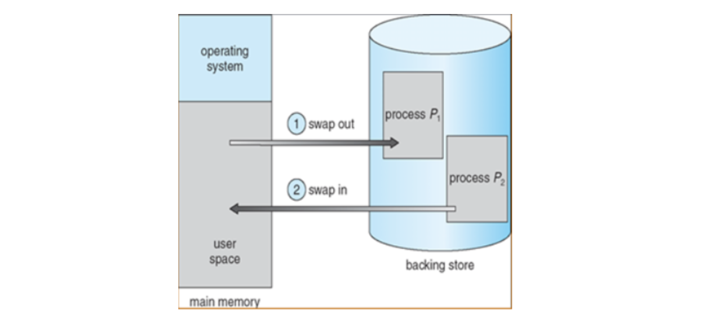
→이 과정을 swap (스왑시킨다) 이라 한다. 주 기억장치(RAM)로 불러오는 과정을 __swap-in,__ 보조 기억장치로 내보내는 과정을 __swap-out__ 이라 한다. swap 에는 큰 디스크 전송시간이 필요하기 때문에 __현재에는 메모리 공간이 부족할 때 Swapping 이 시작된다.__

### (1)단편화 현상
: 메모리의 공간이 작은 조각으로 나뉘어 사용 가능한 메모리가 충분히 존재하지만 할당(사용)이 불가능한 상태
 
#### {1}. 내부 단편화
: 프로세스가 사용하는 메모리 공간 에 포함된 남는 부분. 예를들어 메모리 분할 자유 공간이 10,000B 있고 Process A 가 9,998B 사용하게 되면 2B라는 차이 가 존재하고, 이 현상을 내부 단편화라 칭한다
 
 
#### {2}. 외부 단편화
: 메모리 공간 중 사용하지 못하게 되는 일부분. 물리 메모리(RAM)에서 사이사이 남는 공간들을 모두 합치면 충분한 공간이 되는 부분들이 분산되어 있을때 발생한다고 볼 수 있다.
 
※ 압축
: 외부 단편화를 해소하기 위해 프로세스가 사용하는 공간들을 한쪽으로 몰아, 자유공간을 확보하는 방법론이지만, 작업효율이 좋지 않다. (위의 메모리 현황이 압축을 통해 아래의 그림 처럼 바뀌는 효과를 가질 수 있다)
 
 
 
### (2) 메모리 관리 방법

: 위의 단편화 현상을 줄이고, 적절한 swap을 통해 효율적으로 메모리를 관리하기 위한 방법
#### {1}. 연속 메모리 할당

 프로세스를 메모리에 연속적으로 할당하는 기법
- 할당과 제거를 반복하다보면 Scattered Holes가 생겨나고 이로 인한 외부 단편화가 발생
 
<연속 메모리 할당에서 외부 단편화를 줄이기 위한 할당 방식>
 
a. 최초 적합(First fit)
- 가장 처음 만나는 빈 메모리 공간에 프로세스를 할당
- 빠름
 
b. 최적 적합(Best fit)
- 빈 메모리 공간의 크기와 프로세스의 크기 차이가 가장 적은 곳에 프로세스를 할당
 
c. 최악 적합(Worst fit)
- 빈 메모리 공간의 크기와 프로세스의 크기 차이가 가장 큰 곳에 프로세스를 할당
- 이렇게 생긴 빈 메모리 공간에 또 다른 프로세스를 할당할 수 있을 거라는 가정에 기인
 
 
 
#### {2}. 페이징(Paging)-가상메모리사용, 외부 단편화 해결, 내부 단편화 존재

: 하나의 프로세스가 사용하는 메모리 공간이 연속적이어야 한다는 제약을 없애는 메모리 관리 방법이다.외부 단편화와 압축 작업을 해소하기 위해 생긴 방법론으로, 물리 메모리는 Frame 이라는 고정 크기로 분리되어 있고, 논리 메모리(프로세스가 점유하는)는 페이지라 불리는 고정 크기의 블록으로 분리된다.(페이지 교체 알고리즘에 들어가는 페이지)
페이징 기법을 사용함으로써 논리 메모리는 물리 메모리에 저장될 때, 연속되어 저장될 필요가 없고 물리 메모리의 남는 프레임에 적절히 배치됨으로 외부 단편화를 해결할 수 있는 큰 장점이 있다.
 
하나의 프로세스가 사용하는 공간은 여러 개의 페이지로 나뉘어서 관리되고(논리 메모리에서), 개별 페이지는 순서에 상관없이 물리 메모리에 있는 프레임에 mapping 되어 저장된다고 볼 수 있다.
 
→ 단점 : 내부 단편화 문제의 비중이 늘어나게 된다. 예를들어 페이지 크기가 1,024B이고 프로세스 A 가 3,172B 의 메모리를 요구한다면 3 개의 페이지 프레임(1,024 * 3 = 3,072) 하고도 100B 가 남기 때문에 총 4 개의 페이지 프레임이 필요한 것이다. 결론적으로 4 번째 페이지 프레임에는 924B(1,024 - 100)의 여유 공간이 남게 되는 내부 단편화 문제가 발생하는 것이다.
 
 
 
#### {3}. 세그먼테이션(Segmentation)-가상메모리사용, 내부 단편화 해결, 외부 단편화 존재

: 페이징에서처럼 논리 메모리와 물리 메모리를 같은 크기의 블록이 아닌, 서로 다른 크기의 논리적 단위인 세그먼트(Segment)로 분할 사용자가 두 개의 주소로 지정(세그먼트 번호 + 변위) 세그먼트 테이블에는 각 세그먼트의 기준(세그먼트의 시작 물리 주소)과 한계(세그먼트의 길이)를 저장
 
→ 단점 : 서로 다른 크기의 세그먼트들이 메모리에 적재되고 제거되는 일이 반복되다 보면, 자유 공간들이 많은 수의 작은 조각들로 나누어져 못 쓰게 될 수도 있다.(외부 단편화)
 
 
 
#### {4}. 메모리 풀(Memory Pool)

: 필요한 메모리 공간을 필요한 크기, 개수 만큼 사용자가 직접 지정하여 미리 할당받아 놓고 필요할 때마다 사용하고 반납하는 기법
메모리의 할당, 해제가 잦은 경우에 메모리 풀을 쓰면 효과적이다.
미리 할당해놓고 사용하지 않는 순간에도 계속 할당해놓으므로 메모리 누수가 있는 방식이다.
→ 장점 : 메모리 풀 없이 동적할당과 해제를 반복하면 메모리의 랜덤 한(실제로는 알고리즘에 의한) 위치에 할당과 해제가 반복되면서 단편화를 일으킬 수 있겠지만 미리 공간을 할당해놓고 가져다 쓰고 반납하기 때문에 할당과 해제로 인한 외부 단편화가 발생하지 않는다. 또한 필요한 크기만큼 할당을 해놓기 때문에 내부 단편화 또한 생기지 않는다.
→ 단점 : 하지만 메모리 단편화로 인한 메모리 낭비량보다 메모리 풀을 만들었지만 쓰지 않았을 때 메모리 양이 커질 경우 사용하지 않아야 한다.

## 🔥[8] IPC란? - 정의, 종류, 방법
<code>IPC : 프로세스간 통신 (Interprocess Communication)


IPC = 프로세스 간 통신 프로세스들끼리 서로 데이터를 주고받는 행위 또는 그에 대한 방법을 뜻한다.
</code>

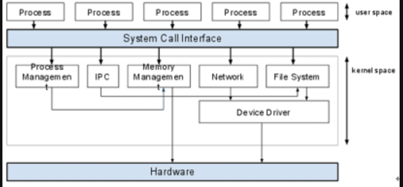
위 그림처럼 porccess는 완전히 독립된 실행객체
  * 장점 : 다른 프로세스에 영향을 받지않는다
  * 단점 : 별도의 설비 없이는 서로간에 통신이 어렵다는 문제
  
  이를 위해서 커녈영역에서 IPC라는 내부 프로세스간 통신을 제공, 프로세스는 커널이 제공하는IPC 설비이용 프로세스간 통신 가능

  __☣︎ 커널이란?__
    
```
    운영체제 자체도 소프트웨어이기 때문에 메모리에 올라가야 사용할 수 있다.
      하지만 메모리 공간의 제약으로 운영체제 중 항상 필요한 부분만을 메모리에 올려놓고, 그렇지 않은 부분은 필요할 때 메모리에 올려서 사용하게 된다.
      이 때 메모리에 상주하는 운영체제의 부분을 커널이라 한다. (보통은 운영체제라고 하면 커널을 말하게 된다.)

즉, 커널은 메모리에 상주하는 부분으로써 운영체제의 핵심적인 부분을 뜻한다.  
```
### (1). IPC의 종류
#### {1}.메시지 전달(Message Passing)-메세지패싱
커널이 제공하는 api를 이용해서 커널 공간을 통해 통신한다. 메시지큐(MessageQueue)를 사용하여 송신 프로스느느 큐에 enqueue, 수신프로세스는 큐에 dequeue를 하며 상호간 통신한다 메시지 큐는 커널 단에서 관리된다

  - 파이프(쉘에서 사용하는 그 파이프)
  - 소켓(TCP/IP) - 로컬에서도 통신이 가능하며 원격에서도 통신이 가능하다.

#### {2}. 메모리공유(Shared Memory)-쉐어드메모리
프로세스끼리 __특정 공통의 메모리 영역을 공유__ 하며 상호간 통신하는 방법
__데이터자체를 공유__ 하도록 지원하며, 한 프로세스셍서 변경한 메모리 공간의 내용을 다른 프로세스에 접근 할 수 있다. 커널에서 관리된다.


  -좌 :<code> Message Passing방법</code> 우 : <code>Shared Memory</code> 방법


  이러한 IPC 통신에서 프로세스 간 데이터를 동기화하고 보호하기 위해 세마포어(Semaphore)와 뮤텍스(Mutex)를 사용한다. (공유된 자원에 한번에 하나의 프로세스만 접근시킬 때)


## 🔥[9] OS - 입출력 관리

컴퓨터의 주요한 작업 
1. 연산작업
2. __입출력 작업__

마우스, 키보드, 모니터등 다양한 장치와 컴퓨터가 통신하려면 둘 사시에 공통된 인터페이스가 존재ㅎ애햐한다 
__컴퓨터와 하드웨어 장치 사이의 공통된 인터페이스 역할을 수행하는것이 입출력 관리의 핵심이다.__

### (1). 입출력 하드웨어의 구성

입출력 장치들이 컴퓨터와 동작하는 원리를 알기전에 입출력 장치들이 어떻게 구성되어 있는지 알아보고자한다.

하드웨어 장치는 케이블을 통해서 또는 무선으로 신호를 보냄으로써 컴퓨터와 통신한다. 이때 포트를통해 컴퓨터에 접속하는데, 하드웨어 장치의 또다른 구성요소는 제어기이다.
(제어기: 포트나 입출력 장치를 제어하는 전자회로의 집합체이며 많은 입출력 장치는 제어기를 내장하고 있다.)


🤔그럼 컴퓨터는 어떻게 장치의 제어기에서 입출력을 하도록 명령할까?

모든 제어기는 레지스터를 가진다. 컴퓨터의 프로세서는 제어기 레지스터에 bit pattern을 쓰거나 읽음으로써 입출력을 실행한다.


### (2).입출력 하드웨어의 동작

#### {1}. 플링 
장치 제어기의 레지스터에는 busy bit라는 것이 존재한다.
busy bit: 현재 장치가 사용 가능한 상태인지, 다른 작업을 처리중이라 사용이 불가능한 상태인지를 나타내는 bit.
1-> 제어기가 작업하느라 바쁜 경우
0-> 제어기가 준비중인 경우
컴퓨터는 장치가 사용중인지 알기위해 주기적으로 busy bit를 검사해야하는데 이 과정을 폴링이라고 한다.

<code>폴링이란 하드웨어 장치의 상태를 수시로 체크하여 명령을 받을 수 있는지를 확인하는것을 말한다.</code>
폴링 자체는 컴퓨터 자원이 많이 소요되지 않지만 장치가 준비하는 시간이 길어질 경우 매우 비효율적이라는 단점이 있다. 이런 경우에 제어기가 자신의 상태가 바뀔 때 컴퓨터에 통보해주는 방식으로 비효율을 막을 수 있다. 이때 발생시키는 신호를 **인터럽트**라고 한다.
#### {2}. 인터럽트

앞서 말했듯이
<code>인터럽트란 CPU가 프로그램을 실행하고 있을 때, 입출력 하드웨어 등의 장치나 예외상황이 발생하여 처리가 필요할 경우에 CPU에게 알려 처리할 수 있도록 하는 것을 말한다.</code>

CPU는 인터럽트 요청 라인이라고 하는 선을 가지는데 CPU는 매번 명령어를 끝내고 다음 명령어를 수행하기 전에 이 선을 검사한다.
만약 입출력 장치가 준비 완료되어서 인터럽트 요청 라인에 신호를 보내면, CPU는 인터럽트를 확인하고 인터럽트 핸들러를 실행한다.
(인터럽트 핸들러: 입출력 장치를 서비스함으로써, 인터럽트를 처리해준다.)

CPU는 인터럽트 발생시 직전 작업 상태를 저장해두고 인터럽트를 처리한다. 인터럽트 처리가 완료된 이후에는 인터럽트 발생전 상태를 복구시켜 중단되었던 작업을 재개한다.

```EX)
1. 사용자가 키보드를 사용하여 입력하면 키보드 컨트롤러가 인터럽트를 발생시켜 CPU에게 그 사실을 알림.
2. CPU는 현재 수행중이던 작업의 상태를 저장, 인터럽트 요청을 처리하기위해 운영체제 내에 정의된 키보드 인터럽트 처리 루틴을 찾음.
3. 키보드 인터럽트 처리 루틴을 실행하고 완료.
4. 인터럽트 처리가 끝나면 인터럽트가 발생하기 직전 상태를 복구시켜 중단되었던 작업을 재개.
```

#### {3}. 입출력 하드웨어와 컴퓨터가 데이터를 주고받는 방식
만약 CPU를 사용하여 디스크와 같은 대용량 입출력 장치의 데이터를 읽으면 CPU 사용량이 매우 높아져 컴퓨터 성능이 심각하게 저하된다는 문제가 발생한다. 따라서 CPU가 매번 바이트 전송을 제어하는 것은 심한 낭비이다.
(PIO: CPU가 1바이트씩 옮기는 입출력 방식)
많은 컴퓨터들의 CPU의 낭비를 막기 위해서 PIO를 DMA(Direct Memory Access)제어기라고 불리는 특수 프로세서에게 위임하여 CPU의 일을 줄여준다.

**직접 메모리 접근(Direct Memory Access)**
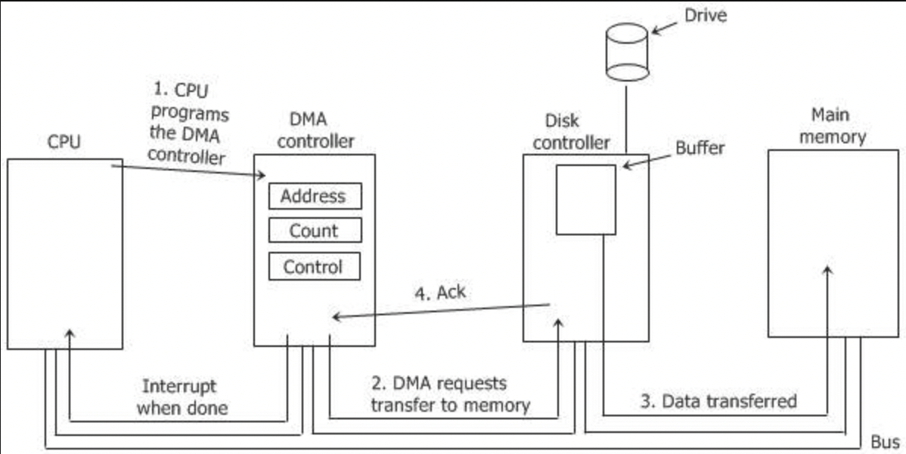

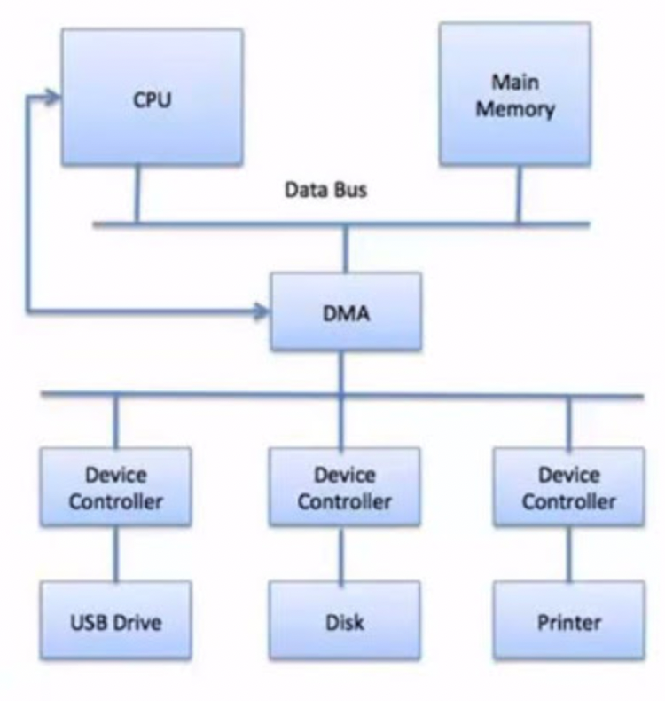
컴퓨터는 메모리에 DMA 명령 블록을 쓴다. 이 블록에는 전송할 데이터가 있는 곳의 포인터와 전송할 장소에 대한 포인터, 그리고 전송될 바이트 수가 기록된다.
CPU는 DMA 명령블록의 주소를 DMA에게 알려주고 자신은 다른 일을 처리한다.
즉 **DMA는 CPU의 도움없이 자신이 직접 버스를 통해 DMA 명령블록에 접근하여 입출력을 실행**한다.

```
**DMA 입출력 방식의 작동 과정**
1. CPU가 입출력 요청을 보낸다.
2. DMA제어기의 레지스터에 주소와 전송 길이가 저장된다.
3. DMA 제어기는 한 블록의 입출력 동작을 수행하고 그동안 CPU는 다른 작업을 한다.
4. 입출력 동작이 완료되면 DMA제어기는 CPU에게 완료했다는 인터럽트를 보낸다.
```

## 🔥[10] POSIX 기초
POSIX (Portable Operating System Interface)란 무엇일까?


## 🔥[11] 네트워크 기초 지식 정리
stdin, stdout, stderr, pipes
네트워크 기초 개념
## 🔥[12] 네트워크 기초 개념