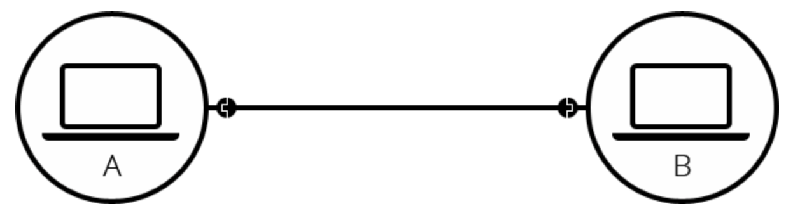
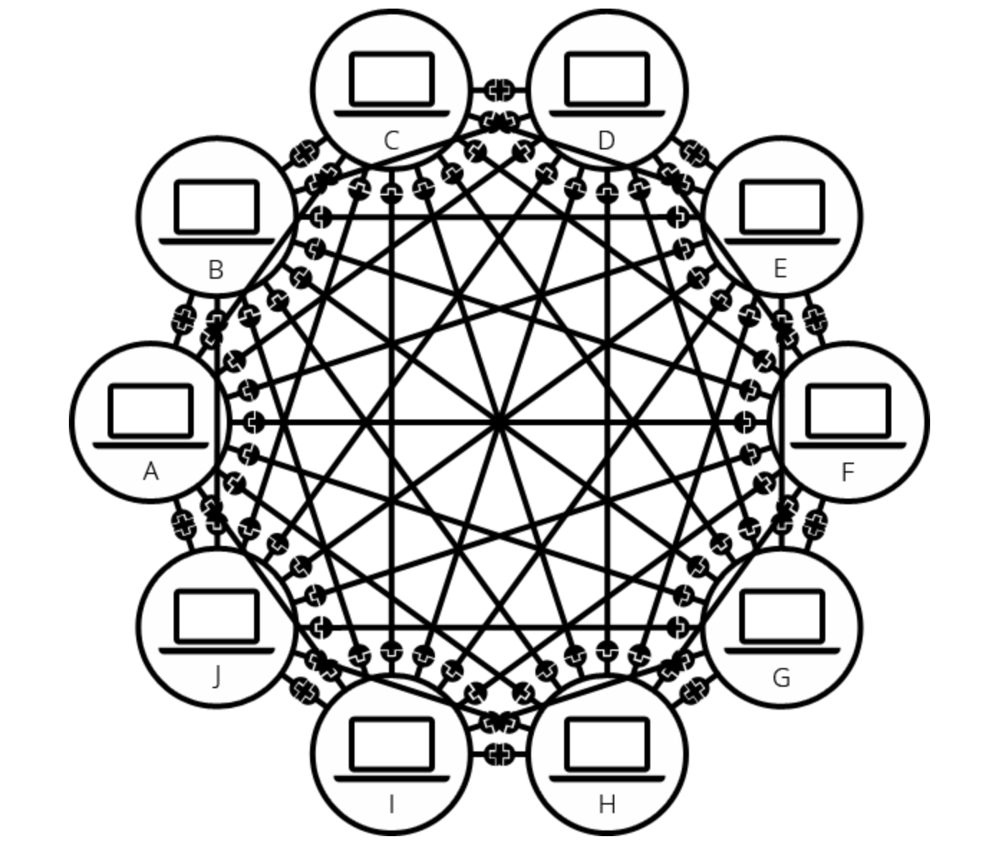
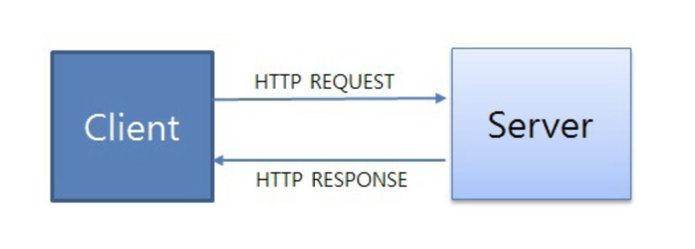

# 인터넷
## [1] 인터넷은 어떻게 작동하는가
  ### (1) 인터넷은 어떻게 동작하는가
   ####  {1} 요약
인터넷은 웹의 핵심적인 기술입니다. 인터넷의 가장 기본적인 것은, 컴퓨터들이 서로 통신 가능한 거대한 네트워크라는 것입니다.

인터넷의 역사는 잘 알려지지 않았습니다. 인터넷은 1960년 대 미육군에서 기금한 연구 프로젝트에서 시작되었습니다. 그리고 1980년 대에 많은 국립 대학과 비공개 기업의 지원으로 공공의 기반으로 변화되었습니다. 인터넷을 지원하는 다양한 기술은 시간이 지남에 따라 진화 해 왔지만 작동 방식은 그다지 변하지 않았습니다. 인터넷은 모든 컴퓨터를 연결하고 어떤 일이 있어도 연결 상태를 유지할 수있는 방법을 찾는 방법입니다.
  ####     {2} 활동적으로 배우기

https://www.youtube.com/watch?v=7_LPdttKXPc
How the internet Works in 5 minutes: Aaron Titus의 인터넷에 대한 기초를 이해하기 위한 5분짜리 동영상

####       {3} 깊게 들어가기
 - #####          1. 단순한 네크워크
  두 개의 컴퓨터가 통신이 필요할 때, 우리는 다른 컴퓨터와 물리적으로 (보통 이더넷 케이블) 또는 무선으로 (예를 들어, WiFi 나 Bluetooth 시스템) 연결되어야 합니다. 모든 현대 컴퓨터들은 이러한 연결 중 하나를 이용하여 연결을 지속할 수 있습니다.
__Note: 이 글의 나머지 부분에서는 유선 케이블에 대해서만 이야기 하지만 무선 네트워크도 동일한 방식입니다.__ 


이러한 네트워크는 두 대의 컴퓨터로 제한되지 않습니다. 원하는 만큼의 컴퓨터를 연결할 수 있습니다. 그러나 이렇게 연결할 수록 매우 복잡해집니다. 예를 들어 10대의 컴퓨터를 연결하려는 경우 컴퓨터 당 9개의 플러그가 달린 45개의 케이블이 필요합니다!

이 문제를 해결하기 위해 네트워크의 각 컴퓨터는 라우터라고하는 특수한 소형 컴퓨터에 연결됩니다. 이 라우터에는 단 하나의 작업만 있습니다. 철도역의 신호원처럼 주어진 컴퓨터에서 보낸 메시지가 올바른 대상 컴퓨터에 도착하는지 확인합니다. 컴퓨터 B에게 메시지를 보내려면 컴퓨터 A가 메시지를 라우터로 보내야하며, 라우터는 메시지를 컴퓨터 B로 전달하고 메시지가 컴퓨터 C로 배달되지 않도록해야합니다.

이 라우터를 시스템에 추가하면 10대의 컴퓨터 네트워크에는 10개의 케이블만 필요합니다. 각 컴퓨터마다 단일 플러그와 10개의 플러그가 있는 하나의 라우터가 필요합니다.
에 연결합니다. ISP는 모두 함께 연결되는 몇몇 특수한 라우터를 관리하고 다른 ISP의 라우터에도 액세스 할 수 있는 회사입니다. 따라서 우리 네트워크의 메시지는 ISP 네트워크의 네트워크를 통해 대상 네트워크로 전달됩니다. 인터넷은 이러한 전체 네트워크 인프라로 구성됩니다.

- #####           3. 컴퓨터 찾기
컴퓨터에 메시지를 보내려면 메시지를 받을 특정 컴퓨터를 지정해야합니다. 따라서 네트워크에 연결된 모든 컴퓨터에는 IP 주소 (IP는 인터넷 프로토콜을 나타냄)라는 고유한 주소가 있습니다. 주소는 점으로 구분 된 네 개의 숫자로 구성된 주소입니다 . 예: 192.168.2.10.

컴퓨터는 이러한 주소로 다른 컴퓨터를 찾아가는데 문제가 없습니다. 그러나 우리들은 IP주소를 기억하기 어렵죠. 그래서 우리는 '도메인 이름' 이라고하는 사람이 읽을 수 있는 IP 주소의 이름을 지정할 수 있습니다. 예를 들어 'google.com'은 IP 주소로  '173.194.121.32' 입니다. 따라서 '도메인 이름'은 'IP주소'보다 인터넷을 사용하기에 쉽습니다.


웹 브라우저를 사용하여 웹을 탐색 할 때 일반적으로 도메인 이름을 사용하여 웹 사이트에 접속합니다. 그것은 인터넷과 웹이 같은 것을 의미할까요? 그렇게 간단하지 않습니다. 앞에서 보았 듯이 인터넷은 수십억 대의 컴퓨터를 모두 연결하는 기술 인프라입니다. 이러한 컴퓨터들 중에 일부는 '웹 서버'로서 웹 브라우저가 이해할 수 있는 서비스를 제공합니다. 인터넷은 인프라이며, 웹은 그 인프라 기반 위에 구축된 서비스입니다. 웹 뿐만 아니라 인터넷 위에 구축된 다른 서비스들(이메일, IRC (en-US) 등)도 있음을 알아야합니다.
- #### 다음단계
    - How the Web works(웹이 작동하는 방법)
Understanding the difference between a web page, a web site, a web server and a search engine(웹 페이지, 웹 사이트, 웹 서버, 검색 엔진의 차이점 이해하기)
Understanding domain names(도메인 이름 이해하기)

### (2) 인터넷의 작동원리
  ####  1. 인터넷이란?
여러분들이 편하게 쓰는 인터넷은 사실 오랜 역사와 생각보다 복잡하게 구성이 되어있습니다.
일단 인터넷을 알기 전에 우리는 TCP/IP가 먼지에 대해서 알아야 합니다.
  #####    TCP/IP란?
TCP/IP가 나타난 이유는 먼저 컴퓨터간의 통신을 위해서입니다. 
TCP/IP는 컴퓨터와 컴퓨터간의 지역네트워크(LAN) 광역네트워크(WAN)에서 원할한 통신을 가능하도록 하기위한 통신규약으로 정의할 수 있습니다. 최초는 ARPANET(최초의 컴퓨터)로 시작이 되었으며 미국방위통신청에서 컴퓨터간의 통신을 위해서 TCP/IP를 사용하도록 한것이 그 시초가 되었습니다.

기본적인 역사는 이렇습니다. 자 이젠 왜 컴퓨터간의 통신을 위해서 TCP/IP 선택한 이유는 TCP/IP의 개방성에 그 정답이있습니다. 즉 하드웨어, 운영체제, 접속매체에 관계없이 동작할수있다는 점 때문에 인터넷 통신을 위한 핵심으로 선택이 되었습니다. 그리고 이름에서도 TCP/IP의 2개의 프로토콜이 이루어져 있습니다. 그 이유는 IP기반에 TCP가 사용되서 이렇게 불리어집니다. 쉽게 말해 IP 프로토콜위에 TCP 프로토콜이 놓이게된겁니다.

IP - 네트워크 상에서 컴퓨터는 고유한 주소가 있습니다. 컴퓨터의 주소는 인터넷에 접속할때 컴퓨터 각각에 부여받습니다. 집 주소나 전화 번호 처럼 말이죠, 이 주소는 총 4바이트로 이루어져있습니다.
예를 들어서 192.168.2.1 이런식으로요 만약 내 컴퓨터의 IP주소가 궁금하다면 윈도우라면 cmd에서 ipconfig 유닉스 계열이면 ifconfig로 치면 주소가 나옵니다. 

TCP - 저번 글에 클라이언트와 서버 이야기 나왔죠? 그렇게 데이터를 주고 받을수있는게 TCP 때문이죠 즉 클라이언트와 서버간에 데이터를 신뢰성있게 전달하기 위해 만들어진 프로토콜입니다. 그리고 TCP는 근거리 통신망(LAN), 원거리 통신망(WAN), 인트라넷, 인터넷 등 컴퓨터에서 실행되는 프로그램 간에 일련의 데이터를 안정적으로 순서대로 에러없이 데이터를 교환할 수 있게합니다. 

기본적인 IP와 TCP에 대한 정보입니다. 종류는 많지만 일단 인터넷을 알기 위해서는 정도만 알면됩니다.

본격적으로 인터넷이란 각 컴퓨터들간의 TCP/IP 통신 프로토콜을 이용해서 서로 데이터를 주고 받도록한 네트워크를 말합니다. 또는 네트워크의 네트워크를 구현하여 모든 컴퓨터를 하나의 통신망 안에 연결하고자 하는 의도엣 인터넷이라고도 합니다.


  ## [2] HTTP는 무엇인가
  ### (1) HTTP란 무엇인가
  __HTTP (HyperText Transfer Protocol)__
  텍스트 기반의 통신 규약으로 인터넷에서 데이터를 주고받을 수 있는 프로토콜이다. 이렇게 규약을 정해두었기 때문에 모든 프로그램이 이 규약에 맞춰 개발해서 서로 정보를 교환할 수 있게 되었다.
  __HTTP 동작__
  클라이언트 즉, 사용자가 브라우저를 통해서 어떠한 서비스를 url을 통하거나 다른 것을 통해서 요청(request)을 하면 서버에서는 해당 요청사항에 맞는 결과를 찾아서 사용자에게 응답(response)하는 형태로 동작한다.

- 요청 : client -> server
- 응답 : server -> client

HTML 문서만이 HTTP 통신을 위한 유일한 정보 문서는 아니다.
Plain text로 부터 JSON 데이터 및 XML과 같은 형태의 정보도 주고 받을 수 있으며, 보통은 클라이언트가 어떤 정보를 HTML 형태로 받고 싶은지, JSON 형태로 받고 싶은지 명시해주는 경우가 많다.
__HTTP 특징__
- HTTP 메시지는 HTTP 서버와 HTTP 클라이언트에 의해 해석이 된다.
- TCP/ IP를 이용하는 응용 프로토콜이다.
(컴퓨터와 컴퓨터간에 데이터를 전송 할 수 있도록 하는 장치로 인터넷이라는 거대한 통신망을 통해 원하는 정보(데이터)를 주고 받는 기능을 이용하는 응용 프로토콜)
- HTTP는 연결 상태를 유지하지 않는 비연결성 프로토콜이다.
(이러한 단점을 해결하기 위해 Cookie와 Session이 등장하였다.)
- HTTP는 연결을 유지하지 않는 프로토콜이기 때문에 요청/응답 방식으로 동작한다.
- 
__예시로 알아보는 HTTP__
서버 : 어떠한 자료에 대한 접근을 관리하는 네트워크 상의 시스템 (요청에 대한 응답을 보내준다.)
클라이언트 : 그 자료에 접근할 수 있는 프로그램
Ex) 웹 브라우저, 핸드폰 어플리케이션 등...
클라이언트 프로그램에서 사용자가 회원가입을 시도하게 되면, 서버로 회원정보를 보내게 되고 서버는 회원 정보를 저장해주기도 한다. 이 과정에서 클라이언트와 서버 간의 교류가 HTTP라는 규약을 이용하여 발생하게 된다.
__Request (요청)__
클라이언트가 서버에게 연락하는 것을 요청이라고 하며 요청을 보낼때는 요청에 대한 정보를 담아 서버로 보낸다.
__예시로 알아보는 Request__
서버가 주문서를 받아 클라이언트가 어떤 것을 원하는지 파악할 수 있게 한다. 이처럼 요청은 식당에서 주문서를 작성하는 것과 같다고 생각하면 된다
__Request Method (요청의 종류)__
- GET : 자료를 요청할 때 사용
- POST : 자료의 생성을 요청할 때 사용
- PUT : 자료의 수정을 요청할 때 사용
- DELETE : 자료의 삭제를 요청할 때 사용

__Request HTTP 메시지 예시__
```
GET https://velog.io/@surim014 HTTP/1.1								// 시작줄
User-Agent: Mozilla/5.0 (Windows NT 10.0; Win64; x64) ...			  // 헤더
Upgrade-Insecure-Requests: 1
```
```js
1. 시작줄 (첫 줄)

첫 줄은 시작줄로 메서드 구조 버전으로 구성되었다.

GET : HTTP Method
https://velog.io/@surim014 : 사이트 주소
HTTP/1.1 : HTTP 버전
2. 헤더 (두 번째 줄부터)

두번째 줄부터는 헤더이며 요청에 대한 정보를 담고 있다. User-Agent, Upgrade-Insecure-Requests 등등이 헤더에 해당되며 헤더의 종류는 매우 많다.

3. 본문 (헤더에서 한 줄 띄고)

본문은 요청을 할 때 함께 보낼 데이터를 담는 부분이다. 현재 예시에는 단순히 주소로만 요청을 보내고 있고 따로 데이터를 담아 보내지 않기 때문에 본문이 비어있다.
```
__Response (응답)__
서버가 요청에 대한 답변을 클라이언트에게 보내는 것을 응답이라고 한다.
__Status Code (상태 코드)__
상태 코드에는 굉장히 많은 종류가 있다. 모두 숫자 세 자리로 이루어져 있으며, 아래와 같이 크게 다섯 부류로 나눌 수 있다.

- 1XX (조건부 응답) : 요청을 받았으며 작업을 계속한다.
- 2XX (성공) : 클라이언트가 요청한 동작을 수신하여 이해했고 승낙했으며 성공적으로 처리했음을 가리킨다.
- 3XX (리다이렉션 완료) : 클라이언트는 요청을 마치기 위해 추가 동작을 취해야 한다.
- 4XX (요청 오류) : 클라이언트에 오류가 있음을 나타낸다.
- 5XX (서버 오류) : 서버가 유효한 요청을 명백하게 수행하지 못했음을 나타낸다.
__Resonse HTTP 메시지 예시__
```java
HTTP/1.1 200 OK														// 시작줄
Connection: keep-alive												 // 헤더
Content-Encoding: gzip												 
Content-Length: 35653
Content-Type: text/html;

<!DOCTYPE html><html lang="ko" data-reactroot=""><head><title...
```
```js
1. 시작줄 (첫 줄)

첫 줄은 버전 상태코드 상태메시지로 구성되어 있다. 200은 성공적인 요청이었다는 뜻이다.

2. 헤더 (두 번째 줄부터)

두 번째 줄부터는 헤더로 응답에 대한 정보를 담고 있다.

3. 본문 (헤더 뒤부터)

응답에는 대부분의 경우 본문이 있다. 보통 데이터를 요청하고 응답 메시지에는 요청한 데이터를 담아서 보내주기 때문이다. 응답 메시지에 HTML이 담겨 있는데 이 HTML을 받아 브라우저가 화면에 렌더링한다.
```
#### 참고사이트
https://www.vanillacoding.co
https://www.zerocho.com/category/HTTP/post/5b344f3af94472001b17f2da
https://ko.wikipedia.org/wiki/HTTP_상태_코드
https://toma0912.tistory.com/69
https://roydest.tistory.com/entry/HTTP란


  ## [3] 브라우저들(크롬,파이어폭스등)과 그들의 작동원리
  ### (1)DNS와 작동원리
  ## [4]domain name은 무엇인가?
  ### (1) DomainName과 HostName
  ## [5]hosting은 무엇인가?