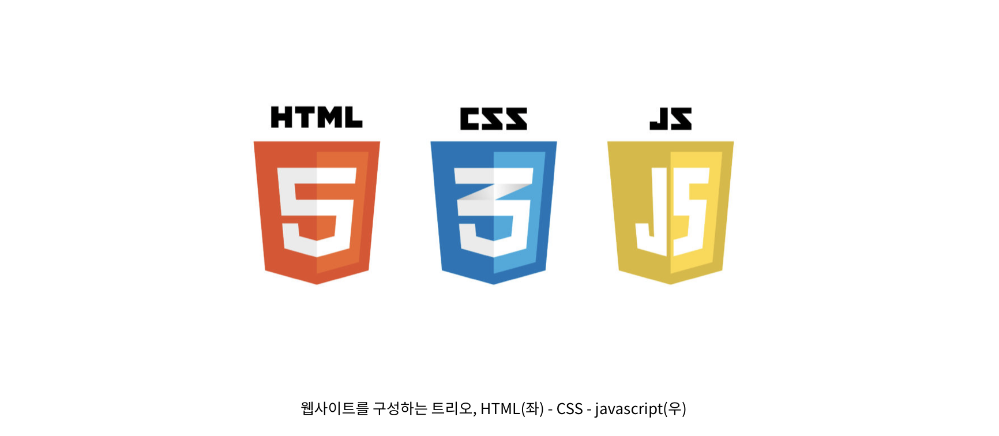
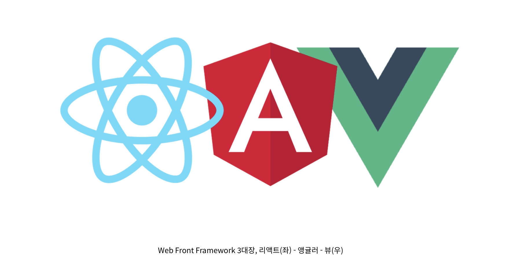

# 기초 Frontend 지식
- ## [1] what is frontEnd?
__"프론트엔드(Front-End) 개발이란, 웹이나 앱을 사용하는 유저가 
눈으로 보는 모든 화면의 요소들을 개발한다."__
  
프론트엔드 개발의 사전적 수행 직무는,
백엔드(Back-End) API (Application Programming Interface)에서 가져온 데이터의 출력, 입력을 통한 비지니스 로직 구성과 유저가 사용하는 유저 인터페이스를 개발한다.
  
**실무에서 경험한 수행 직무는,**
백엔드 개발자가 건네주는 API 문서 혹은 API 정보를 공유 받아 서버에서 제공해주는 데이터를 가져와서 화면에 나타나게 해주는 것이 기본이며, 서비스를 사용하는 흐름에 따라 데이터를 가공하거나 선별하여 해당 단계에서 필요한 데이터만 유저가 볼 수 있도록 한다.
  
### (1) 프론트엔드 개발자가 되려면?
프론트엔드 개발자를 목표로 한다면, 웹 퍼블리싱(HTML, CSS, javascript)에 대한 공부는 물론이고, UI/UX와 네트워크에 대한 공부를 해야한다. 갑자기 뜬금없이 UI/UX가 나오고 네트워크가 나온다. UI/UX는 디자인과 밀접하고, 네트워크는 서버와 밀접하다고 생각하고 있지 않나? 반은 맞고 반은 틀렸다. 
  
- **1.1 프론트엔드의 UI/UX**
먼저 프론트엔드에서 말하는 UI/UX는 모양적인(Visual) 부분이 아니다. 사용자가 원하는 정보를 얻기 위해 필요한 화면을 제공해주는 것이다. 예를 들어 유저가 사용하는 서비스에 회원가입을 하려고 하는데 자신의 정보를 입력할 수 있는 창이 없다면? 회원가입을 하지 못한다. 그래서 프론트엔드 개발자는 입력창, 즉 UI(User Interface)를 유저에게 제공해야 한다.
 
잠깐만, 그러면 프론트엔드 개발자는 웹 퍼블리셔와 비슷한데? 맞다. 하지만 프론트엔드 개발자는 취급하는 기술적 범위가 더욱 넓다. 이 부분은 글의 마지막에서 정리하겠다.
 
다시 돌아와서, 회원가입에 필요한 정보를 입력하는 창을 유저에게 제공했다. 지금이야 웹사이트(WebSite)나 모바일 앱(App)은 보편적이 되어 회원가입이 익숙하지만, 처음 사용하는 유저일 경우, 올바른 정보를 입력하여 회원가입을 할 수 있어야 한다. 이를 안내해주기 위해 UX(User Experience)도 알아야 한다.
  
- **1.2 프론트엔드의 네트워크**
네트워크는 왜 알아야 할까? 프론트엔드 개발자가 서버를 구축할까? 아니다. 데이터베이스와 통신을 할까? 아니다. 그런데 필요한 이유는 무엇일까. 답은 서버와 데이터베이스를 다루는 백엔드 개발자와 일하기 때문이다.
 
실제로 내가 회사에서 근무하며 프론트엔드 개발 병아리 시절에 있었던 일이다. 백엔드 개발자가 API 정보를 내게 공유해줬고, 나는 그 정보를 토대로 화면에 데이터를 나타내기 위해 데이터 바인딩(Data Binding) 작업을 진행했다. 그런데 왠걸, 데이터가 화면에 나오지 않았다. 코드가 잘못되었는지 지우고 다시 작성해도 동일한 현상이 있었다.
 
그래서 오류를 분석해보니, 400 Bad Request 라는 메시지를 보여줬다. 그래서 나는 당당하게 백엔드 개발자에게 해당 메시지가 나온다고 확인해달라고 요청했고, 백엔드 개발자가 실소를 머금었던 기억이 있다.
 
400 Bad Request는 클라이언트에서 서버에 요청하는 정보가 잘못되었을 때 나오는 에러 코드다. 무슨 말인지 이해가 안되는가? 주방에서 김치볶음밥을 준비해놨는데, 나는 제육볶음을 달라고 한거다. 즉, 잘못된 정보를 내가 보내고 있으면서 백엔드 개발자에게 오류를 확인해달라는 미스를 범한 거다.
 
위 에러 코드는 HTTP Status Code라는 네트워크의 기본적인 지식만 알았더라면 해당 오류는 내가 알고 처리할 수 있는 수준이었다. 지금 이 글을 적고 있는 순간에도 이 당시 일을 떠올리면 얼굴이 화끈거린다.
 
협업을 하기 위해서는 협업하는 사람의 직무를 어느정도 이해하고 있어야 협업하기가 수월하듯, 프론트엔드 개발자도 백엔드 개발도 어느정도 알아둘 필요는 있다. 그 중에서 필수적으로 알아야하는 부분은 바로 네트워크다.
  
### (2). 프론트엔드가 갖춰야 할 기술적 소양
지금까지 프론트엔드 개발자가 되기 위해 무엇을 공부해야 되는지 알았다면, 프론트엔드 개발자가 갖춰야 할 기술적 소양을 소개한다.

위 이미지처럼 HTML, CSS, javascript는 웹 퍼블리셔의 핵심 역량으로, 프론트엔드 개발자가 옵션으로 가지고 있으면 좋은 기술들이지만, 개인적으로는 필수적으로 익혀두라고 권하고 싶다. 외주 프로젝트를 진행하면서 웹 퍼블리싱을 담당했었는데, 프론트엔드 개발자가 데이터를 연결하는 과정에서 HTML 구조를 완전히 무너뜨린 적이 있었다. 프론트엔드 개발자는 사용자가 필요한 데이터를 보여주는 역할을 한다. 이는 HTML을 필연적으로 건드릴 수 있음을 의미한다. 
 
내가 작업해둔 것을 누군가 망가뜨린다고 생각해보자. 스트레스 받지 않는가? 더욱이 프론트엔드 개발자는 클라이언트 단에서 일어나는 모든 이슈에 대해 책임을 져야 하는 포지션이다. 그런데 웹 퍼블리싱에 대한 지식이 없어 프론트엔드 개발이 원활하지 않다? 프론트엔드 개발자로서의 자격이 없다!
 
이미 웹 퍼블리싱에 대한 지식이 충분하다면, 더 필요한 기술적 소양은 무엇일까?
 

#### 1. 네트워크 (Network)
네트워크의 중요성은 위 문단에서 설명했으니 넘어가도록 하겠다.
 

#### 2. 버전 관리 (Version Control)
버전 관리는관리 측면에서 필요하다. 프론트엔드 개발을 한다는 것은 클라이언트와 서버가 분리된다는 것을 의미하기 때문에, 클라이언트 버전 관리는 프론트엔드 개발자에게 책임이 있다. 그러므로 버전 관리에 대한 지식은 필수적으로 필요하다. 대표적으로 Git을 많이 사용한다.
 

#### 3. 웹 프론트 프레임워크 (Web Front Framework)

개발자들 사이에는 그런 말이 있다. "개발 환경만 세팅하면 일단 50%는 진행한거야". 맞는 말이다. 예전에는 웹사이트 개발 환경을 구축하려면 많은 시간과 노력이 필요했다. 하지만 개발자들이 누군가. 한 없이 게을러지고 싶은 사람들이다. 명령어 몇 줄만으로 웹사이트 개발 환경을 구축할 수 있도록 프레임워크를 만들어버렸다.
 
대표적으로 리액트(React), 앵귤러(Angular), 뷰(Vue)가 있다. 많은 커뮤니티에서 앵귤러가 낫니, 리액트가 낫니, 뷰가 낫니 하지만 프로젝트 방향성에 맞게 사용하면 된다. 프레임워크는 목적에 맞게 사용하는 도구지, 어떤 프레임워크가 좋고 안좋고가 아니다.
 
웹 프론트 프레임워크는 다음에 별도로 다뤄보도록 하겠다.
  

#### 4. modern javascript
자바스크립트면 자바스크립트지, 모던 자바스크립트는 뭔가 할 것이다. 자바스크립트는 지속적으로 업데이트 되어 오고 있고, 웹 개발에 있어 독보적인 웹 프로그래밍 언어다. 하지만 한계점이 분명히 존재했고 꾸준한 버전 업데이트를 통해 발전해왔는데, ECMA Script 6 (ES6)가 명세가 발표되면서 자바스크립트에 극적인 변화가 일어났다.
 
기존 자바스크립트와 다른 부분이 많아져서 ES6 이후 자바스크립트를 modern javascript라고 명명하기 시작했다. 그리고 웹 프로그래밍 언어의 한계를 벗어나 응용 프로그램 쪽으로도 영역을 넓히고 있어 프론트엔드 개발자는 필수적으로 갖춰야 한다.
 
이외 다른 필요한 것들은 여전히 많지만, 이정도만 익혀둬도 프론트엔드 개발자 초입에는 다다랐다고 보면 된다!

### (3). 웹 퍼블리셔와 프론트엔드 개발자, 뭐가 더 좋을까?
웹 퍼블리셔와 프론트엔드 개발자 중 혼동하고 있는 사람들이 분명히 있을 것이다. 필자 또한 그랬다. 이 글을 쓰고 있는 지금도 프론트엔드 개발보다는 웹 퍼블리싱 비중이 더 높지만, 언젠가는 프론트엔드 개발의 비중이 더 높아지길 희망하고 있다.
 
웹사이트를 열었을 때 나타나는 애니메이션들이나 인터랙션 등을 심도있게 하고 싶다면 웹 퍼블리셔가 되는 것을 추천한다. 디자인적인 관점에서 밀접한 것은 프론트엔드 개발보다는 웹 퍼블리셔가 더 시간을 할애할 수 있기 때문이다.
 
웹사이트의 구조나 형상관리 등 아키텍처 개념에 더 집중하고 싶다면 프론트엔드 개발자로 커리어를 쌓는 것을 추천한다. 그리고 백엔드 쪽으로도 좀 더 범위를 넓혀서 공부한다면, 프론트와 백을 모두 아우르는 풀스택 개발자를 향해 한 단계 더 업그레이드 할 수 있을 것이다.

- ## definition and difference in HTML and CSS and JavaScript
  웹사이트는 크게 3가지 요소로 구성
HTML (Hyper Text Markup Language), CSS (Cascading Style Sheets), 자바스크립트 (Javascript)

__HTML(Hyper Text Markup Language)__
- 웹 문서를 만들기 위하여 사용하는 기본적인 웹 언어의 한 종류이다
- 웹 페이지에서 제목, 이미지, 동영상, 문단, 표, 등을 정의하고 그 구조와 의미를 부여하는 정적 언어이다.
- 웹의 구조를 담당 한다.
 
__CSS(Cascading Style Sheets)__
- 마크업 언어(HTML, XML, XHML 등)가 실제 표시되는 방법(색상, 레이아웃, 크기, 폰트 등)을 지정하여 콘텐츠 구조를 꾸며주는 정적 언어이다.
- 웹의 시각적인 표현을 담당한다.
 
__JS(JavaScript)__
- HTML 문서의 정적이고 단조로운 한계를 극복하기 위해서 넷스케이프(Netscape)사가 만든 LiveScript가 이름을 달리 한 것으로 브라우저 자체에서 내장된 해석기능을 이용한 클라이언트 기반의 일종의 스크립트 언어이다.
- 콘텐츠를 바꾸고 움직이는 등 페이지를 동적으로 꾸며주는 역할을 하는 프로그래밍 언어이다.
- 웹의 동적 처리를 담당한다.
 
쉽게 정리하면 HTML로 웹페이지의 뼈대를 만들고 CSS로 웹 페이지의 옷을 입히고, Javascript로 기능을 추가한다고 할 수 있다.

- ## HTML
- https://opentutorials.org/course/3084
- ## CSS
- https://opentutorials.org/course/3086
- ## JavaScript
- https://opentutorials.org/course/3085