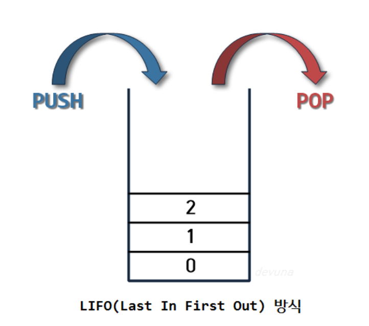

- [\[1\]. IP](#1-ip)
- [\[2\]. Stack \& Queue](#2-stack--queue)

## [1]. IP

#### 1. 공인IP
- 세상에서 단 하나뿐인 주소
- 외부(인터넷망)에 연결되는 통로 
#### 2. 사설IP

- 임의대로 만든 가상주소
- 보통 공유기에 연결하면 사설 IP가 할당
### 3.  포트포워딩

공인IP  xxx.xxx.xxx:?? 로 들어온것은 
우리 사설IP yyy.yyy.yyy:!!로 연결시켜줘! 라고 매핑을 해놓는것

## [2]. Stack & Queue

### stack 이란?
 "쌓아 올린다는 것" 
스택자료구조 == 책츨 쌓는 것처럼 차곡차곡 쌓아올린 형태의 자료구조
<ㅗ> 1. 스택의 특징

- 위의 사진ㅇ처럼 같은 구조와 크기의 자료를 정해진 방향으로만 쌓을수 있다.
- __top으로 정한 곳__을 통해서만 접근 가능.
- 삽입되는 새 자료는 top이 가리키는 자료의 위에 쌓이게 된다.
- 스택에서 자료를 삭제할 때도 top를 통해서만 가능하다.
- 스택에서 top를 통해 __삽입하는 연산을__ 'push', top를 통한 __삭제하는__ 연산을 pop.
- __가장 마지막에 삽입된 자료가 가장 먼저 삭제된다 == 후입선출(Last-In-First_Out)__
  + 비어 있는 스택에서 원소를 추출하려고 할때 stackunderFolow라고 하며
    스택이 넘치는 경우 stackOverflow라고한다.

<h3> 2. 스택의 활용예시</h3>
스택의 특징인  후입선출(LIFO)을 활용하여 여러 분야에서 활용 가능하다.
- 웹 브라우저 방문기록 (뒤로 가기) : 가장 나중에 열린 페이지부터 다시 보여준다.
- 역순 문자열 만들기 : 가장 나중에 입력된 문자부터 출력한다.
- 실행 취소 (undo) : 가장 나중에 실행된 것부터 실행을 취소한다.
- 후위 표기법 계산
- 수식의 괄호 검사 (연산자 우선순위 표현을 위한 괄호 검사)

### Queue란?
사전적 의미는 (무엇을 기다리는 사람, 자동차 등의) 줄 , 혹은 줄을 서서 기다리는 것을 의미한다.
놀이동산에서 줄을 서서 기다리는 것, 은행에서 먼저 온 사람의 업무를 창구에서 처리하는 것과 같이 선입선출(FIFO,First in first out) 방식의 자료구조를 말한다. 

<h3> 1. Queue의 특징</h3>
- 정해진 한 곳(top)을 통해서 삽입, 삭제가 이루어지는 스택과는 달리
- 큐는 한쪽 끝에서 삽입 작업이, 다른 쪽 끝에서 삭제 작업이 양쪽으로 이루어진다.
- 이때 삭제연산만 수행되는 곳을 프론트(front), 삽입연산만 이루어지는 곳을 리어(rear)로 정하여
    각각의 연산작업만 수행된다. 이때, 큐의 리어에서 이루어지는 삽입연산을 인큐(enQueue)
    프론트에서 이루어지는 삭제연산을 디큐(dnQueue)라고 부른다.

  - 큐의 가장 첫 원소를 front / 가장 끝 원소를 rear
  - 큐는 들어올 때 rear로 들어오지만 나올때는 front부터 빠지는 특성
  - 접근방법은 가장 첫 원소와 끝 원소로만 가능
  - 가장 먼저 들어온 프론트 원소가 가장 먼저 삭제
- 즉, 큐에서 프론트 원소는 가장 먼저 큐에 들어왔던 첫 번째 원소가 되는 것이며,
리어 원소는 가장 늦게 큐에 들어온 마지막 원소가 되는 것이다.

<h3> 2. Queue의 활용 예시</h3>
 
큐는 주로 데이터가 입력된 시간 순서대로 처리해야 할 필요가 있는 상황에 이용한다.
- 우선순위가 같은 작업 예약 (프린터의 인쇄 대기열)
- 은행 업무
- 콜센터 고객 대기시간
- 프로세스 관리
- 너비 우선 탐색(BFS, Breadth-First Search) 구현
- 캐시(Cache) 구현