# 인터넷
## [1] 인터넷은 어떻게 작동하는가
  ### (1) 인터넷은 어떻게 동작하는가
   ####  {1} 요약
인터넷은 웹의 핵심적인 기술입니다. 인터넷의 가장 기본적인 것은, 컴퓨터들이 서로 통신 가능한 거대한 네트워크라는 것입니다.

인터넷의 역사는 잘 알려지지 않았습니다. 인터넷은 1960년 대 미육군에서 기금한 연구 프로젝트에서 시작되었습니다. 그리고 1980년 대에 많은 국립 대학과 비공개 기업의 지원으로 공공의 기반으로 변화되었습니다. 인터넷을 지원하는 다양한 기술은 시간이 지남에 따라 진화 해 왔지만 작동 방식은 그다지 변하지 않았습니다. 인터넷은 모든 컴퓨터를 연결하고 어떤 일이 있어도 연결 상태를 유지할 수있는 방법을 찾는 방법입니다.
  ####     {2} 활동적으로 배우기

https://www.youtube.com/watch?v=7_LPdttKXPc
How the internet Works in 5 minutes: Aaron Titus의 인터넷에 대한 기초를 이해하기 위한 5분짜리 동영상

####       {3} 깊게 들어가기
 - #####          1. 단순한 네크워크
  두 개의 컴퓨터가 통신이 필요할 때, 우리는 다른 컴퓨터와 물리적으로 (보통 이더넷 케이블) 또는 무선으로 (예를 들어, WiFi 나 Bluetooth 시스템) 연결되어야 합니다. 모든 현대 컴퓨터들은 이러한 연결 중 하나를 이용하여 연결을 지속할 수 있습니다.
__Note: 이 글의 나머지 부분에서는 유선 케이블에 대해서만 이야기 하지만 무선 네트워크도 동일한 방식입니다.__ 

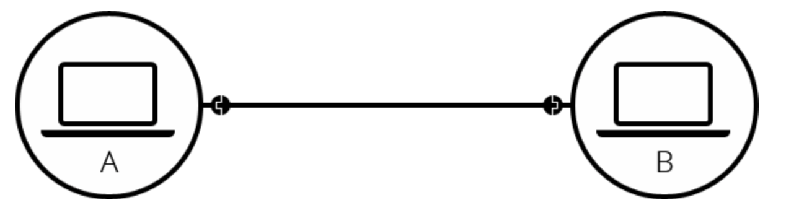
이러한 네트워크는 두 대의 컴퓨터로 제한되지 않습니다. 원하는 만큼의 컴퓨터를 연결할 수 있습니다. 그러나 이렇게 연결할 수록 매우 복잡해집니다. 예를 들어 10대의 컴퓨터를 연결하려는 경우 컴퓨터 당 9개의 플러그가 달린 45개의 케이블이 필요합니다!
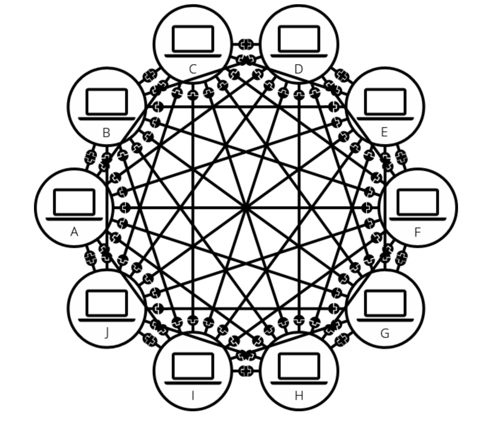
이 문제를 해결하기 위해 네트워크의 각 컴퓨터는 라우터라고하는 특수한 소형 컴퓨터에 연결됩니다. 이 라우터에는 단 하나의 작업만 있습니다. 철도역의 신호원처럼 주어진 컴퓨터에서 보낸 메시지가 올바른 대상 컴퓨터에 도착하는지 확인합니다. 컴퓨터 B에게 메시지를 보내려면 컴퓨터 A가 메시지를 라우터로 보내야하며, 라우터는 메시지를 컴퓨터 B로 전달하고 메시지가 컴퓨터 C로 배달되지 않도록해야합니다.

이 라우터를 시스템에 추가하면 10대의 컴퓨터 네트워크에는 10개의 케이블만 필요합니다. 각 컴퓨터마다 단일 플러그와 10개의 플러그가 있는 하나의 라우터가 필요합니다.
에 연결합니다. ISP는 모두 함께 연결되는 몇몇 특수한 라우터를 관리하고 다른 ISP의 라우터에도 액세스 할 수 있는 회사입니다. 따라서 우리 네트워크의 메시지는 ISP 네트워크의 네트워크를 통해 대상 네트워크로 전달됩니다. 인터넷은 이러한 전체 네트워크 인프라로 구성됩니다.

- #####           3. 컴퓨터 찾기
컴퓨터에 메시지를 보내려면 메시지를 받을 특정 컴퓨터를 지정해야합니다. 따라서 네트워크에 연결된 모든 컴퓨터에는 IP 주소 (IP는 인터넷 프로토콜을 나타냄)라는 고유한 주소가 있습니다. 주소는 점으로 구분 된 네 개의 숫자로 구성된 주소입니다 . 예: 192.168.2.10.

컴퓨터는 이러한 주소로 다른 컴퓨터를 찾아가는데 문제가 없습니다. 그러나 우리들은 IP주소를 기억하기 어렵죠. 그래서 우리는 '도메인 이름' 이라고하는 사람이 읽을 수 있는 IP 주소의 이름을 지정할 수 있습니다. 예를 들어 'google.com'은 IP 주소로  '173.194.121.32' 입니다. 따라서 '도메인 이름'은 'IP주소'보다 인터넷을 사용하기에 쉽습니다.
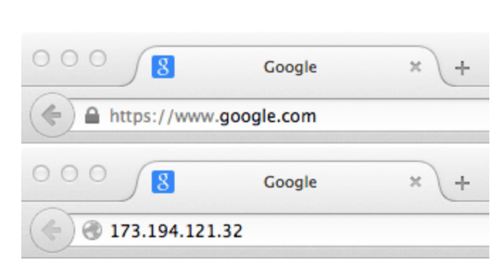

웹 브라우저를 사용하여 웹을 탐색 할 때 일반적으로 도메인 이름을 사용하여 웹 사이트에 접속합니다. 그것은 인터넷과 웹이 같은 것을 의미할까요? 그렇게 간단하지 않습니다. 앞에서 보았 듯이 인터넷은 수십억 대의 컴퓨터를 모두 연결하는 기술 인프라입니다. 이러한 컴퓨터들 중에 일부는 '웹 서버'로서 웹 브라우저가 이해할 수 있는 서비스를 제공합니다. 인터넷은 인프라이며, 웹은 그 인프라 기반 위에 구축된 서비스입니다. 웹 뿐만 아니라 인터넷 위에 구축된 다른 서비스들(이메일, IRC (en-US) 등)도 있음을 알아야합니다.
- #### 다음단계
    - How the Web works(웹이 작동하는 방법)
Understanding the difference between a web page, a web site, a web server and a search engine(웹 페이지, 웹 사이트, 웹 서버, 검색 엔진의 차이점 이해하기)
Understanding domain names(도메인 이름 이해하기)

### (2) 인터넷의 작동원리
  ####  1. 인터넷이란?
여러분들이 편하게 쓰는 인터넷은 사실 오랜 역사와 생각보다 복잡하게 구성이 되어있습니다.
일단 인터넷을 알기 전에 우리는 TCP/IP가 먼지에 대해서 알아야 합니다.
  #####    TCP/IP란?
TCP/IP가 나타난 이유는 먼저 컴퓨터간의 통신을 위해서입니다. 
TCP/IP는 컴퓨터와 컴퓨터간의 지역네트워크(LAN) 광역네트워크(WAN)에서 원할한 통신을 가능하도록 하기위한 통신규약으로 정의할 수 있습니다. 최초는 ARPANET(최초의 컴퓨터)로 시작이 되었으며 미국방위통신청에서 컴퓨터간의 통신을 위해서 TCP/IP를 사용하도록 한것이 그 시초가 되었습니다.

기본적인 역사는 이렇습니다. 자 이젠 왜 컴퓨터간의 통신을 위해서 TCP/IP 선택한 이유는 TCP/IP의 개방성에 그 정답이있습니다. 즉 하드웨어, 운영체제, 접속매체에 관계없이 동작할수있다는 점 때문에 인터넷 통신을 위한 핵심으로 선택이 되었습니다. 그리고 이름에서도 TCP/IP의 2개의 프로토콜이 이루어져 있습니다. 그 이유는 IP기반에 TCP가 사용되서 이렇게 불리어집니다. 쉽게 말해 IP 프로토콜위에 TCP 프로토콜이 놓이게된겁니다.

IP - 네트워크 상에서 컴퓨터는 고유한 주소가 있습니다. 컴퓨터의 주소는 인터넷에 접속할때 컴퓨터 각각에 부여받습니다. 집 주소나 전화 번호 처럼 말이죠, 이 주소는 총 4바이트로 이루어져있습니다.
예를 들어서 192.168.2.1 이런식으로요 만약 내 컴퓨터의 IP주소가 궁금하다면 윈도우라면 cmd에서 ipconfig 유닉스 계열이면 ifconfig로 치면 주소가 나옵니다. 

TCP - 저번 글에 클라이언트와 서버 이야기 나왔죠? 그렇게 데이터를 주고 받을수있는게 TCP 때문이죠 즉 클라이언트와 서버간에 데이터를 신뢰성있게 전달하기 위해 만들어진 프로토콜입니다. 그리고 TCP는 근거리 통신망(LAN), 원거리 통신망(WAN), 인트라넷, 인터넷 등 컴퓨터에서 실행되는 프로그램 간에 일련의 데이터를 안정적으로 순서대로 에러없이 데이터를 교환할 수 있게합니다. 

기본적인 IP와 TCP에 대한 정보입니다. 종류는 많지만 일단 인터넷을 알기 위해서는 정도만 알면됩니다.

본격적으로 인터넷이란 각 컴퓨터들간의 TCP/IP 통신 프로토콜을 이용해서 서로 데이터를 주고 받도록한 네트워크를 말합니다. 또는 네트워크의 네트워크를 구현하여 모든 컴퓨터를 하나의 통신망 안에 연결하고자 하는 의도엣 인터넷이라고도 합니다.


  ## [2] HTTP는 무엇인가
  ### (1) HTTP란 무엇인가
  __HTTP (HyperText Transfer Protocol)__
  텍스트 기반의 통신 규약으로 인터넷에서 데이터를 주고받을 수 있는 프로토콜이다. 이렇게 규약을 정해두었기 때문에 모든 프로그램이 이 규약에 맞춰 개발해서 서로 정보를 교환할 수 있게 되었다.
  __HTTP 동작__
  클라이언트 즉, 사용자가 브라우저를 통해서 어떠한 서비스를 url을 통하거나 다른 것을 통해서 요청(request)을 하면 서버에서는 해당 요청사항에 맞는 결과를 찾아서 사용자에게 응답(response)하는 형태로 동작한다.

- 요청 : client -> server
- 응답 : server -> client

HTML 문서만이 HTTP 통신을 위한 유일한 정보 문서는 아니다.
Plain text로 부터 JSON 데이터 및 XML과 같은 형태의 정보도 주고 받을 수 있으며, 보통은 클라이언트가 어떤 정보를 HTML 형태로 받고 싶은지, JSON 형태로 받고 싶은지 명시해주는 경우가 많다.
__HTTP 특징__
- HTTP 메시지는 HTTP 서버와 HTTP 클라이언트에 의해 해석이 된다.
- TCP/ IP를 이용하는 응용 프로토콜이다.
(컴퓨터와 컴퓨터간에 데이터를 전송 할 수 있도록 하는 장치로 인터넷이라는 거대한 통신망을 통해 원하는 정보(데이터)를 주고 받는 기능을 이용하는 응용 프로토콜)
- HTTP는 연결 상태를 유지하지 않는 비연결성 프로토콜이다.
(이러한 단점을 해결하기 위해 Cookie와 Session이 등장하였다.)
- HTTP는 연결을 유지하지 않는 프로토콜이기 때문에 요청/응답 방식으로 동작한다.
- 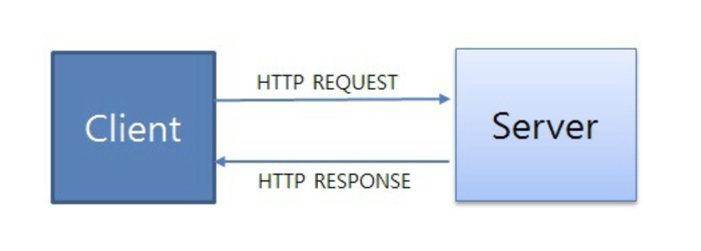
__예시로 알아보는 HTTP__
서버 : 어떠한 자료에 대한 접근을 관리하는 네트워크 상의 시스템 (요청에 대한 응답을 보내준다.)
클라이언트 : 그 자료에 접근할 수 있는 프로그램
Ex) 웹 브라우저, 핸드폰 어플리케이션 등...
클라이언트 프로그램에서 사용자가 회원가입을 시도하게 되면, 서버로 회원정보를 보내게 되고 서버는 회원 정보를 저장해주기도 한다. 이 과정에서 클라이언트와 서버 간의 교류가 HTTP라는 규약을 이용하여 발생하게 된다.
__Request (요청)__
클라이언트가 서버에게 연락하는 것을 요청이라고 하며 요청을 보낼때는 요청에 대한 정보를 담아 서버로 보낸다.
__예시로 알아보는 Request__
서버가 주문서를 받아 클라이언트가 어떤 것을 원하는지 파악할 수 있게 한다. 이처럼 요청은 식당에서 주문서를 작성하는 것과 같다고 생각하면 된다
__Request Method (요청의 종류)__
- GET : 자료를 요청할 때 사용
- POST : 자료의 생성을 요청할 때 사용
- PUT : 자료의 수정을 요청할 때 사용
- DELETE : 자료의 삭제를 요청할 때 사용

__Request HTTP 메시지 예시__
```
GET https://velog.io/@surim014 HTTP/1.1								// 시작줄
User-Agent: Mozilla/5.0 (Windows NT 10.0; Win64; x64) ...			  // 헤더
Upgrade-Insecure-Requests: 1
```
```js
1. 시작줄 (첫 줄)

첫 줄은 시작줄로 메서드 구조 버전으로 구성되었다.

GET : HTTP Method
https://velog.io/@surim014 : 사이트 주소
HTTP/1.1 : HTTP 버전
2. 헤더 (두 번째 줄부터)

두번째 줄부터는 헤더이며 요청에 대한 정보를 담고 있다. User-Agent, Upgrade-Insecure-Requests 등등이 헤더에 해당되며 헤더의 종류는 매우 많다.

3. 본문 (헤더에서 한 줄 띄고)

본문은 요청을 할 때 함께 보낼 데이터를 담는 부분이다. 현재 예시에는 단순히 주소로만 요청을 보내고 있고 따로 데이터를 담아 보내지 않기 때문에 본문이 비어있다.
```
__Response (응답)__
서버가 요청에 대한 답변을 클라이언트에게 보내는 것을 응답이라고 한다.
__Status Code (상태 코드)__
상태 코드에는 굉장히 많은 종류가 있다. 모두 숫자 세 자리로 이루어져 있으며, 아래와 같이 크게 다섯 부류로 나눌 수 있다.

- 1XX (조건부 응답) : 요청을 받았으며 작업을 계속한다.
- 2XX (성공) : 클라이언트가 요청한 동작을 수신하여 이해했고 승낙했으며 성공적으로 처리했음을 가리킨다.
- 3XX (리다이렉션 완료) : 클라이언트는 요청을 마치기 위해 추가 동작을 취해야 한다.
- 4XX (요청 오류) : 클라이언트에 오류가 있음을 나타낸다.
- 5XX (서버 오류) : 서버가 유효한 요청을 명백하게 수행하지 못했음을 나타낸다.
__Resonse HTTP 메시지 예시__
```java
HTTP/1.1 200 OK														// 시작줄
Connection: keep-alive												 // 헤더
Content-Encoding: gzip												 
Content-Length: 35653
Content-Type: text/html;

<!DOCTYPE html><html lang="ko" data-reactroot=""><head><title...
```
```js
1. 시작줄 (첫 줄)

첫 줄은 버전 상태코드 상태메시지로 구성되어 있다. 200은 성공적인 요청이었다는 뜻이다.

2. 헤더 (두 번째 줄부터)

두 번째 줄부터는 헤더로 응답에 대한 정보를 담고 있다.

3. 본문 (헤더 뒤부터)

응답에는 대부분의 경우 본문이 있다. 보통 데이터를 요청하고 응답 메시지에는 요청한 데이터를 담아서 보내주기 때문이다. 응답 메시지에 HTML이 담겨 있는데 이 HTML을 받아 브라우저가 화면에 렌더링한다.
```
#### 참고사이트
https://www.vanillacoding.co
https://www.zerocho.com/category/HTTP/post/5b344f3af94472001b17f2da
https://ko.wikipedia.org/wiki/HTTP_상태_코드
https://toma0912.tistory.com/69
https://roydest.tistory.com/entry/HTTP란


  ## [3] 브라우저들(크롬,파이어폭스등)과 그들의 작동원리
  ### (1)
  2012.05.18|305820
이 글은 이스라엘 개발자 탈리 가르시엘(Tali Garsiel)이 html5rocks.com에 게시한 "How Browsers Work: Behind the scenes of modern web browsers"를 번역한 글입니다. 탈리 가르시엘은 몇 년간 브라우저 내부와 관련된 공개 자료를 확인하고, C++ 코드 수백만 줄 분량의 WebKit이나 Gecko 같은 오픈소스 렌더링 엔진의 소스 코드를 직접 분석하면서 어떻게 브라우저가 동작하는지 파악했습니다.
  #### 1. 소개
브라우저는 아마도 가장 많이 사용하는 소프트웨어일 것이다. 이 글을 통해 브라우저가 어떻게 동작하는지 설명하려고 한다. 이 글을 읽고 나면, 브라우저 주소 창에 naver.com을 입력했을 때 어떤 과정을 거쳐 네이버 페이지가 화면에 보이게 되는지 알게 될 것이다.
  

  #### 2. 이 글에서 설명하는 브라우저
최근에는 인터넷 익스플로러, 파이어폭스, 사파리, 크롬, 오페라 이렇게 다섯 개의 브라우저를 많이 사용하지만 나는 파이어폭스, 크롬, 사파리와 같은 오픈소스 브라우저를 예로 들 것이다. 사파리는 부분적으로 오픈소스이다. StatCounter 브라우저 통계에 의하면 2012년 3월 현재 파이어폭스, 사파리, 크롬의 점유율은 62.57%에 달한다. 오픈소스 브라우저가 시장의 상당 부분을 차지하게 된 것이다.

  #### 3. 브라우저의 주요 기능
  브라우저의 주요 기능은 사용자가 선택한 자원을 서버에 요청하고 브라우저에 표시하는 것이다. 자원은 보통 HTML 문서지만 PDF나 이미지 또는 다른 형태일 수 있다. 자원의 주소는 URI(Uniform Resource Identifier)에 의해 정해진다.
브라우저는 HTML과 CSS 명세에 따라 HTML 파일을 해석해서 표시하는데 이 명세는 웹 표준화 기구인 W3C(World Wide Web Consortium)에서 정한다. 과거에는 브라우저들이 일부만 이 명세에 따라 구현하고 독자적인 방법으로 확장함으로써 웹 제작자가 심각한 호환성 문제를 겪었지만 최근에는 대부분의 브라우저가 표준 명세를 따른다.
브라우저의 사용자 인터페이스는 서로 닮아 있는데 다음과 같은 요소들이 일반적이다.
- URI를 입력할 수 있는 주소 표시 줄
- 이전 버튼과 다음 버튼
- 북마크
- 새로 고침 버튼과 현재 문서의 로드를 중단할 수 있는 정지 버튼
- 홈 버튼
브라우저의 사용자 인터페이스는 표준 명세가 없음에도 불구하고 수 년간 서로의 장점을 모방하면서 현재에 이르게 되었다. HTML5 명세는 주소 표시줄, 상태 표시줄, 도구 모음과 같은 일반적인 요소를 제외하고 브라우저의 필수 UI를 정의하지 않았다. 물론 파이어폭스의 다운로드 관리자와 같이 브라우저에 특화된 기능도 있다.
  #### 4. 브라우저의 기본 구조
  - 브라우저의 주요 구성 요소는 다음과 같다.(1.1)
    - 사용자 인터페이스 - 주소 표시줄, 이전/다음 버튼, 북마크 메뉴 등. 요청한 페이지를 보여주는 창을 제외한 나머지 모든 부분이다.
    - 브라우저 엔진 - 사용자 인터페이스와 렌더링 엔진 사이의 동작을 제어.
    - 렌더링 엔진 - 요청한 콘텐츠를 표시. 예를 들어 HTML을 요청하면 HTML과 CSS를 파싱하여 화면에 표시함.
    - 통신 - HTTP 요청과 같은 네트워크 호출에 사용됨. 이것은 플랫폼 독립적인 인터페이스이고 각 플랫폼 하부에서 실행됨.
    - UI 백엔드 - 콤보 박스와 창 같은 기본적인 장치를 그림. 플랫폼에서 명시하지 않은 일반적인 인터페이스로서, OS 사용자 인터페이스 체계를 사용.
    - 자바스크립트 해석기 - 자바스크립트 코드를 해석하고 실행.
    - 자료 저장소 - 이 부분은 자료를 저장하는 계층이다. 쿠키를 저장하는 것과 같이 모든 종류의 자원을 하드 디스크에 저장할 필요가 있다. HTML5 명세에는 브라우저가 지원하는 '웹 데이터 베이스'가 정의되어 있다.
    
    - 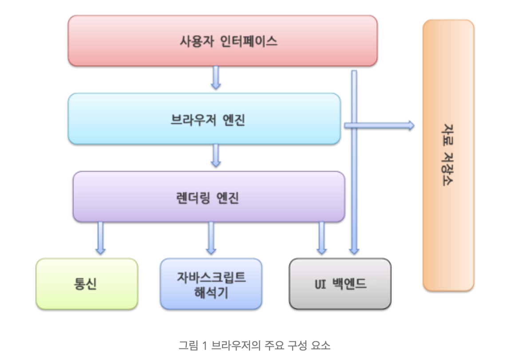
크롬은 대부분의 브라우저와 달리 각 탭마다 별도의 렌더링 엔진 인스턴스를 유지하는 것이 주목할만하다. 각 탭은 독립된 프로세스로 처리된다.

  #### 5. 렌더링 엔진
  렌더링 엔진의 역할은 요청 받은 내용을 브라우저 화면에 표시하는 일이다.
렌더링 엔진은 HTML 및 XML 문서와 이미지를 표시할 수 있다. 물론 플러그인이나 브라우저 확장 기능을 이용해 PDF와 같은 다른 유형도 표시할 수 있다. 그러나 이 장에서는 HTML과 이미지를 CSS로 표시하는 주된 사용 패턴에 초점을 맞출 것이다.

  #### 6. 렌더링 엔진들
이 글에서 다루는 브라우저인 파이어폭스와 크롬, 사파리는 두 종류의 렌더링 엔진으로 제작되었다. 파이어폭스는 모질라에서 직접 만든 게코(Gecko) 엔진을 사용하고 사파리와 크롬은 웹킷(Webkit) 엔진을 사용한다.
웹킷은 최초 리눅스 플랫폼에서 동작하기 위해 제작된 오픈소스 엔진인데 애플이 맥과 윈도우즈에서 사파리 브라우저를 지원하기 위해 수정을 가했다. 더 자세한 내용은 webkit.org를 참조한다.
  #### 7. 동작 과정
렌더링 엔진은 통신으로부터 요청한 문서의 내용을 얻는 것으로 시작하는데 문서의 내용은 보통 8KB 단위로 전송된다.
다음은 렌더링 엔진의 기본적인 동작 과정이다.
    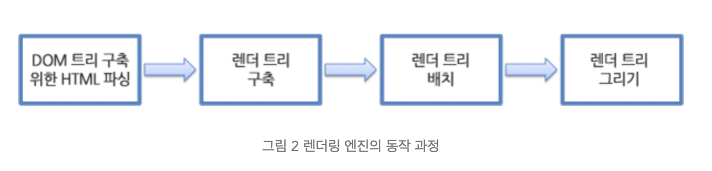
    렌더링 엔진은 HTML 문서를 파싱하고 "콘텐츠 트리" 내부에서 태그를 [DOM](http://www.html5rocks.com/en/tutorials/internals/howbrowserswork/) 노드로 변환한다. 그 다음 외부 CSS 파일과 함께 포함된 스타일 요소도 파싱한다. 스타일 정보와 HTML 표시 규칙은 ["렌더 트리"](https://www.html5rocks.com/en/tutorials/internals/howbrowserswork/)라고 부르는 또 다른 트리를 생성한다.
렌더 트리는 색상 또는 면적과 같은 시각적 속성이 있는 사각형을 포함하고 있는데 정해진 순서대로 화면에 표시된다.
렌더 트리 생성이 끝나면 배치가 시작되는데 이것은 각 노드가 화면의 정확한 위치에 표시되는 것을 의미한다. 다음은 UI 백엔드에서 렌더 트리의 각 노드를 가로지르며 형상을 만들어 내는 그리기 과정이다.
일련의 과정들이 점진적으로 진행된다는 것을 아는 것이 중요하다. 렌더링 엔진은 좀 더 나은 사용자 경험을 위해 가능하면 빠르게 내용을 표시하는데 모든 HTML을 파싱할 때까지 기다리지 않고 배치와 그리기 과정을 시작한다. 네트워크로부터 나머지 내용이 전송되기를 기다리는 동시에 받은 내용의 일부를 먼저 화면에 표시하는 것이다.
  #### 8. 동작 과정예
  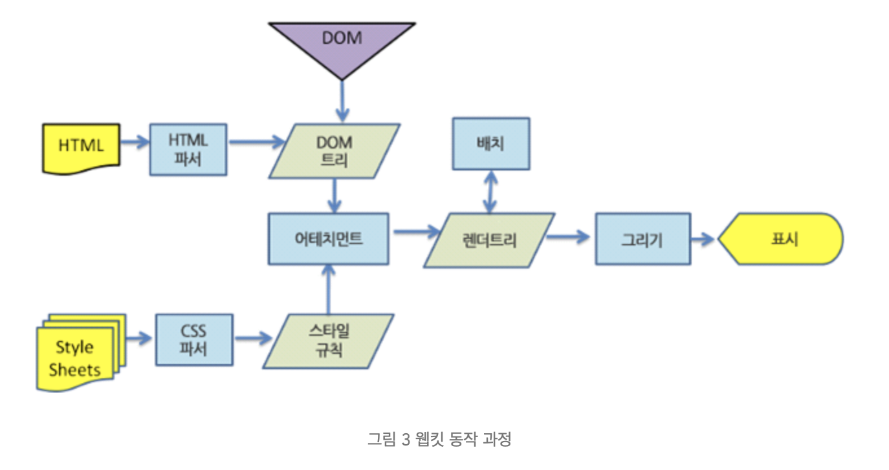
  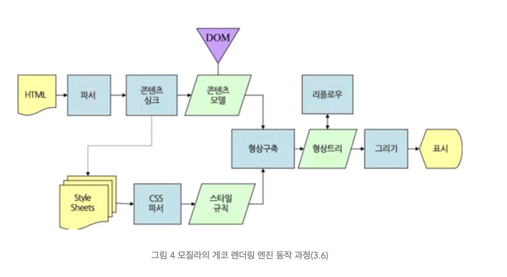
웹킷과 게코가 용어를 약간 다르게 사용하고 있지만 동작 과정은 기본적으로 동일하다는 것을 그림 3과 그림 4에서 알 수 있다.
게코는 시각적으로 처리되는 렌더 트리를 "형상 트리(frame tree)"라고 부르고 각 요소를 형상(frame)이라고 하는데 웹킷은 "렌더 객체(render object)"로 구성되어 있는 "렌더 트리(render tree)"라는 용어를 사용한다. 웹킷은 요소를 배치하는데 "배치(layout)" 라는 용어를 사용하지만 게코는 "리플로(reflow)" 라고 부른다. "어태치먼트(attachment)"는 웹킷이 렌더 트리를 생성하기 위해 DOM 노드와 시각 정보를 연결하는 과정이다. 게코는 HTML과 DOM 트리 사이에 "콘텐츠 싱크(content sink)"라고 부르는 과정을 두는데 이는 DOM 요소를 생성하는 공정으로 웹킷과 비교하여 의미있는 차이점이라고 보지는 않는다.
  #### 9. 파싱과 DOM 트리 구축
  </br>

  __파싱 일반__
  파싱은 렌더링 엔진에서 매우 중요한 과정이기 때문에 더 자세히 다룰 필요가 있다. 파싱에 대한 간단한 소개로 시작한다.
문서 파싱은 브라우저가 코드를 이해하고 사용할 수 있는 구조로 변환하는 것을 의미한다. 파싱 결과는 보통 문서 구조를 나타내는 노드 트리인데 파싱 트리(parse tree) 또는 문법 트리(syntax tree)라고 부른다.
예를 들면 2+3-1과 같은 표현식은 다음과 같은 트리가 된다.
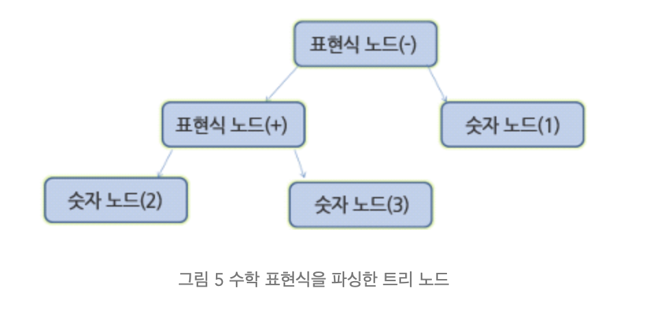
</br>

__문법__
파싱은 문서에 작성된 언어 또는 형식의 규칙에 따르는데 파싱할 수 있는 모든 형식은 정해진 용어와 구문 규칙에 따라야 한다. 이것을 [문맥 자유 문법](https://ko.wikipedia.org/wiki/문맥_자유_문법)이라고 한다. 인간의 언어는 이런 모습과는 다르기 때문에 기계적으로 파싱이 불가능하다.
</br>

__파서-어휘 분석기 조합__
파싱은 어휘 분석과 구문 분석이라는 두 가지로 구분할 수 있다.
어휘 분석은 자료를 토큰으로 분해하는 과정이다. 토큰은 유효하게 구성된 단위의 집합체로 용어집이라고도 할 수 있는데 인간의 언어로 말하자면 사전에 등장하는 모든 단어에 해당된다.
구문 분석은 언어의 구문 규칙을 적용하는 과정이다.
파서는 보통 두 가지 일을 하는데 자료를 유효한 토큰으로 분해하는 어휘 분석기(토큰 변환기 라고도 부름)가 있고 언어 구문 규칙에 따라 문서 구조를 분석함으로써 파싱 트리를 생성하는 파서가 있다. 어휘 분석기는 공백과 줄 바꿈 같은 의미 없는 문자를 제거한다.
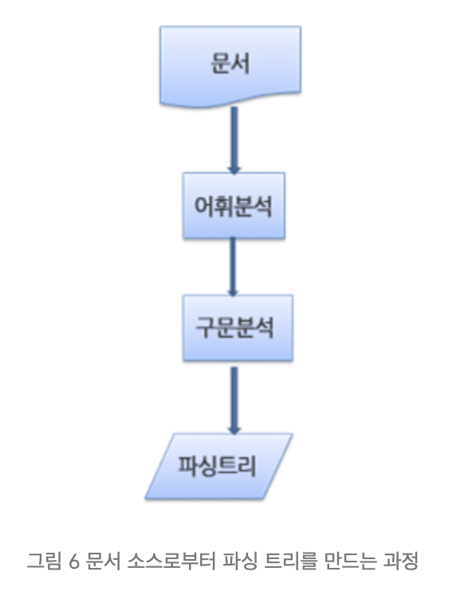
파싱 과정은 반복된다. 파서는 보통 어휘 분석기로부터 새 토큰을 받아서 구문 규칙과 일치하는지 확인한다. 규칙에 맞으면 토큰에 해당하는 노드가 파싱 트리에 추가되고 파서는 또 다른 토큰을 요청한다.
규칙에 맞지 않으면 파서는 토큰을 내부적으로 저장하고 토큰과 일치하는 규칙이 발견될 때까지 요청한다. 맞는 규칙이 없는 경우 예외로 처리하는데 이것은 문서가 유효하지 않고 구문 오류를 포함하고 있다는 의미다.
</br>

__변환__
파서 트리는 최종 결과물이 아니다. 파싱은 보통 문서를 다른 양식으로 변환하는데 컴파일이 하나의 예가 된다. 소스 코드를 기계 코드로 만드는 컴파일러는 파싱 트리 생성 후 이를 기계 코드 문서로 변환한다.
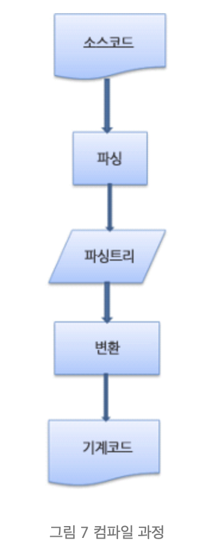
</br>

__파싱예__
그림 5에서는 수학 표현식을 파싱 트리로 만들어 보았다. 간단한 수학 언어를 정의하고 파싱 과정을 살펴 보자.
어휘: 수학 언어는 정수, 더하기 기호, 빼기 기호를 포함한다.

구문:

- 언어 구문의 기본적인 요소는 표현식, 항, 연산자이다.
- 언어에 포함되는 표현식의 수는 제한이 없다.
- 표현식은 "항" 뒤에 "연산자" 그 뒤에 또 다른 항이 따르는 형태로 정의한다.
- 연산자는 더하기 토큰 또는 빼기 토큰이다.
- 정수 토큰 또는 하나의 표현식은 항이다.

입력된 값 2+3-1을 분석해 보자.

규칙에 맞는 첫 번째 부분 문자열은 2이다. 규칙 5번에 따르면 이것은 하나의 항이다. 두 번째로 맞는 것은 2+3 인데 이것은 항 뒤에 연산자와 또 다른 항이 등장한다는 세 번째 규칙과도 일치한다. 입력 값의 마지막 부분까지 진행하면 또 다른 일치를 발견할 수 있다. 2+3은 항과 연산자와 항으로 구성된 하나의 새로운 항이라는 것을 알고 있기 때문에 2+3-1은 하나의 표현식이 된다. 2++은 어떤 규칙과도 맞지 않기 때문에 유효하지 않은 입력이 된다.
</br>

__어휘와 구문에 대한 공식적인 정의__
어휘는 보통 [정규 표현식](https://www.regular-expressions.info)으로 표현한다. 예를 들면 언어는 다음과 같이 정의될 것이다.
```java
INTEGER : 0|[1-9][0-9]*  
PLUS : +  
MINUS : -  
```
보시다시피 정수는 정규 표현식으로 정의한다.
구문은 보통 [BNF](https://ko.wikipedia.org/wiki/BNF) 라고 부르는 형식에 따라 정의한다. 언어는 다음과 같이 정의될 것이다.
```java
expression := term operation term  
operation := PLUS | MINUS  
term := INTEGER | expression 
```
문법이 [문맥 자유 문법](https://ko.wikipedia.org/wiki/문맥_자유_문법)이라면 언어는 정규 파서로 파싱할 수 있다.
 문맥 자유 문법을 쉽게 말하면 완전히 BNF로 표현 가능한 문법이다. 공식적인 정의는 위키백과의 [문맥 자유 문법](https://ko.wikipedia.org/wiki/문맥_자유_문법)을 참조한다.
 </br>

 __파서의 종류__
 파서는 기본적으로 하향식 파서와 상향식 파서가 있다. 하향식 파서는 구문의 상위 구조로부터 일치하는 부분을 찾기 시작하는데 반해 상향식 파서는 낮은 수준에서 점차 높은 수준으로 찾는다.
두 종류의 파서가 예제를 어떻게 파싱하는지 살펴보자.
하향식 파서는 2+3과 같은 표현식에 해당하는 높은 수준의 규칙을 먼저 찾는다. 그 다음 표현식으로 2+3-1을 찾을 것이다. 표현식을 찾는 과정은 일치하는 다른 규칙을 점진적으로 더 찾아내는 방식인데 어쨌거나 가장 높은 수준의 규칙을 먼저 찾는 것으로부터 시작한다.
상향식 파서는 입력 값이 규칙에 맞을 때까지 찾아서 맞는 입력 값을 규칙으로 바꾸는데 이 과정은 입력 값의 끝까지 진행된다. 부분적으로 일치하는 표현식은 파서 스택에 쌓인다.

스택	입력 값  	2+3-1 
항	+3-1 
항 연산자	3-1 
표현식	-1 
표현식 연산자	1 
표현식	 
|스택|입력값|
|------|---|
||2+3-1|
|항|+3-1 |
|항 연산자|3-1|
|표현식|-1|
|표현식 연산자|1|
|표현식 ||
상향식 파서는 입력 값의 오른쪽으로 이동하면서(입력 값의 처음을 가리키는 포인터가 오른쪽으로 이동하는 것을 상상) 구문 규칙으로 갈수록 남는 것이 점차 감소하기 때문에 이동-감소 파서라고 부른다.
</br>

__파서 자동 생성__
파서를 생성해 줄 수 있는 도구를 파서 생성기라고 한다. 언어에 어휘나 구문 규칙 같은 문법을 부여하면 동작하는 파서를 만들어 준다. 파서를 생성하는 것은 파싱에 대한 깊은 이해를 필요로 하고 수동으로 파서를 최적화하여 생성하는 것은 쉬운 일이 아니기 때문에 파서 생성기는 매우 유용하다.
웹킷은 잘 알려진 두 개의 파서 생성기를 사용한다. 어휘 생성을 위한 [플렉스(Flex)](https://ko.wikipedia.org/wiki/Flex_%28어휘분석기%29)와 파서 생성을 위한 [바이슨(Bison)](http://www.gnu.org/software/bison/)이다. 렉스(Lex)와 약(Yacc)이라는 이름과 함께 들어본 적이 있을지도 모르겠다. 플렉스는 토큰의 정규 표현식 정의를 포함하는 파일을 입력 받고 바이슨은 BNF 형식의 언어 구문 규칙을 입력 받는다.
</br>

#### 10. HTML 파서
HTML 파서는 HTML 마크업을 파싱 트리로 변환한다.
__HTML 문법 정의__
HTML의 어휘와 문법은 W3C에 의해 명세로 정의되어 있다. 현재 버전은 HTML4와 초안 상태로 진행 중인 HTML5 이다.
</br>

__문맥 자유 문법이 아님__
파싱 일반 소개를 통해 알게 된 것처럼 문법은 BNF와 같은 형식을 이용하여 공식적으로 정의할 수 있다. 
안타깝게도 모든 전통적인 파서는 HTML에 적용할 수 없다. 그럼에도 불구하여 지금까지 파싱을 설명한 것은 그냥 재미 때문은 아니다. 파싱은 CSS와 자바스크립트를 파싱하는 데 사용된다. HTML은 파서가 요구하는 문맥 자유 문법에 의해 쉽게 정의할 수 없다.
HTML 정의를 위한 공식적인 형식으로 DTD(문서 형식 정의)가 있지만 이것은 문맥 자유 문법이 아니다.
이것은 언뜻 이상하게 보일 수도 있는데 HTML이 XML과 유사하기 때문이다. 사용할 수 있는 XML 파서는 많다. HTML을 XML 형태로 재구성한 XHTML도 있는데 무엇이 큰 차이점일까?
차이점은 HTML이 더 "너그럽다"는 점이다. HTML은 암묵적으로 태그에 대한 생략이 가능하다. 가끔 시작 또는 종료 태그 등을 생략한다. 전반적으로 뻣뻣하고 부담스러운 XML에 반하여 HTML은 "유연한" 문법이다.
이런 작은 차이가 큰 차이를 만들어 낸다. 웹 제작자의 실수를 너그럽게 용서하고 편하게 만들어주는 이것이야 말로 HTML이 인기가 있었던 이유다. 다른 한편으로는 공식적인 문법으로 작성하기 어렵게 만드는 문제가 있다. 정리하자면 HTML은 파싱하기 어렵고 전통적인 구문 분석이 불가능하기 때문에 문맥 자유 문법이 아니라는 것이다. XML 파서로도 파싱하기 쉽지 않다. 
</br>

__HTML DTD__
HTML의 정의는 DTD 형식 안에 있는데 SGML 계열 언어의 정의를 이용한 것이다. 이 형식은 허용되는 모든 요소와 그들의 속성 그리고 중첩 구조에 대한 정의를 포함한다. 앞서 말 한대로 HTML DTD는 문맥 자유 문법이 아니다. 
DTD는 여러 변종이 있다. 엄격한 형식은 명세만을 따르지만 다른 형식은 낡은 브라우저에서 사용된 마크업을 지원한다. 낡은 마크업을 지원하는 이유는 오래된 콘텐츠에 대한 하위 호환성 때문이다. 현재의 엄격한 형식 DTD는 www.w3.org/TR/html4/strict.dtd 에서 확인할 수 있다.
</br>

__DOM__
"파싱 트리"는 DOM 요소와 속성 노드의 트리로서 출력 트리가 된다. DOM은 문서 객체 모델(Document Object Model)의 준말이다. 이것은 HTML 문서의 객체 표현이고 외부를 향하는 자바스크립트와 같은 HTML 요소의 연결 지점이다.
트리의 최상위 객체는 [문서](https://www.w3.org/TR/1998/REC-DOM-Level-1-19981001/level-one-core.html)이다.
DOM은 마크업과 1:1의 관계를 맺는다. 예를 들면 이런 마크업이 있다.
```html
 <html>
  <body>
   <p>Hello World</p>
   <div></div>
  </body>
</html> 
```
이것은 아래와 같은 DOM 트리로 변환할 수 있다.
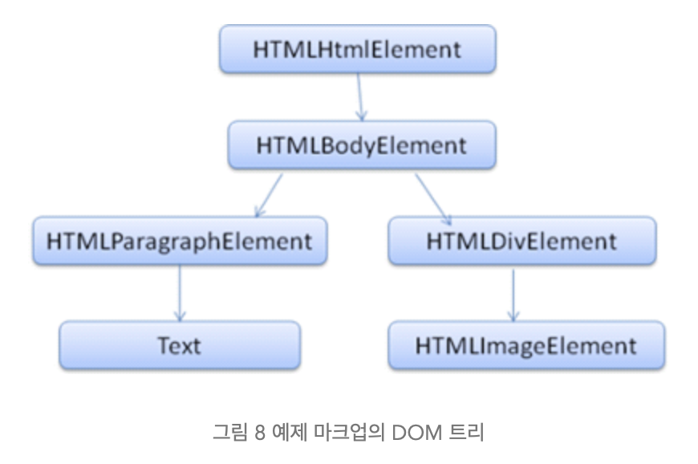
HTML과 마찬가지로 DOM은 W3C에 의해 명세(www.w3.org/DOM/DOMTR)가 정해져 있다. 이것은 문서를 다루기 위한 일반적인 명세인데 부분적으로 HTML 요소를 설명하기도 한다. HTML 정의는 www.w3.org/TR/2003/REC-DOM-Level-2-HTML-20030109/idl-definitions.html에서 찾을 수 있다.
트리가 DOM 노드를 포함한다고 말하는 것은 DOM 접점의 하나를 실행하는 요소를 구성한다는 의미다. 브라우저는 내부의 다른 속성들을 이용하여 이를 구체적으로 실행한다.
</br>

__파싱 알고리즘__
앞서 말한대로 HTML은 일반적인 하향식 또는 상향식 파서로 파싱이 안되는데 그 이유는 다음과 같다.
- 언어의 너그러운 속성.
- 잘 알려져 있는 HTML 오류에 대한 브라우저의 관용.
- 변경에 의한 재파싱. 일반적으로 소스는 파싱하는 동안 변하지 않지만 HTML에서 document.write을 포함하고 있는 스크립트 태그는 토큰을 추가할 수 있기 때문에 실제로는  입력 과정에서 파싱이 수정된다.
  
일반적인 파싱 기술을 사용할 수 없기 때문에 브라우저는 HTML 파싱을 위해 별도의 파서를 생성한다.
[파싱 알고리즘은 HTML 자세히 설명](https://html.spec.whatwg.org/multipage/parsing.html)되어 있다. 알고리즘은 토큰화와 트리 구축 이렇게 두 단계로 되어 있다. 
토큰화는 어휘 분석으로서 입력 값을 토큰으로 파싱한다. HTML에서 토큰은 시작 태그, 종료 태그, 속성 이름과 속성 값이다.
토큰화는 토큰을 인지해서 트리 생성자로 넘기고 다름 토큰을 확인하기 위해 다음 문자를 확인한다. 그리고 입력의 마지막까지 이 과정을 반복한다.
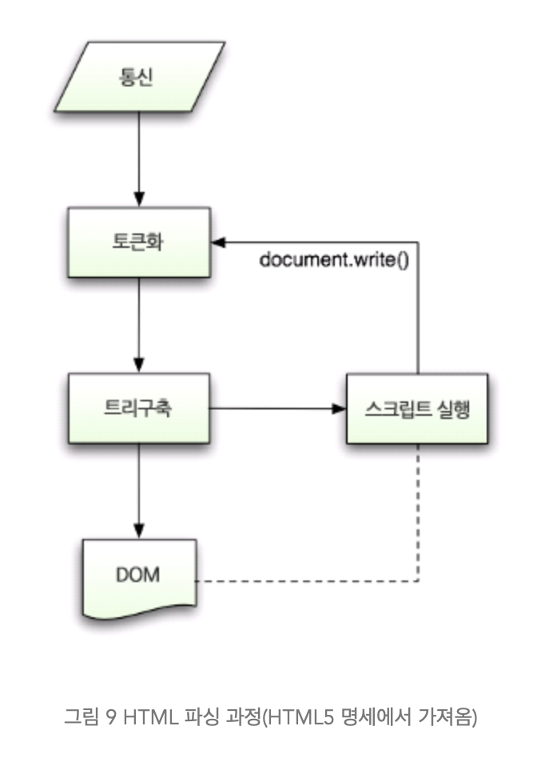
</br>

__토큰화 알고리즘__
알고리즘의 결과물은 HTML 토큰이다. 알고리즘은 상태 기계(State Machine)라고 볼 수 있다.  각 상태는 하나 이상의 연속된 문자를 입력받아 이 문자에 따라 다음 상태를 갱신한다. 그러나 결과는 현재의 토큰화 상태와 트리 구축 상태의 영향을 받는데. 이것은 같은 문자를 읽어 들여도 현재 상태에 따라 다음 상태의 결과가 다르게 나온다는 것을 의미한다. 알고리즘은 전체를 설명하기에 너무 복잡하니 원리 이해를 도울만한 간단한 예제를 한번 보자.

다음은 HTML 토큰화를 설명하기 위한 기본적인 예제이다.
```html
 <html>
   <body>
      Hello world
   </body>
</html> 
```

초기 상태는 "자료 상태" 이다. < 문자를 만나면 상태는 "태그 열림 상태"로 변한다. a 부터 z까지의 문자를 만나면 "시작 태그 토큰"을 생성하고 상태는 "태그 이름 상태"로 변하는데 이 상태는 > 문자를 만날 때까지 유지한다. 각 문자에는 새로운 토큰 이름이 붙는데 이 경우 생성된 토큰은 html 토큰이다.

'>'문자에 도달하면 현재 토큰이 발행되고 상태는 다시 "자료 상태"로 바뀐다. 태그는 동일한 절차에 따라 처리된다. 지금까지 html 태그와 body 태그를 발행했고 다시 "자료 상태"로 돌아왔다.  Hello World의 H 문자를 만나면 문자 토큰이 생성되고 발행될 것이다. 이것은 종료 태그의 < 문자를 만날 때까지 진행된다. Hello World의 각 문자를 위한 문자 토큰을 발행할 것이다.

다시 "태그 열림 상태"가 되었다. / 문자는 종료 태그 토큰을 생성하고 "태그 이름 상태"로 변경 될 것이다. 이 상태는 > 문자를 만날 때까지 유지된다. 그리고 새로운 태그 토큰이 발행되고 다시 "자료 상태"가 된다. 또한 동일하게 처리될 것이다.
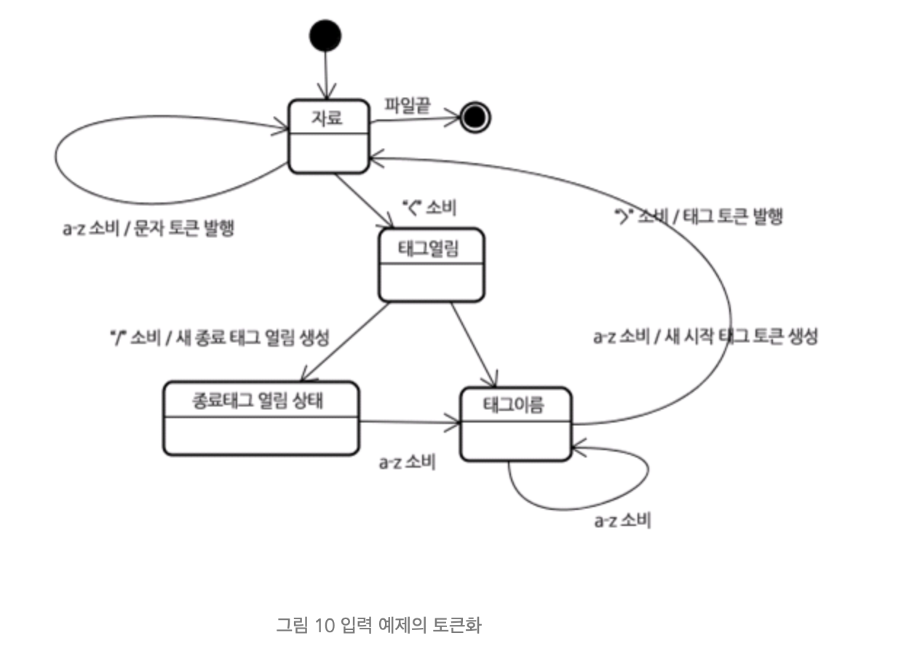
</br>

__트리 구축 알고리즘__
파서가 생성되면 문서 객체가 생성된다. 트리 구축이 진행되는 동안 문서 최상단에서는 DOM 트리가 수정되고 요소가 추가된다. 토큰화에 의해 발행된 각 노드는 트리 생성자에 의해 처리된다. 각 토큰을 위한 DOM 요소의 명세는 정의되어 있다. DOM 트리에 요소를 추가하는 것이 아니라면 열린 요소는 스택(임시 버퍼 저장소)에 추가된다. 이 스택은 부정확한 중첩과 종료되지 않은 태그를 교정한다. 알고리즘은 상태 기계라고 설명할 수 있고 상태는 "삽입 모드" 라고 부른다.

아래 입력 예제의 트리 생성 과정을 보자.
```html
<html>
   <body>
      Hello world
   </body>
</html>  
```
트리 구축 단계의 입력 값은 토큰화 단계에서 만들어지는 일련의 토큰이다. 받은 html 토큰은 "html 이전" 모드가 되고 토큰은 이 모드에서 처리된다. 이것은 HTMLHtmlElement 요소를 생성하고 문서 객체의 최상단에 추가된다.

상태는 "head 이전" 모드로 바뀌었고 "body" 토큰을 받았다. "head" 토큰이 없더라도 HTMLHeadElement는 묵시적으로 생성되어 트리에 추가될 것이다.

곧이어 "head 안쪽" 모드로 이동했고 다음은 "head 다음" 모드로 간다. body 토큰이 처리 되었고 HTMLBodyElement가 생성되어 추가됐으며 "body 안쪽" 모드가 되었다.

"Hellow world" 문자열의 문자 토큰을 받았다. 첫 번째 토큰이 생성되고 "본문" 노드가 추가되면서 다른 문자들이 그 노드에 추가될 것이다.

body 종료 토큰을 받으면 "body 다음" 모드가 된다. html 종료 태그를 만나면 "body 다음 다음" 모드로 바뀐다. 마지막 파일 토큰을 받으면 파싱을 종료한다.
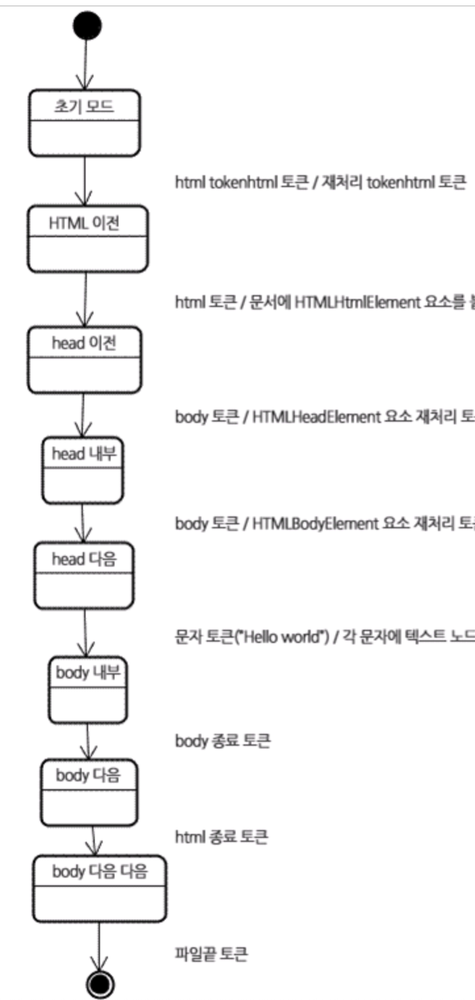
</br>

__파싱이 끝난 이후의 동작__
이번 단계에서 브라우저는 문서와 상호작용할 수 있게 되고 문서 파싱 이후에 실행되어야 하는 "지연" 모드 스크립트를 파싱하기 시작한다. 문서 상태는 "완료"가 되고 "로드" 이벤트가 발생한다. 보다 자세한 내용은 [HTML5의 토큰화 알고리즘](https://html.spec.whatwg.org/multipage/syntax.html)과 트리 구축에서 볼 수 있다.
</br>

__브라우저의 오류 처리__
HTML 페이지에서 "유효하지 않은 구문" 이라는 오류를 본 적이 없을 것이다. 이는 브라우저가 모든 오류 구문을 교정하기 때문이다.

아래 오류가 포함된 HTML 예제를 보자
```html
<html>  
   <mytag></mytag>
   <div>
     <p>
   </div>
   Really lousy HTML
   </p>
</html>  
```
나는 일부러 여러 가지 규칙을 위반 했다. "mytag"는 표준 태그가 아니고 "p" 태그와 "div" 태그는 중첩 오류가 있다. 그러나 브라우저는 투덜거리지 않고 올바르게 표시하는데 이는 파서가 HTML 제작자의 실수를 수정했기 때문이다.

이런 오류 처리 행태는 브라우저에서 꽤나 일반적임에도 불구하고 HTML의 현재 명세가 아니라는 점이 놀라울 뿐이다. 북마크와 이전/다음 버튼처럼 수 년간 브라우저 안에서 구현된 것이다. 잘 알려진 HTML 오류를 많은 사이트에서 발견할 수 있지만 브라우저는 다른 브라우저들이 했던 것처럼 관습적으로 오류를 고치고 있다.

HTML5 명세는 이런 요구 사항 일부를 정의했다. 웹킷은 이것을 HTML 파서 클래스의 시작 부분에 주석으로 잘 요약해 두었다.

파서는 토큰화된 입력 값을 파싱하여 문서를 만들고 문서 트리를 생성한다. 규칙에 맞게 잘 작성된 문서라면 파싱이 수월하겠지만 불행하게도 형식에 맞지 않게 작성된 많은 HTML 문서를 다뤄야 하기 때문에 파서는 오류에 대한 아량이 있어야 한다.
'
파서는 적어도 다음과 같은 오류를 처리해야 한다.

- 어떤 태그의 안쪽에 추가하려는 태그가 금지된 것일 때 일단 허용된 태그를 먼저 닫고 금지된 태그는 외부에 추가한다.
- 파서가 직접 요소를 추가해서는 안된다. 문서 제작자에 의해 뒤늦게 요소가 추가될 수 있고 생략 가능한 경우도 있다. HTML, HEAD, BODY, TBODY, TR, TD, LI 태그가 이런 경우에 해당한다.
- 인라인 요소 안쪽에 블록 요소가 있는 경우 부모 블록 요소를 만날 때까지 모든 인라인 태그를 닫는다.
- 이런 방법이 도움이 되지 않으면 태그를 추가하거나 무시할 수 있는 상태가 될 때까지 요소를 닫는다.

웹킷이 오류를 처리하는 예는 다음과 같다.

`<br> 대신 </br>`
`어떤 사이트는 <br> 대신 </br>을 사용한다. 인터넷 익스플로러, 파이어폭스와 호환성을 갖기 위해 웹킷은 이것을 <br> 으로 간주한다. 코드는 다음과 같다.`
```html
if(t->isCloseTag(brTag) && m_document->inCompatMode()) {  
    reportError(MalformedBRError);
    t->beginTag = true;
}
```
오류는 내부적으로 처리하고 사용자에게는 표시하지 않는다.
어긋난 표
어긋난 표는 표 안에 또 다른 표가 th 또는 td 셀 내부에 있지 않은 것을 의미한다. 아래 예제와 같은 경우를 말한다.
```html
<table>

    <table>

    <tr><td>inner table</td></tr>

    </table>

    <tr><td>outer table</td></tr>

</table>  
```
이런 경우 웹킷은 표의 중첩을 분해하여 형제 요소가 되도록 처리한다.
```html
<table>

    <tr><td>outer table</td></tr>

</table>

<table>

    <tr><td>inner table</td></tr>

</table>  
```
코드는 다음과 같다.
```java
if(m_inStrayTableContent && localName == tableTag)  
popBlock(tableTag);  
```
웹킷은 이런 오류를 처리하는데 스택을 사용한다. 안쪽의 표는 바깥쪽 표의 외부로 옮겨져서 형제 요소가 된다.
중첩된 폼 요소

폼 안에 또 다른 폼을 넣은 경우 안쪽의 폼은 무시된다. 코드는 다음과 같다.
```java
if(!m_currentFormElement) {  
    m_currentFormElement = new HTMLFormElement(formTag, m_document);
}
```
태그 중첩이 너무 깊을 때
주석에는 이렇게 적혀 있다.
www.liceo.edu.mx 사이트는 약 1,500개 수준의 태그 중첩이 되어 있는 예제인데 모든 요소가 <b>로 되어 있다. 최대 20개의 중첩만 허용하고 나머지는 무시한다.
```js
bool HTMLParser::allowNestedRedundantTag(const AtomicString& tagName)  
{
 
    unsigned i = 0;
    for (HTMLStackElem* curr = m_blockStack; 
        i < cMaxRedundantTagDepth && curr && curr->tagName == tagName;  
        curr = curr->next, i++) { }
    return i != cMaxRedundantTagDepth;
}
```
잘못 닫힌 html 또는 body 태그
주석에는 이렇게 적혀 있다.
깨진 html을 지원한다. 일부 바보 같은 페이지는 문서가 끝나기 전에 body를 닫아버리기 때문에 브라우저는 body 태그를 닫지 않는다. 대신 종료를 위해 end()를 호출한다.
```js
if (t->tagName == htmlTag || t->tagName == bodyTag )  
   return;
```
웹킷 오류 처리 코드에 예제로 등장하는 것을 원치 않는다면 웹 제작자는 올바른 HTML 작성을 위해 신경 써야 할 것이다.

  #### 11. CSS 파싱

소개 글에서 설명했던 파싱의 개념을 기억하는가? HTML과는 다르게 CSS는 문맥 자유 문법이고 소개 글에서 설명했던 파서 유형을 이용하여 파싱이 가능하다. 실제로 [CSS 명세는 CSS 어휘와 문법을 정의](https://www.w3.org/TR/CSS2/grammar.html)하고 있다.
몇 가지 예제를 보자. 어휘 문법은 각 토큰을 위한 정규 표현식으로 정의되어 있다.
omment   \/*[^]*+([^/][^]*+)\/ 
num        [0-9]+|[0-9]"."[0-9]+ 
nonascii    [\200-\377] 
nmstart    [_a-z]|{nonascii}|{escape} 
nmchar    [_a-z0-9-]|{nonascii}|{escape} 
name        {nmchar}+ 
ident        {nmstart}{nmchar}
"ident"는 클래스 이름처럼 식별자(identifier)를 줄인 것이다. "name"은 요소의 아이디("#"으로 참조하는) 이다.
구문 문법은 BNF로 설명되어 있다.
```css
Ruleset  
   : selector [ ',' S* selector ]*
       '{' S* declaration [ ';' S* declaration ]* '}' S*
   ;
Selector  
   : simple_selector [ combinator selector | S+ [ combinator? selector ]? ]?
   ;
simple_selector  
   : element_name [ HASH | class | attrib | pseudo ]*
   | [ HASH | class | attrib | pseudo ]+
   ;
Class  
   : '.' IDENT
   ;
element_name  
   : IDENT | '*'
   ;
Attrib  
   : '[' S* IDENT S* [ [ '=' | INCLUDES | DASHMATCH ] S*
       [ IDENT | STRING ] S* ] ']'
   ;
Pseudo  
   : ':' [ IDENT | FUNCTION S* [IDENT S*] ')' ]
   ;
```
룰셋(ruleset)은 다음과 같은 구조를 나타낸다.
```css
div.error, a.error {  
   color: red;
   font-weight: bold;
}
```
div.error와 a.error 는 선택자(selector)이다. 중괄호 안쪽에는 이 룰셋에 적용된 규칙이 포함되어 있다. 이 구조는 공식적으로 다음과 같이 정의되어 있다.
```css
Ruleset  
   : selector [ ',' S* selector ]*
       '{' S* declaration [ ';' S* declaration ]* '}' S*
   ;
```
룰셋은 쉼표와 공백(S가 공백을 의미함)으로 구분된 하나 또는 여러 개의 선택자라는 것을 의미한다. 룰셋은 중괄호 내부에 하나 또는 세미 콜론으로 구분된 여러 개의 선언을 포함한다. "선언"과 "선택자"는 이어지는 BNF에 정의되어 있다.
</br>

__웹킷 CSS 파서__
웹킷은 CSS 문법 파일로부터 자동으로 파서를 생성하기 위해 플렉스와 바이슨 파서 생성기를 사용한다. 파서 소개에서 언급했던 것처럼 바이슨은 상향식 이동 감소 파서를 생성한다. 파이어폭스는 직접 작성한 하향식 파서를 사용한다. 두 경우 모두 각 CSS 파일은 스타일 시트 객체로 파싱되고 각 객체는 CSS 규칙을 포함한다. CSS 규칙 객체는 선택자와 선언 객체 그리고 CSS 문법과 일치하는 다른 객체를 포함한다.
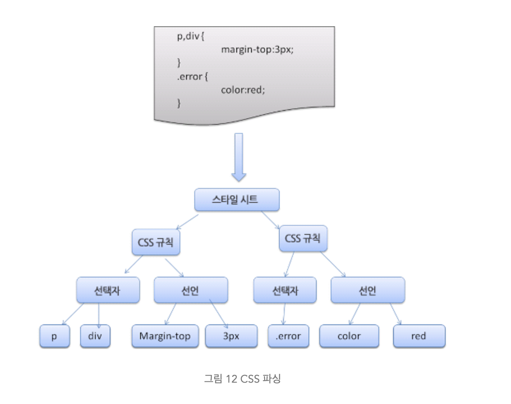

  #### 12. 스크립트와 스타일 시트의 진행 순서
__스크립트__
웹은 파싱과 실행이 동시에 수행되는 동기화(synchronous) 모델이다. 제작자는 파서가 < script > 태그를 만나면 즉시 파싱하고 실행하기를 기대한다. 스크립트가 실행되는 동안 문서의 파싱은 중단된다. 스크립트가 외부에 있는 경우 우선 네트워크로부터 자원을 가져와야 하는데 이 또한 실시간으로 처리되고 자원을 받을 때까지 파싱은 중단된다. 이 모델은 수 년간 지속됐고 HTML4와 HTML5의 명세에도 정의되어 있다. 제작자는 스크립트를 "지연(defer)"으로 표시할 수 있는데 지연으로 표시하게 되면 문서 파싱은 중단되지 않고 문서 파싱이 완료된 이후에 스크립트가 실행된다. HTML5는 스크립트를 비동기(asynchronous)로 처리하는 속성을 추가했기 때문에 별도의 맥락에 의해 파싱되고 실행된다.
</br>      

__예측파싱__
웹킷과 파이어폭스는 예측 파싱과 같은 최적화를 지원한다. 스크립트를 실행하는 동안 다른 스레드는 네트워크로부터 다른 자원을 찾아 내려받고 문서의 나머지 부분을 파싱한다.  이런 방법은 자원을 병렬로 연결하여 받을 수 있고 전체적인 속도를 개선한다. 참고로 예측 파서는 DOM 트리를 수정하지 않고 메인 파서의 일로 넘긴다. 예측 파서는 외부 스크립트, 외부 스타일 시트와 외부 이미지와 같이 참조된 외부 자원을 파싱할 뿐이다.
</br>

__스타일 시트__
한편 스타일 시트는 다른 모델을 사용한다. 이론적으로 스타일 시트는 DOM 트리를 변경하지 않기 때문에 문서 파싱을 기다리거나 중단할 이유가 없다. 그러나 스크립트가 문서를 파싱하는 동안 스타일 정보를 요청하는 경우라면 문제가 된다. 스타일이 파싱되지 않은 상태라면 스크립트는 잘못된 결과를 내놓기 때문에 많은 문제를 야기한다. 이런 문제는 흔치 않은 것처럼 보이지만 매우 빈번하게 발생한다. 파이어폭스는 아직 로드 중이거나 파싱 중인 스타일 시트가 있는 경우 모든 스크립트의 실행을 중단한다. 한편 웹킷은 로드되지 않은 스타일 시트 가운데 문제가 될만한 속성이 있을 때에만 스크립트를 중단한다.

#### 13.렌더 트리 구축
DOM 트리가 구축되는 동안 브라우저는 렌더 트리를 구축한다. 표시해야 할 순서와 문서의 시각적인 구성 요소로써 올바른 순서로 내용을 그려낼 수 있도록 하기 위한 목적이 있다.
파이어폭스는 이 구성 요소를 "형상(frames)" 이라고 부르고 웹킷은 "렌더러(renderer)" 또는 "렌더 객체(render object)"라는 용어를 사용한다.
렌더러는 자신과 자식 요소를 어떻게 배치하고 그려내야 하는지 알고 있다.
웹킷 렌더러의 기본 클래스인 RenderObject 클래스는 다음과 같이 정의되어 있다.

```java
class RenderObject { virtual  
    void layout(); virtual
    void paint(PaintInfo); virtual
    void rect repaintRect();
    Node * node; //the DOM node
    RenderStyle * style; // the computed style
    RenderLayer * containgLayer; //the containing z-index layer
}
```
각 렌더러는 CSS2 명세에 따라 노드의 CSS 박스에 부합하는 사각형을 표시한다. 렌더러는 너비, 높이 그리고 위치와 같은 기하학적 정보를 포함한다. 
박스 유형은 노드와 관련된 "display" 스타일 속성의 영향을 받는다(스타일 계산 참고). 여기 보이는 웹킷 코드는 display 속성에 따라 DOM 노드에 어떤 유형의 렌더러를 만들어야 하는지 결정하는 코드이다.
```java
RenderObject* RenderObject::createObject(Node* node, RenderStyle* style)  
{
    Document* doc = node->document();
    RenderArena* arena = doc->renderArena();
    …
    RenderObject* o = 0;
 
    switch (style->display()) {
        case NONE:
            break;
        case INLINE:
            o = new (arena) RenderInline(node);
            break;
        case BLOCK:
            o = new (arena) RenderBlock(node);
            break;
        case INLINE_BLOCK:
            o = new (arena) RenderBlock(node);
            break;
        case LIST_ITEM:
            o = new (arena) RenderListItem(node);
            break;
        ...
    }
    return o;
}
```
요소 유형 또한 고려해야 하는데 예를 들면 폼 콘트롤과 표는 특별한 구조이다. 요소가 특별한 렌더러를 만들어야 한다면 웹킷은 creatRenderer 메서드를 무시하고 비기하학 정보를 포함하는 스타일 객체를 표시한다.
</br>

#### 14. DOM 트리와 렌더 트리의 관계 
렌더러는 DOM 요소에 부합하지만 1:1로 대응하는 관계는 아니다. 예를 들어 "head" 요소와 같은 비시각적 DOM 요소는 렌더 트리에 추가되지 않는다. 또한 display 속성에 "none" 값이 할당된 요소는 트리에 나타나지 않는다(visibility 속성에 "hidden" 값이 할당된 요소는 트리에 나타난다).

여러 개의 시각 객체와 대응하는 DOM 요소도 있는데 이것들은 보통 하나의 사각형으로는 묘사할 수 없는 복잡한 구조다. 예를 들면 "select" 요소는 '표시 영역, 드롭다운 목록, 버튼' 표시를 위한 3개의 렌더러가 있다. 또한 한 줄에 충분히 표시할 수 없는 문자가 여러 줄로 바뀔 때 새 줄은 별도의 렌더러로 추가된다. 여러 렌더러와 대응하는 또 다른 예는 깨진 HTML이다. CSS 명세에 의하면 인라인 박스는 블록 박스만 포함하거나 인라인 박스만을 포함해야 하는데 인라인과 블록 박스가 섞인 경우 인라인 박스를 감싸기 위한 익명의 블록 렌더러가 생성된다.

어떤 렌더 객체는 DOM 노드에 대응하지만 트리의 동일한 위치에 있지 않다. float 처리된 요소 또는 position 속성 값이 absolute로 처리된 요소는 흐름에서 벗어나 트리의 다른 곳에 배치된 상태로 형상이 그려진다. 대신 자리 표시자가 원래 있어야 할 곳에 배치된다.
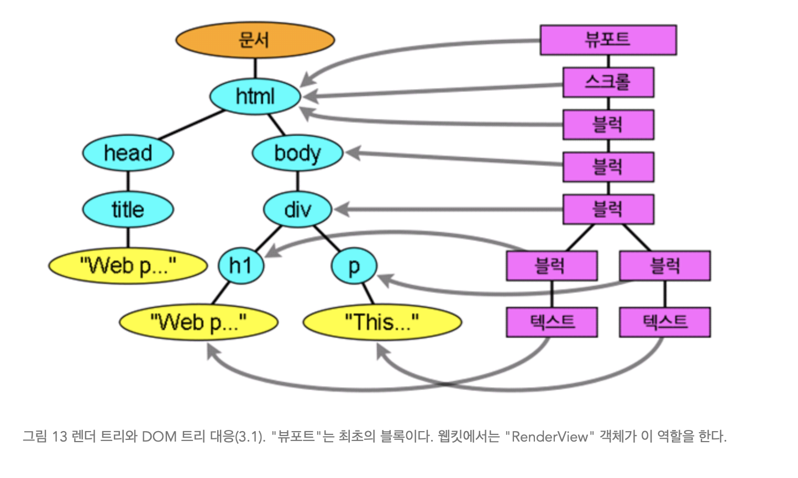
</br>

__트리를 구축하는 과정__
파이어폭스에서 프레젠테이션은 DOM 업데이트를 위한 리스너로 등록된다. 프레젠테이션은 형상 만들기를 FrameConstructor에 위임하고 FrameConstructor는 스타일(스타일 계산 참고)을 결정하고 형상을 만든다.

웹킷에서는 스타일을 결정하고 렌더러를 만드는 과정을 "어태치먼트(attachment)" 라고 부른다. 모든 DOM 노드에는 "attach" 메서드가 있다. 어태치먼트는 동기적인데 DOM 트리에 노드를 추가하면 새 노드의 "attach" 메서드를 호출한다.

html 태그와 body 태그를 처리함으로써 렌더 트리 루트를 구성한다. 루트 렌더 객체는 CSS 명세에서 포함 블록(다른 모든 블록을 포함하는 최상위 블록)이라고 부르는 그것과 일치한다. 파이어폭스는 이것을 ViewPortFrame이라 부르고 웹킷은 RenderView라고 부른다. 이것이 문서가 가리키는 렌더 객체다. 트리의 나머지 부분은 DOM 노드를 추가함으로써 구축된다.

[CSS2 처리 모델 명세](https://www.w3.org/TR/CSS21/intro.html)를 참고.
</br>

__스타일 계산__

렌더 트리를 구축하려면 각 렌더 객체의 시각적 속성에 대한 계산이 필요한데 이것은 각 요소의 스타일 속성을 계산함으로써 처리된다.

스타일은 인라인 스타일 요소와 HTML의 시각적 속성(예를 들면 bgcolor 같은 HTML 속성)과 같은 다양한 형태의 스타일 시트를 포함하는데 HTML의 시각적 속성들은 대응하는 CSS 스타일 속성으로 변환된다.

최초의 스타일 시트는 브라우저가 제공하는 기본 스타일 시트인데 페이지 제작자 또는 사용자도 이를 제공할 수 있다. 브라우저는 사용자가 선호하는 스타일을 정의할 수 있도록 지원하는데 파이어폭스의 경우 "파이어폭스 프로필" 폴더에 있는 스타일 시트를 변경함으로써 사용자 선호 스타일을 정의할 수 있다.

스타일을 계산하는 일에는 다음과 같은 몇 가지 어려움이 따른다.
- 스타일 데이터는 구성이 매우 광범위한데 수 많은 스타일 속성들을 수용하면서 메모리 문제를 야기할 수 있다.
- 최적화되어 있지 않다면 각 요소에 할당된 규칙을 찾는 것은 성능 문제를 야기할 수 있다. 각 요소에 할당된 규칙 목록을 전체 규칙으로부터 찾아내는 것은 과중한 일이다. 맞는 규칙을 찾는 과정은 얼핏 보기에는 약속된 방식으로 순탄하게 시작하는 것 같지만 실상 쓸모가 없거나 다른 길을 찾아야만 하는 복잡한 구조가 될 수 있다. 
예를 들어 이런 복합 선택자가 있다.
div div div div { … }
이 선택자는 3번째 자손<div>에 규칙을 적용한다는 뜻이다. 규칙을 적용할 <div> 요소를 확인하려면 트리로부터 임의의 줄기를 선택하고 탐색하는 과정에서 규칙에 맞지 않는 줄기를 선택했다면 또 다른 줄기를 선택해야 한다.
- 규칙을 적용하는 것은 계층 구조를 파악해야 하는 꽤나 복잡한 다단계 규칙을 수반한다.
브라우저가 이 문제를 어떻게 처리하는지 살펴보자.
</br>

__스타일 정보 공유__
웹킷 노드는 스타일 객체(RenderStyle)를 참조하는데 이 객체는 일정 조건 아래 공유할 수 있다. 노드가 형제이거나 또는 사촌일 때 공유하며 다음과 같은 조건일 때 공유할 수 있다.
- 동일한 마우스 반응 상태를 가진 요소여야 한다. 예를 들어 한 요소가 :hover 상태가 될 수 없는데 다른 요소는 :hover가 될 수 있다면 동일한 마우스 상태가 아니다.
- 아이디가 없는 요소.
- 태그 이름이 일치해야 한다.
- 클래스 속성이 일치해야 한다.
- 지정된 속성이 일치해야 한다.
- 링크(link) 상태가 일치해야 한다.
- 초점(focus) 상태가 일치해야 한다.
- 문서 전체에서 속성 선택자의 영향을 받는 요소가 없어야 한다. 여기서 영향이라 함은 속성 선택자를 사용한 경우를 말한다(속성 선택자 예 input[type=text]{...})
- 요소에 인라인 스타일 속성이 없어야 한다(인라인 스타일 예 <p style="...">...</p>).
- 문서 전체에서 형제 선택자를 사용하지 않아야 한다. 웹 코어는 형제 선택자를 만나면 전역 스위치를 열고 전체 문서의 스타일 공유를 중단한다. 형제 선택자는 + 선택자와 :first-child 그리고 :last-child를 포함한다.
</br>

__파이어폭스 규칙 트리__
파이어폭스는 스타일 계산을 쉽게 처리하기 위해 규칙 트리와 스타일 문맥 트리라고 하는 두 개의 트리를 더 가지고 있다. 웹킷도 스타일 객체를 가지고 있지만 스타일 문맥 트리처럼 저장되지 않고 오직 DOM 노드로 관련 스타일을 처리한다.
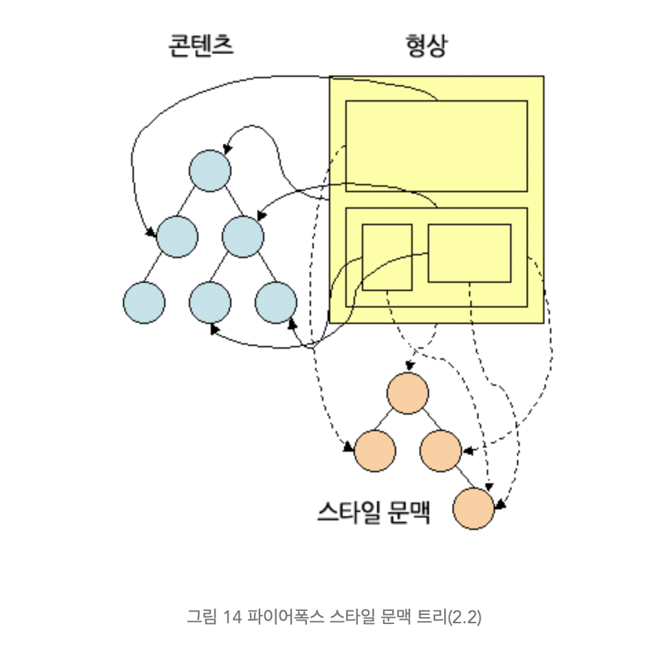

스타일 문맥에는 최종 값이 저장되어 있다. 값은 올바른 순서 안에서 부합하는 규칙을 적용하고 논리로부터 구체적인 값으로 변환함으로써 계산된다. 예를 들어 논리적인 값이 화면의 백분율(%) 이라면 이 값은 계산에 의해 절대적인 단위(px)로 변환된다. 이런 규칙 트리 아이디어는 정말 현명하다. 노드 사이에서 이 값을 공유함으로써 그것들을 다시 계산하는 일을 방지하기 때문이다.

부합하는 모든 규칙은 트리에 저장하는데 경로의 하위 노드가 높은 우선순위를 갖는다. 규칙 저장은 느리게 처리된다. 트리는 처음부터 모든 노드를 계산하지 않지만 노드 스타일이 계산될 필요가 있을 때 계산된 경로를 트리에 추가한다.

트리 경로를 어휘 목록 속에 있는 단어라고 생각하고 이미 규칙 트리를 계산했다고 가정해 보자.
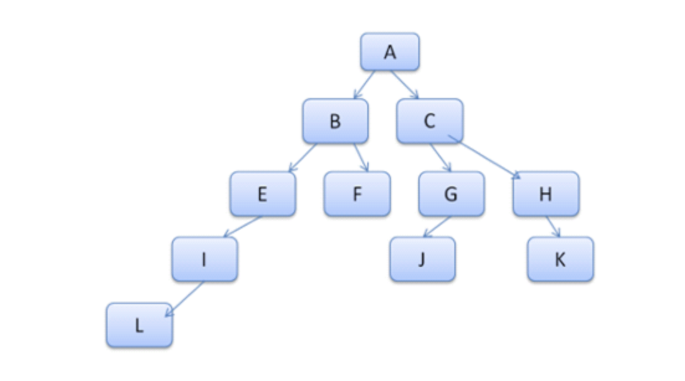
내용 트리에서 또 다른 요소에 부합하는 규칙이 필요하다고 가정하고 부합하는 규칙이 순서에 따라 B - E - I 라고 치자. 브라우저는 이미 A - B - E - I - L 경로를 계산했기 때문에 트리 안에 이 경로가 있고 할 일이 줄었다. 

트리가 작업량을 줄이는 방법을 살펴보자.
</br>

__구조체로 분리__

스타일 문맥은 구조체(structs)로 나뉘는데 선 또는 색상과 같은 종류의 스타일 정보를 포함한다. 구조체의 속성들은 상속되거나 또는 상속되지 않는다. 속성들은 요소에 따라 정해져 있지 않은 한 부모로부터 상속된다. 상속되지 않는 속성들은 "재설정(reset)" 속성이라 부르는데 상속을 받지 않는 것으로 정해져 있다면 기본 값을 사용한다.

트리는 최종으로 계산된 값을 포함하여 전체 구조체를 저장하는 방법으로 도움을 준다. 하위 노드에 구조체를 위한 속성 선언이 없다면 저장된 상위 노드의 구조체 속성을 그대로 받아서 사용하는 것이다.
</br>

__규칙 트리를 사용하여 스타일 문맥을 계산__
어떤 요소의 스타일 문맥을 계산할 때 가장 먼저 규칙 트리의 경로를 계산하거나 또는 이미 존재하는 경로를 사용한다. 그 다음 새로운 스타일 문맥으로 채우기 위해 경로 안에서 규칙을 적용한다. 가장 높은 우선순위(보통 가장 구체적인 선택자)를 가진 경로의 하위 노드에서 시작하여 구조체가 가득 찰 때까지 트리의 상단으로 거슬러 올라간다. 규칙 노드 안에서 구조체를 위한 특별한 선언이 없다면 상당한 최적화를 할 수 있다. 선언이 가득 채워질 때까지 노드 트리의 상위로 찾아 올라가서 간단하게 적용하면 최상의 최적화가 되고 모든 구조체는 공유된다. 이것은 최종 값과 메모리 계산을 절약한다.

선언이 완전하지 않으면 구조체가 채워질 때까지 트리의 상단으로 거슬러 올라간다.

구조체에서 어떤 선언도 발견할 수 없는 경우 구조체는 "상속(inherit)" 타입인데 문맥 트리에서 부모 구조체를 향하면서 성공적으로 구조체를 공유한다. 재설정 구조체라면 기본 값들이 사용될 것이다.

가장 구체적인 노드에 값을 추가하면 실제 값으로 변환하기 위해 약간의 추가적인 계산을 할 필요가 있는데 트리 노드에서 결과를 저장하기 때문에 자식에게도 사용할 수 있다.

같은 트리 노드를 가리키는 형제 요소가 있는 경우 전체 스타일 문맥이 이들 사이에서 공유된다.

이런 HTML이 있다고 가정해 보자.
```html
<div class="err" id="div1">  
    <p>
    this is a <span class="big"> big error </span>
    this is also a <span class="big"> very big error</span> error
    </p>
</div>  
<div class="err" id="div2">another error</div>  
```
그리고 다음과 같은 규칙이 있다.
- 1 div { margin:5px; color:black }
- 2 .err { color:red }
- 3 .big { margin-top:3px }
- 4 div span { margin-bottom:4px }
- 5 #div1 { color:blue }
- 6 #div2 { color:green }
좀 단순하게 하기 위해 색상과 여백 이렇게 두 개의 구조체를 채울 필요가 있다고 치자. 색상 구조체는 오직 색상 값만을 포함하고 여백 구조체는 네 개의 면에 대한 값을 포함한다.

결과적으로 규칙 트리는 아래처럼 보일 것이다. 노드는 노드 이름과 노드가 가리키는 규칙의 번호로 표시되어 있다.
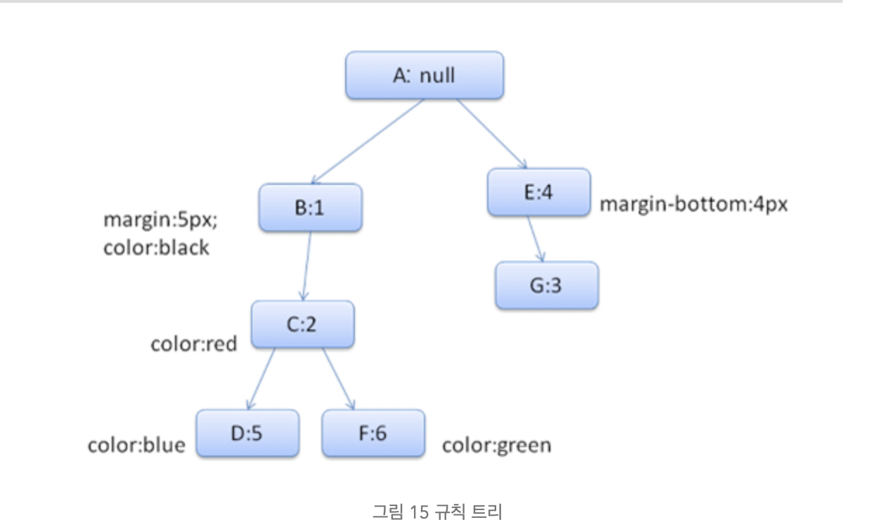
문맥 트리는 아래처럼 보일 것이다. 노드는 노드 이름과 노드가 가리키는 규칙 노드로 표시되어 있다.
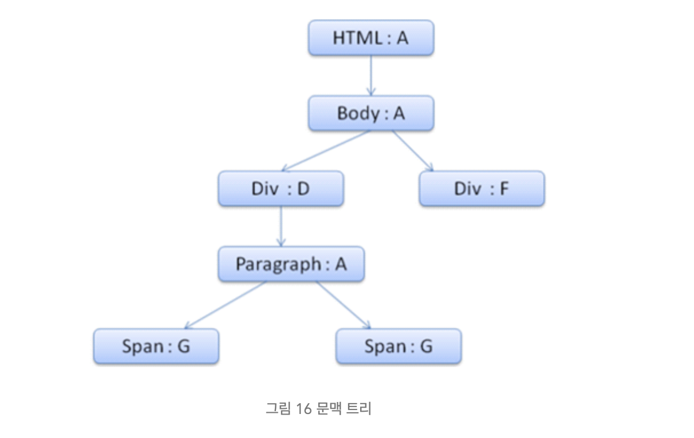
HTML을 파싱하여 두 번째 `<div> 태그인 <div class="err" id="div2">`에 이르렀다고 가정하자. 이 노드에 필요한 스타일 문맥을 생성하고 스타일 구조체를 채워야 한다.

두 번째 `<div>` 규칙에 맞는 것을 찾으면 1, 2, 6이 되는데 이것은 요소가 사용할 수 있는 트리 경로(규칙 트리의 B:1, C:2)가 이미 존재한다는 것을 의미하고 규칙 6(규칙 트리에서 노드 F:6)에 이르는 또 다른 노드를 문맥 트리에 추가하면 된다. 스타일 문맥을 생성하고 문맥 트리에 추가하면 새로운 스타일 문맥이 규칙 트리의 F:6 노드를 가리킨다.

이제는 스타일 구조체를 채워야 하는데 여백 구조체를 채우는 것으로부터 시작한다. 마지막 규칙 노드(F:6)가 여백 구조체를 포함하지 않기 때문에 이전 노드에 저장된 구조체를 찾을 때까지 위로 거슬러 올라가서 계산된 값을 사용한다. 여백 규칙이 선언된 최상위 노드의 구조체를 규칙 노드 B:1 에서 찾았다.

색상 구조체 정의에는 저장된 구조체를 사용할 수 없다. 색상은 이미 하나의 속성 값을 가지고 있기 때문에 다른 값을 채우기 위해 규칙 트리 상단으로 거슬러 올라갈 필요가 없다. 최종 값을 계산하고 계산된 값(문자열에서 RGB 등으로 변환된)을 이 노드에 저장할 것이다.
'
두 번째 `<span>` 요소는 보다 수월하게 진행된다. 맞는 규칙을 찾다 보면 이전 span과 같이 규칙 트리의 G:3를 가리킨다는 결론에 이르는데 동일한 노드를 가리키는 형제가 있기 때문에 전체 스타일 문맥을 공유하고 이전 span의 문맥을 취하면 된다.

부모로부터 상속된 규칙을 포함하고 있는 구조체의 저장은 문맥 트리에서 처리된다. 색상 속성은 실제로 상속된다. 그러나 파이어폭스는 재설정으로 처리해서 규칙 트리에 저장한다.

예를 들어 문단 요소에 글꼴을 위한 규칙을 추가한다면.
```css
p { font-family:Verdana; font size:10px; font-weight:bold }  
```
문맥 트리에서 div의 자식인 p 요소는 그 부모의 동일 글꼴 구조체를 공유할 수 있다. p 요소에 지정된 규칙이 없는 경우라도 마찬가지다.

규칙 트리가 없는 웹킷은 선언이 일치하는 규칙이 4번 탐색된다. 우선 중요하지 않은 상위 속성(display와 같은 속성이 의존하기 때문)이 적용되고, 그 다음 중요한 상위 속성이 적용된다. 그리고 나서 중요하지 않은 일반 속성이 적용되고 마지막으로 중요한 일반 속성이 적용된다. 이것은 
여러 번 나타나는 속성들이 정확한 다단계 순서에 따라 결정된다는 것을 의미하고 가장 마지막 값이 적용된다.

요약하면 스타일 객체는 전체 또는 일부를 공유함으로써 1번과 3번 문제를 해결한다. 파이어폭스 규칙 트리는 올바른 순서에 따라 속성을 적용하는 것을 돕는다.
</br>

__쉬운 선택을 위한 규칙 다루기__
스타일 규칙을 위한 몇 가지 소스가 있다.
CSS 규칙을 외부 스타일 시트에서 선언하거나 style 요소에서 선언
`p {color:blue}  `
인라인 스타인ㄹ 속성
`<p style="color:blue"></p> `
HTML의 시각적 속성(이것들은 CSS 규칙으로 변환됨)
`<p bgcolor="blue"></p> `

마지막 두 가지 스타일은 자신이 스타일 속성을 가지고 있거나 HTML 속성을 이용하여 연결할 수 있기 때문에 요소에 쉽게 연결된다.

위에서 언급한 문제 2번에 따라 CSS 규칙을 연결하는 것은 까다로울 수 있는데 이 문제를 해결하려면 쉽게 접근할 수 있도록 규칙을 교묘하게 처리해야 한다.

스타일 시트를 파싱한 후 규칙은 선택자에 따라 여러 해시맵 중 하나에 추가된다. 아이디, 클래스 이름, 태그 이름을 사용한 맵이 있고 이런 분류에 맞지 않는 것을 위한 일반적인 맵이 있다. 선택자가 아이디인 경우 규칙은 아이디 맵에 추가되고 선택자가 클래스인 경우 규칙은 클래스 맵에 추가된다.

이런 처리 작업을 통해 규칙을 찾는 일은 훨씬 쉬워진다. 맵에서 특정 요소와 관련 있는 규칙을 추출할 수 있기 때문에 모든 선언을 찾아 볼 필요가 없다. 이러한 최적화는 찾아야 할 규칙의 95% 이상을 제거하기 때문에 규칙을 찾는 동안 모든 선언을 고려할 필요가 없다.

다음 스타일 규칙 예제를 살펴보자
```css
p.error {color:red}  
#messageDiv {height:50px}
div {margin:5px} 
```
첫 번째 규칙은 클래스 맵에 추가된다. 두 번째는 아이디 맵에 추가되고 세 번째는 태그 맵에 추가된다. 

위 스타일과 관련된 HTML 코드는 다음과 같다.
```css
<p class="error">an error occurred </p>  
<div id=" messageDiv">this is a message</div>  
```
우선 p 요소의 규칙을 찾아보자. 클래스 맵은 발견된 "p.error"를 위한 규칙 하부의 "error" 키를 찾았다. div 요소는 아이디 맵(키는 아이디)과 태그 맵에 관련 규칙이 있다. 그러므로 이제 남은 작업은 키를 사용하여 추출한 규칙 중에 실제로 일치하는 규칙을 찾는 것이다.

예를 들어 div에 해당하는 다음과 같은 또 다른 규칙이 있다고 가정하자.
`table div {margin:5px}  `
이 예제는 여전히 태그 맵에서 규칙을 추출할 것이다. 가장 우측에 있는 선택자가 키이기 때문이다. 그러나 앞서 작성한 div 요소와는 일치하지 않는다. 상위에 table이 없기 때문이다.
웹킷과 파이어폭스 모두 이런 방식으로 처리하고 있다.
</br>

#### 15. 다단계 순서에 따라 규칙 적용하기
스타일 객체는 모든 CSS 속성을 포함하고 있는데 어떤 규칙과도 일치하지 않는 일부 속성은 부모 요소의 스타일 객체로부터 상속 받는다. 그 외 다른 속성들은 기본 값으로 설정된다.
문제는 하나 이상의 속성이 정의될 때 시작되고 다단계 순서가 이 문제를 해결하게 된다.
</br>

__스타일 시트 다단계 순서__
스타일 속성 선언은 여러 스타일 시트에서 나타날 수 있고 하나의 스타일 시트 안에서도 여러 번 나타날 수 있는데 이것은 규칙을 적용하는 순서가 매우 중요하다는 것을 의미한다. 이것을 "다단계(cascade)" 순서라고 한다. CSS2 명세에 따르면 다단계 순서는 다음과 같다(우선 순위가 낮은 것에서 높은 순서임).

- 브라우저 선언 (browser declarations)
- 사용자 일반 선언 (user normal declarations)
- 저작자 일반 선언 (author normal declarations)
- 저작자 중요 선언 (author important declarations)
- 사용자 중요 선언 (user important declarations)
  
브라우저 선언의 중요도가 가장 낮으며 사용자가 저작자의 선언을 덮어 쓸 수 있는 것은 선언이 중요하다고 표시한 경우뿐이다. 같은 순서 안에서 동일한 속성 선언은 특정성(specificity)에 의해 정렬이 되고 이 순서는 곧 특정성이 된다. HTML 시각 속성은 CSS 속성 선언으로 변환되고 변환된 속성들은 저작자 일반 선언 규칙으로 간주된다.
</br>

__특정성__
선택자 특정성은 CSS2 명세에 다음과 같이 정의되어 있다.
- 선택자 없이 'style' 속성이 선언된 것이면 1을 센다. 그렇지 않으면 0을 센다. (=a)
- 선택자에 포함된 아이디 선택자 개수를 센다. (=b)
- 선택자에 포함된 속성 선택자(클래스 선택자와 속성 선택자)와 가상 클래스 선택자의 숫자를 센다. (=c)
- 선택자에 포함된 요소 선택자와 가상 요소 선택자의 숫자를 센다. (=d)
네 개의 연결된 숫자 a-b-c-d (큰 진법의 숫자)를 연결하면 특정성의 값이 된다.

사용할 진법은 분류 중에 가장 높은 숫자에 의해서 정의된다. 예를 들어 a=14이면 16진수를 사용할 수 있다. 흔치는 않겠지만 a=17과 같은 경우라면 17진법이 필요할 것이다. 17진법을 사용해야 하는 경우는 html body div div p … (선택자에 17개의 태그를 사용하는 경우로 흔치 않음)와 같이 선택자를 사용하는 경우에 발생할 수 있다.

다음과 같은 몇 가지 예제를 참고하기 바란다.
```css
*{} /* a=0 b=0 c=0 d=0 -> specificity = 0,0,0,0 */
li{} /* a=0 b=0 c=0 d=1 -> specificity = 0,0,0,1 */  
li:first-line{} /* a=0 b=0 c=0 d=2 -> specificity = 0,0,0,2 */  
ul li{} /* a=0 b=0 c=0 d=2 -> specificity = 0,0,0,2 */  
ul ol+li{} /* a=0 b=0 c=0 d=3 -> specificity = 0,0,0,3 */  
h1+*[rel=up]{} /* a=0 b=0 c=1 d=1 -> specificity = 0,0,1,1 */  
ul ol li.red{} /* a=0 b=0 c=1 d=3 -> specificity = 0,0,1,3 */  
li.red.level{} /* a=0 b=0 c=2 d=1 -> specificity = 0,0,2,1 */  
#x34y{} /* a=0 b=1 c=0 d=0 -> specificity = 0,1,0,0 */
style="" /* a=1 b=0 c=0 d=0 -> specificity = 1,0,0,0 */  
```
</br>

__규칙 정렬__
맞는 규칙을 찾으면 다단계 규칙에 따라 정렬된다. 웹킷은 목록이 적으면 버블 정렬을 사용하고 목록이 많을 때는 병합 정렬을 사용한다. 웹킷은 규칙에 ">" 연산자를 덮어쓰는 방식으로 정렬을 실행한다.
```java
static bool operator >(CSSRuleData& r1, CSSRuleData& r2)  
{
    int spec1 = r1.selector()->specificity();
    int spec2 = r2.selector()->specificity();
    return (spec1 == spec2) : r1.position() > r2.position() : spec1 > spec2;
}
```
#### 15. 점진적 처리
웹킷은 @import를 포함한 최상위 수준의 스타일 시트가 로드되었는지 표시하기 위해 플래그를 사용한다. DOM 노드와 시각정보를 연결하는 과정(attaching)에서 스타일이 완전히 로드되지 않았다면 문서에 자리 표시자를 사용하고 스타일 시트가 로드됐을 때 다시 계산한다.
</br>

#### 16. 배치
렌더러가 생성되어 트리에 추가될 때 크기와 위치 정보는 없는데 이런 값을 계산하는 것을 배치 또는 리플로라고 부른다.

HTML은 흐름 기반의 배치 모델을 사용하는데 이것은 보통 단일 경로를 통해 크기와 위치 정보를 계산할 수 있다는 것을 의미한다. 일반적으로 "흐름 속"에서 나중에 등장하는 요소는 앞서 등장한 요소의 위치와 크기에 영향을 미치지 않기 때문에 배치는 왼쪽에서 오른쪽으로 또는 위에서 아래로 흐른다. 단, 표는 크기와 위치를 계산하기 위해 하나 이상의 경로를 필요로 하기 때문에 예외가 된다 (3.5).

좌표계는 기준점으로부터 상대적으로 위치를 결정하는데 좌단(X축)과 상단(Y축) 좌표를 사용한다.

배치는 반복되며 HTML 문서의 <html> 요소에 해당하는 최상위 렌더러에서 시작한다. 배치는 프레임 계층의 일부 또는 전부를 통해 반복되고 각 렌더러에 필요한 크기와 위치 정보를 계산한다.

최상위 렌더러의 위치는 0,0 이고 브라우저 창의 보이는 영역에 해당하는 뷰포트 만큼의 면적을 갖는다.

모든 렌더러는 "배치" 또는 "리플로" 메서드를 갖는데 각 렌더러는 배치해야 할 자식의 배치 메소드를 불러온다.
</br>

#### 17. 더티 비트 체제
소소한 변경 때문에 전체를 다시 배치하지 않기 위해 브라우저는 "더티 비트" 체제를 사용한다. 렌더러는 다시 배치할 필요가 있는 변경 요소 또는 추가된 것과 그 자식을 "더티"라고 표시한다.

"더티"와 "자식이 더티" 이렇게 두 가지 플래그가 있다. 자식이 더터하다는 것은 본인은 괜찮지만 자식 가운데 적어도 하나를 다시 배치할 필요가 있다는 의미다.
</br>

#### 18. 전역 배치와 점증 배치
배치는 렌더러 트리 전체에서 일어날 수 있는데 이것을 "전역" 배치라 하고 다음과 같은 경우에 발생한다.

- 글꼴 크기 변경과 같이 모든 렌더러에 영향을 주는 전역 스타일 변경.
- 화면 크기 변경에 의한 결과.
  
배치는 더티 렌더러가 배치되는 경우에만 점증되는데 추가적인 배치가 필요하기 때문에 약간의 손실이 발생할 수 있다.
점증 배치는 렌더러가 더티일 때 비동기적으로 일어난다. 예를 들면 네트워크로부터 추가 내용을 받아서 DOM 트리에 더해진 다음 새로운 렌더러가 렌더 트리에 붙을 때이다.
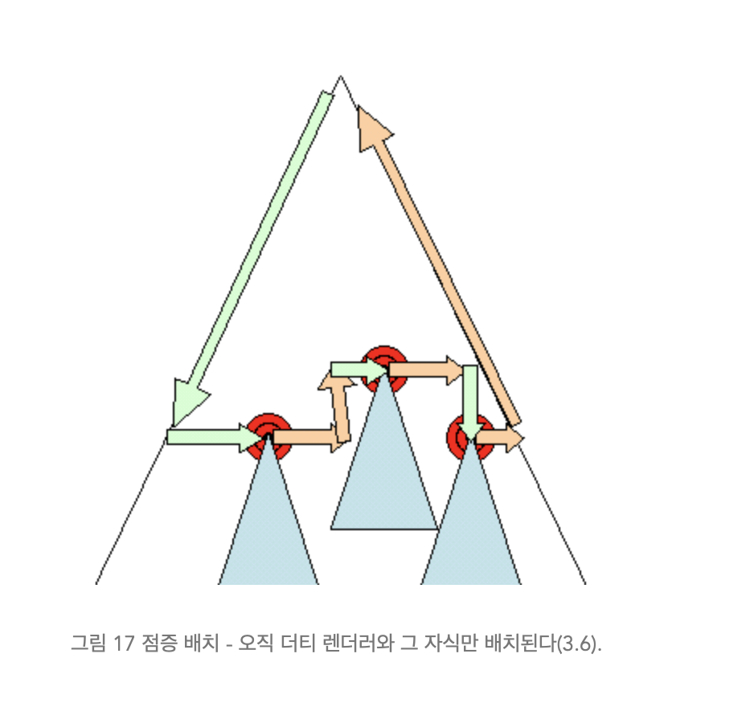
</br>

#### 19. 비동기 배치와 동기 배치

점증 배치는 비동기로 실행된다. 파이어폭스는 점증 배치를 위해 "리플로 명령"을 쌓아 놓고 스케줄러는 이 명령을 한꺼번에 실행한다. 웹킷도 점증 배치를 실행하는 타이머가 있는데 트리를 탐색하여 "더티" 렌더러를 배치한다.

"offsetHeight" 같은 스타일 정보를 요청하는 스크립트는 동기적으로 점증 배치를 실행한다.

전역 배치는 보통 동기적으로 실행된다.

때때로 배치는 스크롤 위치 변화와 같은 일부 속성들 때문에 초기 배치 이후 콜백으로 실행된다.
</br>

#### 20. 최적화
배치가 "크기 변경" 또는 렌더러 위치 변화 때문에 실행되는 경우 렌더러의 크기는 다시 계산하지 않고 캐시로부터 가져온다.

어떤 경우는 하위 트리만 수정이 되고 최상위로부터 배치가 시작되지 않는 경우도 있다. 이런 경우는 입력 필드에 텍스트를 입력하는 경우와 같이 변화 범위가 한정적이어서 주변에 영향을 미치지 않을 때 발생한다. 만약 입력 필드 바깥쪽에 텍스트가 입력되는 경우라면 배치는 최상단으로부터 시작될 것이다.
</br>

__배치과정__
배치는 보통 다음과 같은 형태로 진행된다.

- 부모 렌더러가 자신의 너비를 결정.
- 부모가 자식을 검토.
    - 자식 렌더러를 배치(자식의 x와 y를 설정)
    - (부모와 자식이 더티하거나 전역 배치 상태이거나 또는 다른 이유로) 필요하다면 자식 배치를 호출하여 자식의 높이를 계산한다.
- 부모는 자식의 누적된 높이와 여백, 패딩을 사용하여 자신의 높이를 설정한다. 이 값은 부모 렌더러의 부모가 사용하게 된다.
- 더티 비트 플래그를 제거한다.
  
파이어폭스는 "상태" 객체(nsHTMLReflowState)를 배치("리플로"를 의미)를 위한 매개 변수로 사용하는데 상태는 부모의 너비를 포함한다.

파이어폭스 배치의 결과는 "매트릭스" 객체(nsHTMLReflowMatrics)인데 높이가 계산된 렌더러를 포함한다.
</br>

__너비 계산__
렌더러의 너비는 포함하는 블록의 너비, 그리고 렌더러의 너비와 여백, 테두리를 이용하여 계산된다. 

예를 들어 다음은 div 요소의 너비를 보자.
`<div style="width:30%"></div>`

웹킷은 다음(RenderBox 클래스의 calcWidth 메서드)과 같이 계산할 것이다.

- 컨테이너의 너비는 컨테이너 availableWidth와 0 사이의 최대값이다. 이 경우 availableWidth는 다음과 같이 계산된 contentWidth이다.
  clientWidth() - paddingLeft() - paddingRight()
  clientWidth와 clientHeight는 객체의 테두리와 스크롤바를 제외한 내부 영역을 의미한다.
- 요소의 너비는 "width" 스타일 속성의 값이다. 이 컨테이너 너비의 백분률 값은 절대 값으로 변환될 것이다.
- 좌우측 테두리와 패딩 값이 추가된다.

여기까지 "미리 획득한 너비"의 계산이었다. 이제는 최소 너비와 최대 너비를 계산해야 한다.
미리 획득한 너비가 최대 너비보다 크면 최대 너비가 사용된다. 미리 획득한 너비가 최소 너비(깨지지 않는 가장 작은 단위)보다 작으면 최소 너비가 사용된다. 
배치할 필요가 있지만 너비가 고정된 경우 값은 캐시에 저장된다.
</br>

__줄바꿈__
렌더러가 배치되는 동안 줄을 바꿀 필요가 있을 때 배치는 중단되고 줄 바꿀 필요가 있음을 부모에게 전달한다. 부모는 추가 렌더러를 생성하고 배치를 호출한다.
</br>

__그리기__
그리기 단계에서는 화면에 내용을 표시하기 위한 렌더 트리가 탐색되고 렌더러의 "paint" 메서드가 호출된다. 그리기는 UI 기반의 구성 요소를 사용한다.
</br>

__전역과 검증__
그리기는 배치와 마찬가지로 전역 또는 점증 방식으로 수행된다. 점증 그리기에서 일부 렌더러는 전체 트리에 영향을 주지 않는 방식으로 변경된다. 변경된 렌더러는 화면 위의 사각형을 무효화 하는데 OS는 이것을 "더티 영역"으로 보고 "paint" 이벤트를 발생시킨다. OS는 몇 개의 영역을 하나로 합치는 방법으로 효과적으로 처리한다. 크롬은 렌더러가 별도의 처리 과정이기 때문에 조금 더 복잡하다. 크롬은 OS의 동작을 어느 정도 모방한다. 프레젠테이션은 이런 이벤트에 귀 기울기고 렌더 최상위로 메시지를 전달한다. 그러면 트리는 적절한 렌더러에 이를 때까지 탐색되고 스스로(보통 자식과 함께) 다시 그려진다.
</br>

__그리기 순서__
CSS 2는 그리기 과정의 순서를정의했다. 이것은 실제로 요소가 stacking contexts에 쌓이는 순서다. 스택은 뒤에서 앞으로 그려지기 때문에 이 순서는 그리기에 영향을 미친다. 블록 렌더러가 쌓이는 순서는 다음과 같다.
- 배경 색
- 배경 이미지
- 테두리
- 자식
- 아웃라인
</br>

__파이어폭스 표시 목록__
파이어폭스는 렌더 트리를 검토하고 그려진 사각형을 위한 표시 목록을 구성한다. 목록은 올바른 그리기 순서(배경, 테두리, 기타……)에 따라 사각형을 위한 적절한 렌더러를 포함한다. 이런 방법으로 트리는 여러 번 리페인팅을 실행하는 대신 한 번만 탐색하면서 배경 색, 배경 이미지, 테두리 그리고 나머지 순으로 그려낸다.

파이어폭스는 다른 불투명 요소 뒤에 완전히 가려진 요소는 추가하지 않는 방법으로 최적화를 진행한다.
</br>

__웹킷 사각형 저장소__

리페인팅 전에 웹킷은 기존의 사각형을 비트맵으로 저장하여 새로운 사각형과 비교하고 차이가 있는 부분만 다시 그린다.
</br>

__동적 변경__
브라우저는 변경에 대해 가능한 한 최소한의 동작으로 반응하려고 노력한다. 그렇기 때문에 요소의 색깔이 바뀌면 해당 요소의 리페인팅만 발생한다. 요소의 위치가 바뀌면 요소와 자식 그리고 형제의 리페인팅과 재배치가 발생한다. DOM 노드를 추가하면 노드의 리페인팅과 재 배치가 발생한다. "html" 요소의 글꼴 크기를 변경하는 것과 같은 큰 변경은 캐시를 무효화하고 트리 전체의 배치와 리페인팅이 발생한다.
</br>

__렌더링 엔진의 스레드__
렌더링 엔진은 통신을 제외한 거의 모든 경우에 단일 스레드로 동작한다. 파이어폭스와 사파리의 경우 렌더링 엔진의 스레드는 브라우저의 주요한 스레드에 해당한다. 크롬에서는 이것이 탭 프로세스의 주요 스레드이다.

통신은 몇 개의 병렬 스레드에 의해 진행될 수 있는데 병렬 연결의 수는 보통 2개에서 6개로 제한된다(예를 들면 파이어폭스 3은 6개를 사용).
</br>

__이벤트 순환__
브라우저의 주요 스레드는 이벤트 순환으로 처리 과정을 유지하기 위해 무한 순환된다. 배치와 그리기 같은 이벤트를 위해 대기하고 이벤트를 처리한다. 아래는 주요 이벤트 순환을 위한 파이어폭스 코드이다.
```java
while (!mExiting)  
NS_ProcessNextEvent(thread);  
```
</br>

#### 21. CSS2 시각 모델
__캔버스__

CSS2 명세는 캔버스를 "서식 구조가 표현되는 공간" 이라고 설명한다. 브라우저가 내용을 그리는 공간인 것이다. 캔버스 공간 각각의 면적은 무한하지만 브라우저는 뷰포트의 크기를 기초로 초기 너비를 결정한다.

CSS2 명세에 따르면 캔버스는 기본적으로 투명하기 때문에 다른 캔버스와 겹치는 경우 비쳐 보이고, 투명하지 않을 경우에는 브라우저에서 정의한 색이 지정된다.
</br>

__CSS 박스 모델__
CSS 박스 모델은 문서 트리에 있는 요소를 위해 생성되고 시각적 서식 모델에 따라 배치된 사각형 박스를 설명한다.
각 박스는 콘텐츠 영역(문자, 이미지 등)과 선택적인 패딩과 테두리, 여백이 있다.
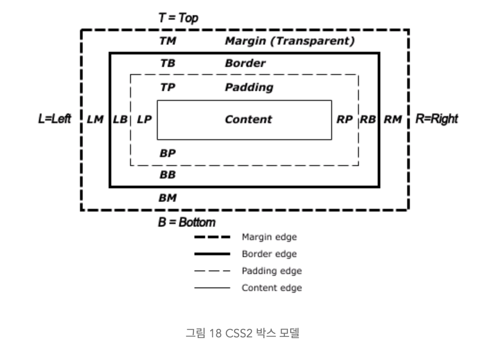
각 노드는 이런 상자를 0에서 n개 생성한다.

모든 요소는 만들어질 박스의 유형을 결정하는 "display" 속성을 갖는데 이 속성의 유형은 다음과 같다.
- block  - 블록 상자를 만든다.
- inline - 하나 또는 그 이상의 인라인 상자를 만든다.
- none - 박스를 만들지 않는다.

기본 값은 인라인이지만 브라우저의 스타일 시트는 다른 기본 값을 설정한다. 예를 들면 "div" 요소의 display 속성에 대한 기본 값은 block 이다.
브라우저의 기본 스타일 시트 예제는 [www][45][.][45][w][45][3.][45][org][45][/][45][TR][45][/][45][CSS][45][2/][45][sample][45][.][45][html][45]에서 찾을 수 있다.
</br>

__위치 결정 방법__

위치를 결정하는 방법은 다음과 같은 세 가지다.
- Normal - 객체는 문서 안의 자리에 따라 위치가 결정된다. 이것은 렌더 트리에서 객체의 자리가 DOM 트리의 자리와 같고 박스 유형과 면적에 따라 배치됨을 의미한다.
- Float - 객체는 우선 일반적인 흐름에 따라 배치된 다음 왼쪽이나 오른쪽으로 흘러 이동한다.
- Absolute - 객체는 DOM 트리 자리와는 다른 렌더 트리에 놓인다.

위치는 "position" 속성과 "float" 속성에 의해 결정된다.

- static과 relative로 설정하면 일반적인 흐름에 따라 위치가 결정된다.
- absolute와 fixed로 설정하면 절대적인 위치가 된다.
- 
position 속성을 정의하지 않으면 static이 기본 값이 되며 일반적인 흐름에 따라 위치가 결정된다. static 아닌 다른 속성 값(relatice, absolute, fixed)을 사용하면 top, bottom, left, right 속성으로 위치를 결정할 수 있다.

박스가 배치되는 방법은 다음과 같은 방법으로 결정된다.

- 박스 유형(display, inline ...)
- 박스 크기(width, height ...)
- 위치 결정 방법(position, float)
- 추가적인 정보 - 이미지 크기와 화면 크기 등
</br>

__박스 유형__
블록 박스: 브라우저 창에서 사각형 블록을 형성한다.
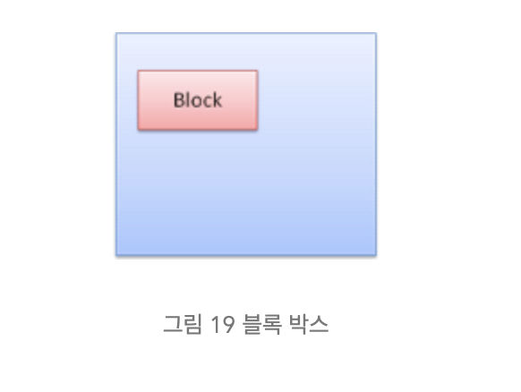

인라인 박스: 블록이 되지 않고 블록 내부에 포함된다.
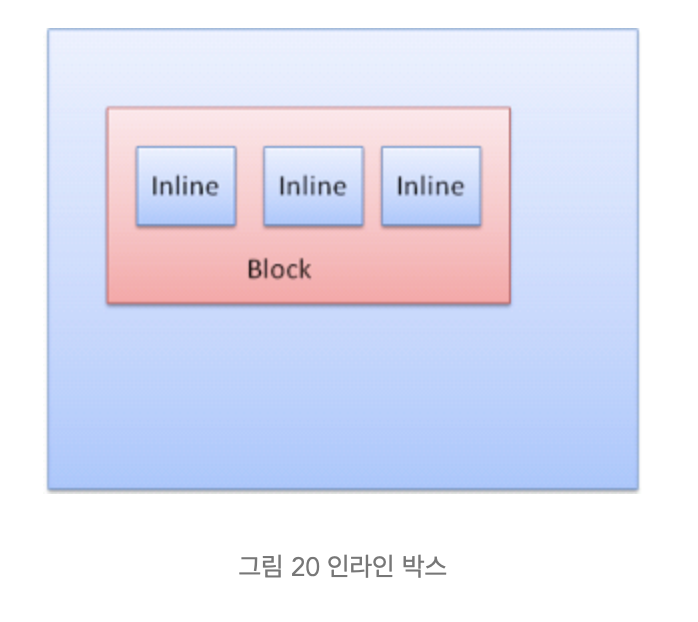

블록은 다른 블록 아래 수직으로 배치되고 인라인은 수평으로 배치된다.
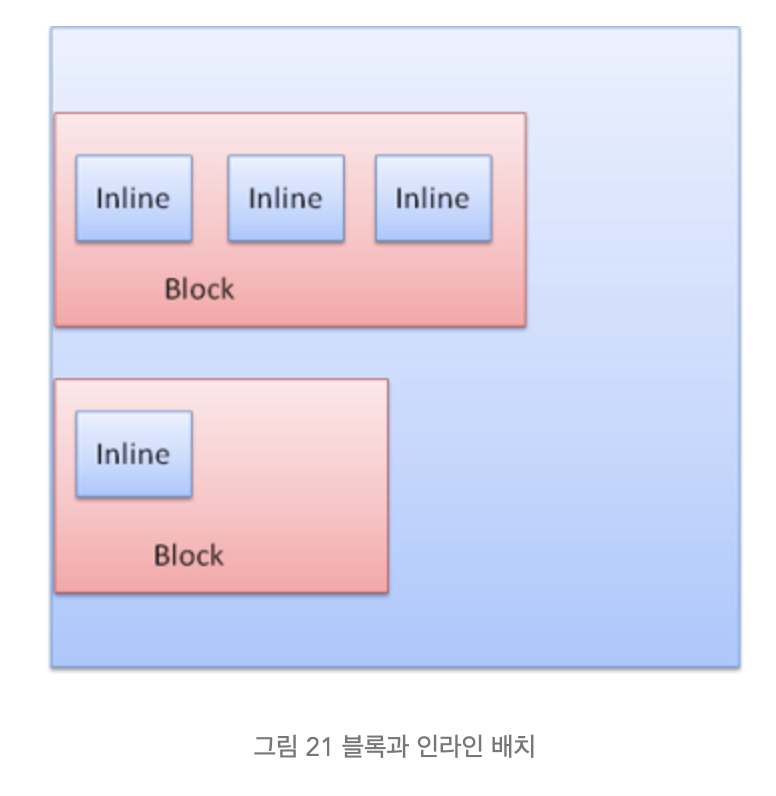

인라인 박스는 라인 또는 "라인 박스" 안쪽에 놓인다. 라인은 적어도 가장 큰 박스만큼 크지만 "baseline" 정렬일 때 더 커질 수 있다. 이것은 요소의 하단이 다른 상자의 하단이 아닌 곳에 배치된 경우를 의미한다. 포함하는 너비가 충분하지 않으면 인라인은 몇 줄의 라인으로 배치되는데 이것은 보통 문단 안에서 발생한다.
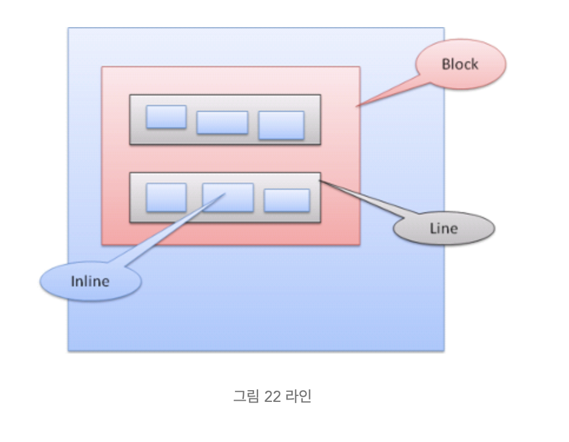

#### 22. 위치 잡기

__상대적인 위치__
상대적인 위치 잡기는 일반적인 흐름에 따라 위치를 결정한 다음 필요한 만큼 이동한다.
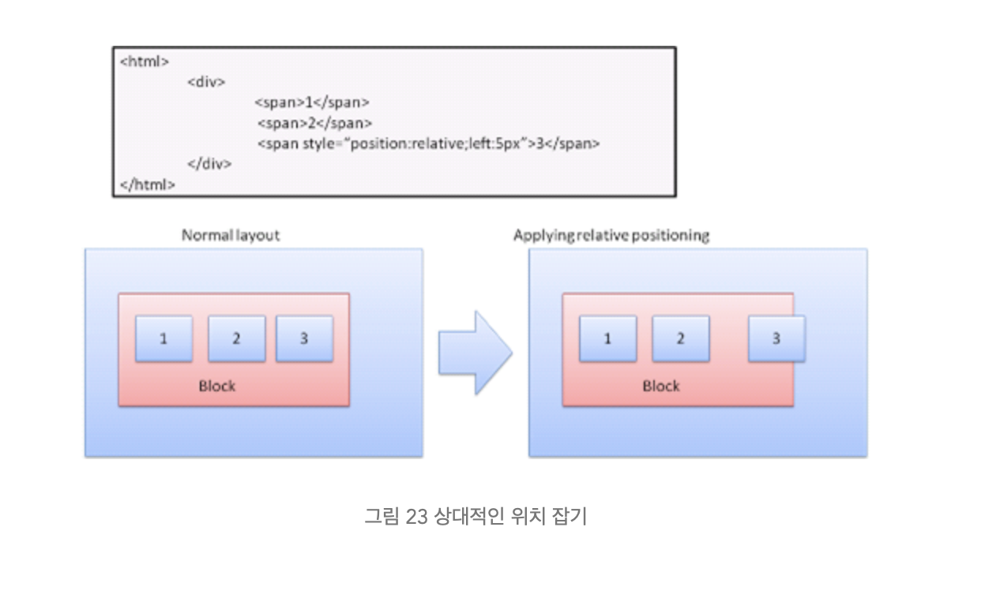
</br>

__플로트__
플로트 박스는 라인의 왼쪽 또는 오른쪽으로 이동한다. 흥미로운 점은 다른 박스가 이 주변을 흐른다는 것이다.

HTML을 다음과 같이 작성하면.
```html
<p>  
  
Lorem ipsum dolor sit amet, consectetuer...  
</p> 
```
아래와 같이 보일 것이다.

</br>

__절대적인(absolute) 위치와 고정된(fixed) 위치__
절대와 고정 배치는 일반적인 흐름과 무관하게 결정되고, 일반적인 흐름에 관여하지 않으며, 면적은 부모에 따라 상대적이다. 고정인 경우 뷰포트로부터 위치를 결정한다.
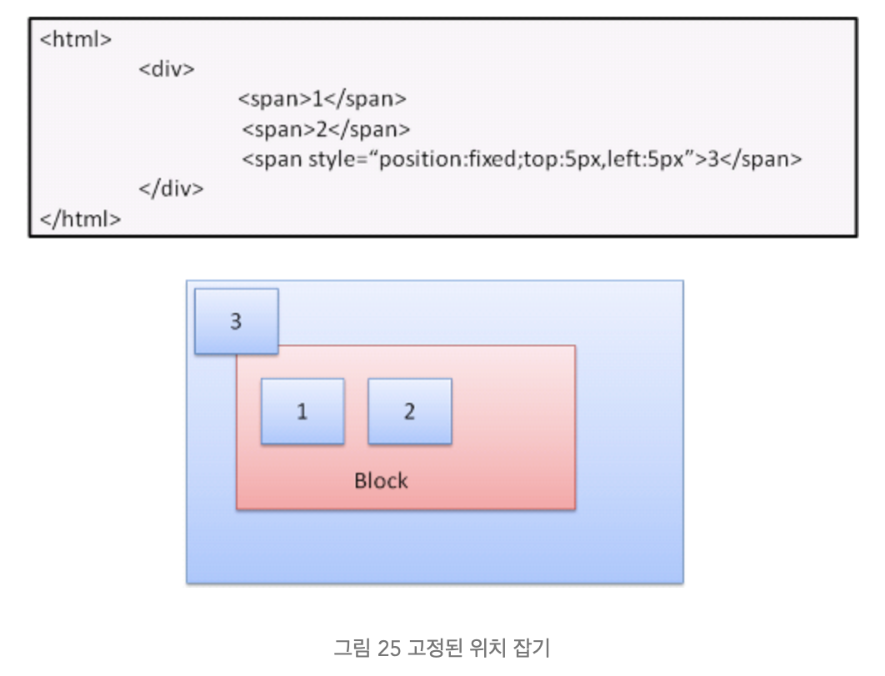
참고 - 고정된 박스는 문서가 스크롤되어도 따라 움직이지 않는다.
</br>

__층 표현__

이것은 CSS의 z-index 속성에 의해 명시된다. 층은 박스의 3차원 표현이고 "z 축"을 따라 위치를 정한다.

박스는 (stacking contexts라고 부르는) 스택으로 구분된다. 각 스택에서 뒤쪽 요소가 먼저 그려지고 앞쪽 요소는 사용자에게 가까운 쪽으로 나중에 그려진다. 가장 앞쪽에 위치한 요소는 겹치는 이전 요소를 가린다.

스택은 z-index 속성에 따라 순서를 결정한다. z-index 속성이 있는 박스는 지역 스택(local stack)을 형성한다. 뷰포트는 바깥쪽의 스택(outer stack)이다.

다음 예제를 보자.
```html
<style type="text/css">  
div {  
    position: absolute;
    left: 2in;
    top: 2in;
}
</style>  
<p>  
    <div style="z-index:3;background-color:red;width:1in;height:1in"></div>
    <div style="z-index:1;background-color:green;width:2in;height:2in"></div>
</p>  
```
이 코드는 다음과 같이 보일 것이다.
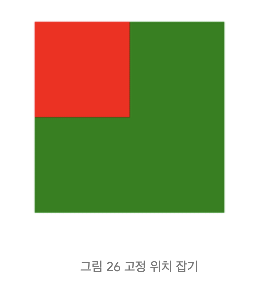
붉은색 박스가 초록색 박스보다 마크업에서 먼저 나오기 때문에 일반적인 흐름이라면 먼저 그려져야 하지만 z-index 속성이 높기 때문에 더 앞쪽에 표시된다.
#### 참고 자료
브라우저 아키텍처
Grosskurth, Alan. AReferenceArchitectureforWebBrowsers (pdf)
Gupta, Vineet. HowBrowsersWork - Part 1 - Architecture
파싱
Aho, Sethi, Ullman, Compilers: Principles, Techniques, and Tools (aka the "Dragon book"), Addison-Wesley, 1986
Rick Jelliffe. TheBoldandtheBeautiful: twonewdraftsforHTML 5.
파이어폭스
L. David Baron, FasterHTMLandCSS: LayoutEngineInternalsforWebDevelopers.
L. David Baron, FasterHTMLandCSS: LayoutEngineInternalsforWebDevelopers (Googletechtalkvideo)
L. David Baron, Mozilla'sLayoutEngine
L. David Baron, MozillaStyleSystemDocumentation
Chris Waterson, NotesonHTMLReflow
Chris Waterson, GeckoOverview
Alexander Larsson, ThelifeofanHTMLHTTPrequest
웹킷
David Hyatt, ImplementingCSS(part 1)
David Hyatt, AnOverviewofWebCore
David Hyatt, WebCoreRendering
David Hyatt, TheFOUCProblem
W3C 명세
HTML 4.01 Specification
W3CHTML5 Specification
CascadingStyleSheetsLevel 2 Revision 1 (CSS 2.1) Specification
브라우저 빌드 지침
Firefox. https://developer.mozilla.org/en/Build_Documentation
Webkit. http://webkit.org/building/build.html
번역 Ajax UI랩 장정환, 웹표준개발2팀 남덕현, 오픈퍼블리싱팀 정찬명
테크니컬 에디팅 웹플랫폼개발랩 송기선, 기술문서팀 박춘권
라이선스 특별한 고지가 없는 한 이 페이지의 내용은 크리에이티브커먼즈속성 3.0 라이선스 아래 있습니다. 코드 샘플은 아파치 2.0 라이선스 아래 있습니다.
이미지 출처 이 글에 첨부된 이미지의 출처는 특별한 언급이 없는 한 "HowBrowsersWork: Behindthescenesofmodernwebbrowsers"입니다.

  ## [4]DNS와 작동원리
  ### (1)DNS와 작동원리
  
  ## [5]domain name은 무엇인가?
  ### (1) DomainName과 HostName
  ## [6]hosting은 무엇인가?
  ### (1) 호스팅이란?