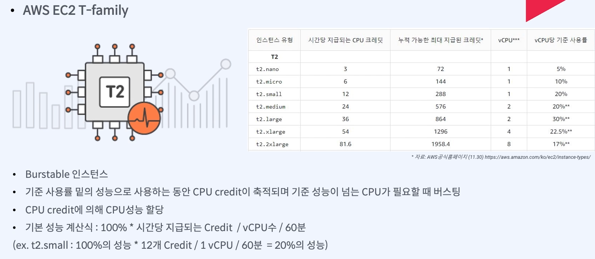
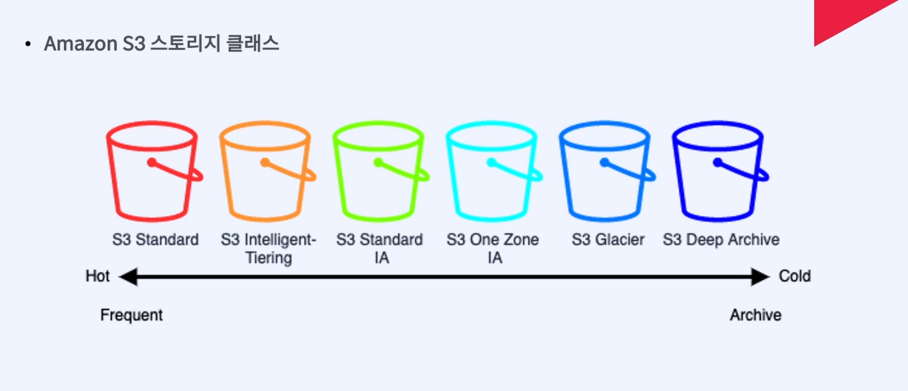
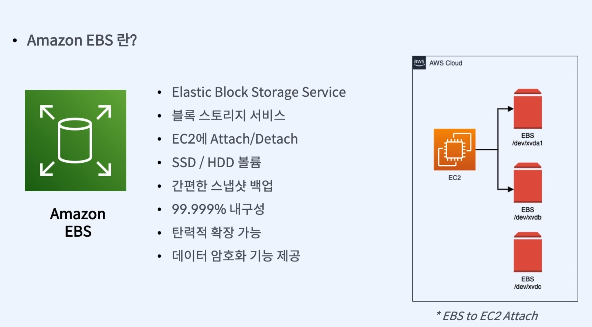

# [1]. AWS주요 서비스
## {1}. AWS주요 컾퓨팅 서비스
### (1). EC2(Elastic compute Cloude)
 __인스턴스 타입 종류__

 __인스턴스 타입 설명__

__인스턴스 T-Family 유의점__

- T-Family의 버스트기능 
  - 사이즈마다 기준 CPU사용률이 있음
  - 저 사용률 기준보다 낮은 성능으로 사용하면 CPU크레딧 이라는게 쌓임
  - 기준을 넘는 사용률으로 사용할때 크레딧을 사용해 차감됨
  - 지속해서 모든 크레딧이 사용되면cpu 성능저하가 일어남
  - 
### (2). AWS Lamda

  
## {2}. AWS주요 스토리지 서비스

### (1) S3
 

접근 빈도를 기준으로
  HOT storage:자주 사용하는 접속하는 데이터↑
  COLD storage: 자주 사용하지않는 데이터 비용↓ 
 - standard
   - 높은 내구성과 가용성을 갖춘 객체 스토리지 
   - 주로 정적 웹사이트나 콘텐츠 배포, 모바일 및 게임 어플리케이션
   - 자동으로 클래스를 이동하게 해준다
 - intelligent-tiering
   - 객체의접근 빈도의 패턴을 파악해서 자동으로 클래스를 이동하게 해준다 
   - 비용절감 효과를 볼 수 있다
 - standardIA(InfrequenrAccess)
   -  자주 접근 하진 않지만 필요할때 빠르게 접근해야 하는 데이터에 적합
 - standardIA(InfrequenrAccess)
  -  자주 접근 하진 않지만 필요할때 빠르게 접근해야 하는 데이터에 적합
  - 단일 레이지의 데이터를 저장할때 적합하고 비용이 20%정도 절감 
- Glacier 
  - 자주 접속하지 않는 장기 접근데이터 
  - 비교적 가격 저렴
- Deep Archive
  - 더 빈도가 적은 

   ex)1년에 한번

### (2) EBS
 
### (3) EFS

## {3}. AWS주요 네트워크 서비스
## {4}. AWS주요 데이터베이스 서비스
## {5}. AWS주요 보안 서비스
## {6}. AWS주요 관리형 서비스
## ec2에 베포
1.인스턴스 생성
2. ssh 로접속항땐 
 
<back>
1. ec2에 내가 쓰는 언어 다운받음
2. 내 프로젝트에 url 설정

git -- settings --> deploy keys