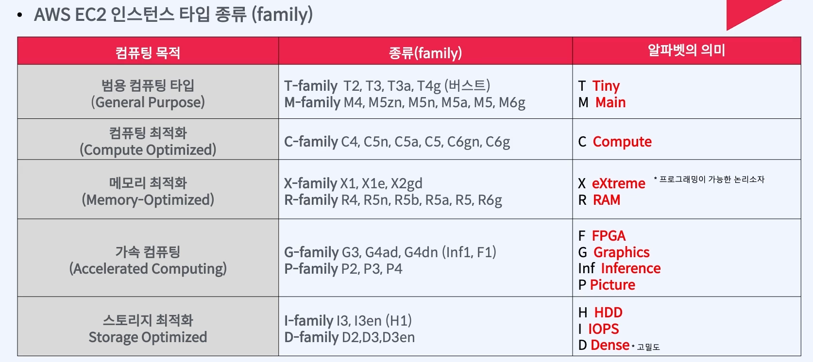
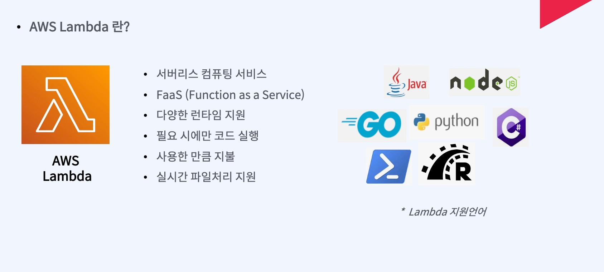

### ec2인스턴스 타입 종류

#### EC2 T-Family

- T-Family의 버스트기능 
  - 사이즈마다 기준 CPU사용률이 있음
  - 저 사용률 기준보다 낮은 성능으로 사용하면 CPU크레딧 이라는게 쌓임
  - 기준을 넘는 사용률으로 사용할때 크레딧을 사용해 차감됨
  - 지속해서 모든 크레딧이 사용되면cpu 성능저하가 일어남
  - 
### AWS Lamda

## ec2에 베포
1.인스턴스 생성
2. ssh 로접속항땐 
 
 
 
1. ec2에 내가 쓰는 언어 다운받음
2. 내 프로젝트에 url 설정

git -- settings --> deploy keys