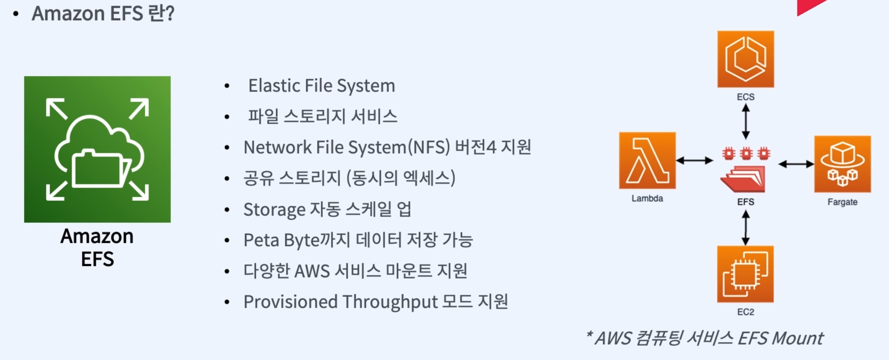
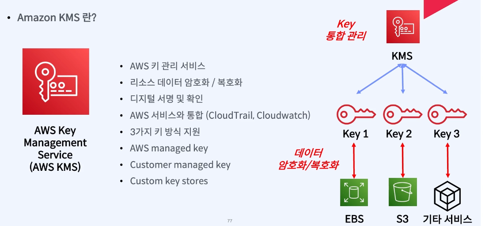
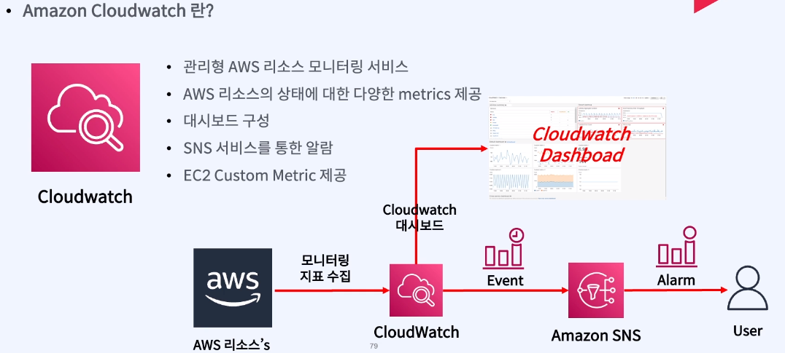

# [1]. AWS주요 서비스
## {1}. AWS주요 컾퓨팅 서비스
### (1). EC2(Elastic compute Cloude)
 __인스턴스 타입 종류__

 __인스턴스 타입 설명__

__인스턴스 T-Family 유의점__

- T-Family의 버스트기능 
  - 사이즈마다 기준 CPU사용률이 있음
  - 저 사용률 기준보다 낮은 성능으로 사용하면 CPU크레딧 이라는게 쌓임
  - 기준을 넘는 사용률으로 사용할때 크레딧을 사용해 차감됨
  - 지속해서 모든 크레딧이 사용되면cpu 성능저하가 일어남
  - 
### (2). AWS Lamda

</hr>
  
## {2}. AWS주요 스토리지 서비스

### (1) S3
 


접근 빈도를 기준으로
 <span style="background-color:#ffdce0"> HOT storage:자주 사용하는 접속하는 데이터↑</span>
 <span style="background-color:#f1f8ff"> COLD storage: 자주 사용하지않는 데이터 비용↓ </span>
 - standard
   - 높은 내구성과 가용성을 갖춘 객체 스토리지 
   - 주로 정적 웹사이트나 콘텐츠 배포, 모바일 및 게임 어플리케이션
   - 자동으로 클래스를 이동하게 해준다
 - intelligent-tiering
   - 객체의접근 빈도의 패턴을 파악해서 자동으로 클래스를 이동하게 해준다 
   - 비용절감 효과를 볼 수 있다
 - standardIA(InfrequenrAccess)
   -  자주 접근 하진 않지만 필요할때 빠르게 접근해야 하는 데이터에 적합
 - standardIA(InfrequenrAccess)
  -  자주 접근 하진 않지만 필요할때 빠르게 접근해야 하는 데이터에 적합
  - 단일 레이지의 데이터를 저장할때 적합하고 비용이 20%정도 절감 
- Glacier 
  - 자주 접속하지 않는 장기 접근데이터 
  - 비교적 가격 저렴
- Deep Archive
  - 더 빈도가 적은 </p>
   ex)1년에 한번

### (2) EBS
 
### (3) EFS

## {3}. AWS주요 네트워크 서비스

### (1) VPC(Virtual Private-Network Computing)
가상의 사설 네트워크를 구축함

{:width="200" height="70"}
    - 동일한 네트워크에 있는거섳럼 통신 가능 
    - 위의 예시에서 A-C_D로는 불가능하고 A-D로 연결이 되어야함
  - 
    - 중앙관리- 관리측면의 유리
### (2) cloudFront
- 
- cdn : 클라이언트가 인터넷에 접속하는것과 가까운곳에서 컨텐츠를 캐싱해서 전세계 오리진 서버에서 배포함
- 내가 아마존을.com 검색해서 들어갈 경우 미국 아마존 오리진 서버로 접속하는것이 아닌 현재 내위치에서 가장 가까운 클라우드엣지로케이션에 캐싱이 되어있는 서비스에 접근을 해서 네트워크를 좀더 빠르게 이용한다
- 주요할점 :
-  
### (3) route53
-  
- aws dns시스템 도매인 구매/등록
- aws내부 리소스 헬스체크 기능 
 다양한 route53 policy 
 #


## {4}. AWS주요 데이터베이스 서비스
### (1) RDS(RelationalDatabaseService)
#### 
##### 1-1 RDS Multi AZ구성 
  - 눈으로 보이지 않지만 서로다른 가용영역에 복제품으로 SlaveDB라는 형태의 디비를 사용한다
  - masterDB가용역역에 장애가 발생하면 수분이내에 master->slave 로 failover(장애극복기능)
  - 장애복구 시간에 민감한 서비스라면 반드시 사용해야 하지만 비용이 두배정도 차이난다
##### 1-2 Read Replica구성 
  - 읽기 부화분산 기능
  - masterdb의 부화가 생겼을떄 
##### 1-3 dynamoDB 
  - aws가 만든 완전관리형 noSQL데이타베이스
##### 1-4 elasticache 
  - memory크기만큼만 가능 
  - elasticacheRedisCluster 
## {5}. AWS주요 보안 서비스
### (1). WAF
인터넷에서 사용하는 http,https트래픽을 모니터링하고 차단함으로써 고객의 웹 어플리케이션을 보호하는 도구
가용성에 영향을 미치거나, 보안을 악화시키거나, 리소스를 과다하게 사용하는 등등 여러형태의 웹공격을 보호해줌
[OWASP TOP 10](https://velog.io/@ayg0418/OWASP-Top-10/)


### (2). Shield
DDOS란? 네트워크에 트래픽을 의도적으로 과다하게 키워서 컴퓨팅 자원에 과부화를 거는 공격
트래픽 과부화로 인해 시스템중단,성능저하 트래픽 발생


### (3). KMS
암호화키를 쉽게 사용하고 제어하도록 하는 서비스


## {6}. AWS주요 관리형 서비스
### (1). cloudwatch

### (2). SNS(Simple Notificaytion Service)

### (3). cloudtrail

</hr>
</hr>
# [2]. AWS 가격정책


## {1}. 가격약정 할인(RI/Saving Plan)

## {2}. 네트워크 트래픽 비용
__네트워크 트래픽?__ 
- 네트워크상에서 송수신된는 모든 데이터 통신의 양
- 홈페이지를 열고 닫을 때, 이미지/동영상 다운로드 받을 때, 메신저 대화할
- 트래픽 양 = 용량 * 사용자 수 * 개수(4GB *10명 * 10개)=400GB
- 
## {3}. 비용 최적화

### (1). FinOps 클라우드 사용금액을 관리하고 운영하는 process

- 1. 정확한 스펙의 리소스를 사용하는가?
- 2. 유연한 사용량의 조절
  - fargate:사용량이 일정하지 않은 서비스에 사용권유
- 3. 올바른 가격정책의 활용
- 4. 다양한 스토리지 옵션 활용 
  - ex)standardS3 storage / deep archive storage
### (2). 오픈소스 billBot

[billBot-github](https://github.com/cremich/cdk-bill-bot/)
billBot :aws비용레포트 일간,월간 슬랙을 통해 알림을 받는 오픈소스 솔루션
- 아키텍쳐 핵심 : aws CUR을 쌓는것 
  - CUR : aws Cost and Useage Report 

</hr></hr>

# [3]. AWS CLI
## {1}.사용
aws
- awsCli
  - [최신버전의 aws-cli install](https://docs.aws.amazon.com/ko_kr/cli/latest/userguide/getting-started-install.html)
#
ㅊ

```javascript
aws sts get-caller-identity
```
## {1}.유저 추가

```javascript
aws configure --profile [사용자이름]
accessKey->
secretKey->
region->ap-northeast-2
output->json

aws sts get-caller-identity --profile [사용자이름]
or
export AWS_PROFILE=[사용자이름]
aws sts get-caller-identity 
```

