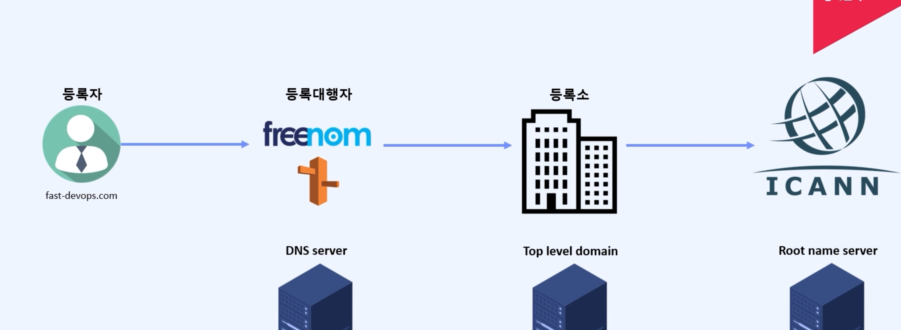
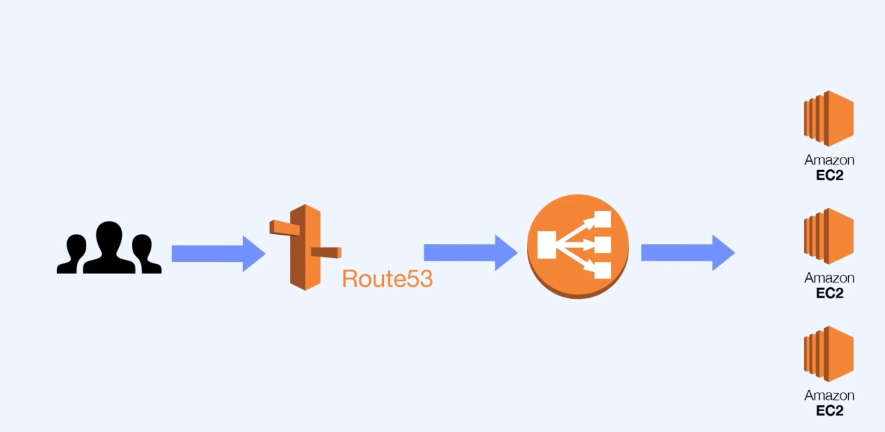
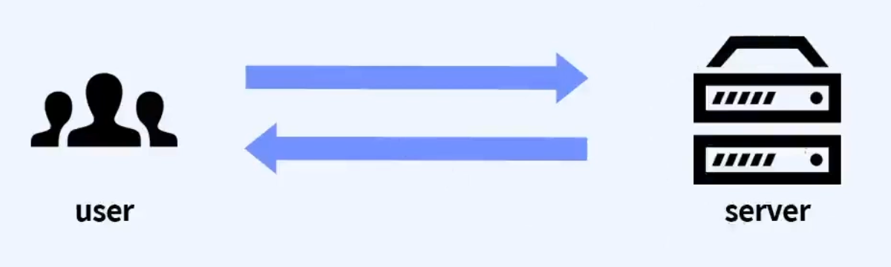
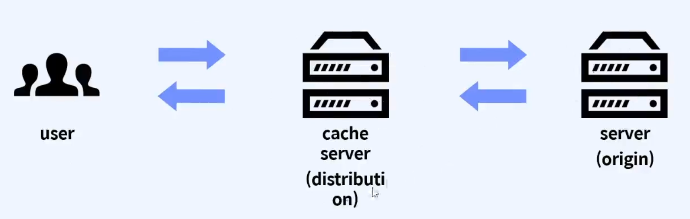
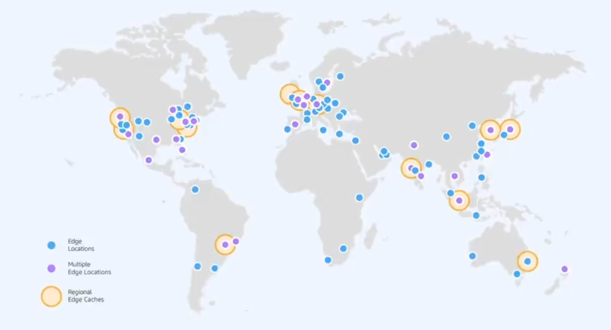

등록대행자 : route53

route52 으ㅡㄹ 활용한 http설정
만든 route53을 ec2서버 여러개를 연결한 elb에 연결한다

https 를 설정 해주기 위해서 certificate매니저 만들어준다

certificate manager -> 공인 인증서(amazon내부)요청 -> 

## [3] CloudeFront 
= Cache + CDN

- 기본적으로 Cache서버
- Cache서버는 전세계에 흩어져 있는 인프라를 활용하기 때문에  추가적으로 CDN기능도 보유
- 웹서버의 비용을  감소시키며, 전세계의 유저를 대상으로 고속으로 웹서비스를 제공하도록 하는 서비스

#### Cache 
__기존방식__

 - 클라이언트가 요청할 때마다 서버가 응답해주는 방식
 - HTML문서를 준비해놨다가 뿌려주는 것이 아니라, 동적으로 생성하는 방식 
 - 유저 입장에선 느림
 - 서버 입장에선 서버비용이 많이 나감
이를 해결하기 위해서 

__새로운 방식__

 - 클라이엉ㄴ트가 요청하여 응답된 결과를 cache로 저장
 - 다음번에 클라이언트가 요청할 때는 기존 server에 요청할 필요 없이 cache server에 요청하여 저장된 정보를 추출
 - 요청할 때마다 동저긍로 생성하는 방식에서 벗어나, 준비된 데이터를 cache에 저장하고 그대로 뿌려줌
  
  -->일반적으로 캐시서버 사용하는 페이지는 잘 바뀌지 않는페이지 
  자주 바뀌는 페이지의 사용한다면 캐시서버의 리로드 시간을 짧게 설정한다

  #### CDN
  - 전세계 어느 위치에서 접속하더라도 빠른 속도로 서비스할 수 있도록 하는 서비스
  - Content Delivery Network의 약자
  - 전 세계에 흩어져 있는 Edge Location(캐시서버) 활용
  