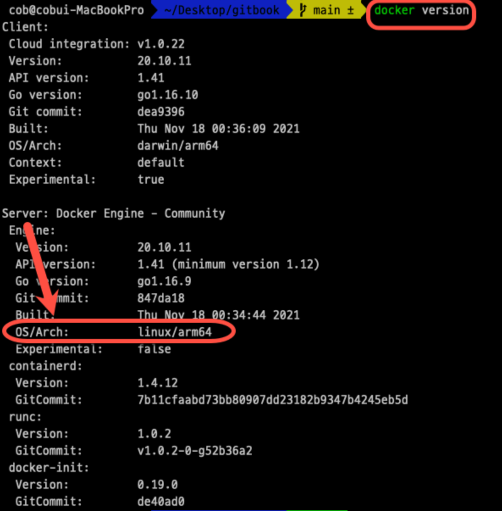

- [ \[1\]. 도커 ](#-1-도커-)
- [ \[2\]. 도커 기본지식쌓기](#-2-도커-기본지식쌓기)
- [--\>](#--)
- [ \[3\]. 도커 명령어](#-3-도커-명령어)
- [ \[4\].  도커이미지 만들기 ](#-4--도커이미지-만들기-)
- [5\]](#5)


## <span style = "color:purple"> [1]. 도커 </span>
Docker는 컨테이너가 아니고 컨테이너를 위한 운영체제이며 각서버에 설치되어 컨테이너를 구축, 시작, 중단하는데 사용할 수 있는 명령어를 제공

* 도커를 쓰는이유 
한서버에 여러개의 프로그램을 사용할 경우 스펙(버전)이 전부 다 다를 수 있음
--> 컨테이너 위에서 구동시켜서 버전이 일치하지않는 문제 등을 해결할 수 있다.
--> 서로의 소프트웨어적으로 간섭이 일어나지 않는다.

* 도커컴포즈 쓰는이유 
--> 여러개의 도커를 관리하기 위함이다

* kubernetes 쓰는이유 
--> 여러개의 도커를 관리하거나 그것을 관리하는 도커컴포즈를 관리 할 수 있다.,


#### 1-1 도커이미지?
 컨테이너를 정의하는 읽기전용 템플릿이다. 이 이미지에는
    __라이브러비, 종속성데 대한 정의, 실행되는 코드가포함__
    되어 있다. 이런 도커 이미지가 인스턴스화된 것이 바로 도커 컨테이너이다.

## <span style = "color : darkorange"> [2]. 도커 기본지식쌓기</span>


__도커 != 가상머신__
컨테이너란 공통기능 세트를 충족하는 단일 호스트에서 실행되는 격리된 프로세스 그룹이며 이런 기능중 일부는 Linux커널에서 찾을 수 있다.
\

??어떻게 도커 컨테이너를 격리시키는 것일까?
이를 위linux의 cgroup(control group)과 네임스페이스(namespace)에 대해 알아야한다

#### Linux Namespaces(ns)
   1. 2002년 리눅스와 함께 도입된 리눅스 커널 기능이다.(도커역시 리눅스 커널 기능을 이용해 컨테이너를 격리한다)
   이 기능은 추상화 계층에서 특정 전역 시스템 리소스를 랭핑하는것이다. 이렇게하면 네임스페이스 내의 프로세스에 리소스의 자체 격리 인스턴스가 있는것처럼 보이게 할 수 있으며,
   <span style = "color:red">네임스페이스의 주요 긴응은 프로세스를 서로 격리한다는것<span>

2. 개발자는 컨테이너를 사용하면 완전한 vm을 사용하고 있는것처럼 착각 할수 있다 하지만 사실은 어딘가 단일서버에서 두개의 프로세스가 실행되고 있지만 서로 격리되어 있는 것이다 현재 사용 가능한 네임스페이스는 여러 개의 고유한 네임스페이스가 구현되어있다.->{
   __user__: root 가 같은 공간 내에서 권한을 가질 수 있다.
   __pid__ : 다른 독립적인 네트워크 스택을 가지고 자신의 개인 라우팅 ip주소 세트 테이블, 소켓 ㅇ녀결 테이블, 방화벽, 기타 네트워크 관련 자원 추적 목록을 가질 수 있다.
   __mnt__ :호스트 파일 시스템에 영향을 주지 않고 마운트 네임스페이스에서 파일 시스템을 마운트 및 언마운트 할 수 있다.
   __ipc__ : 자신의 ipc자원이 아닌 posix메시지 큐이다.
   __uts__ : 하나의 시스템이 다른 프로세스에 다른 호스트 및 도메인 이름을 가지고 있는 것처럼 보일 수 있다 
   }

#### Linux Namespaces(ns)
제어 그룹은 프로세모음의 리소스 사용량 (cpu, 메모리, 디스크, I/O,네트워크)
리소스 제한 : 프로세스가 사용 할 ㅅ ㅜ있는 특정 리소스의 양을 제한하도록 cgroup을 구성 할 수 있다.
우선 순위 : 리소스 경합이 있을때 다른 cgroup의 프로세스와 비교하여 프로세스가 사용할 수 있는 리소스의 양을 제어할 수 있다.
회계 : 리소스 제한은 cgroup수준에서 모니터링 되고 보고된다.
제어 : 단일 명령으로 cgroup 을 사용하여 포드 수준에서 리소스 요청 및 제한, 해당 [QoS클래스](https://kubernetes.io/docs/tasks/configure-pod-container/quality-service-pod/)
를 구현 할 수 있다

#### Linux 컨테이너(LXC)와 Docker 컨테이너으 차이점은?
1. LXC는 OS컨테이너화에 중점을 두는 반면 Docker컨테이너는 애플리케이션 컨테이너화에 중점을 둔다
2. LXC는 다목적 운영체제의 가상화인 반면 Docker는 단일목적 애플리케이션의 가상화이다
3. LXC는 단일 제어 호스트 에서 여러 개의 가상환경을 생성하고 실행할 수 있는 os수준의 가상화 기수을 제공
```
docker version
```

## -->  

macOS환경임에도 Linux이다
내 컴퓨터 상관없이 도커 서버가 리눅스 vm환경에서 실행된다 
### ==>> 모든 커테이너는 리눅스 가상머신 위세서 생성되며 , 리눅스 커널이 컨테이너를 ㄲ리시키고 리소스를 나눠주게 된다.


## <span style = "color:blue"> [3]. 도커 명령어</span>
```java
$ docker run [이미지 이름] [실행할 명령어(optional)]
```
docker create 과 docker start를 한번에 실생시키는 명령어 이다
__->이미지를 생성 및 실행__
<hr>
```java
$ docker ps
$ docker ps -a
```


<hr>

```java
$ docker stop [중지할 containerId 또는 이름] / docker kill [중지할 containerId 또는 이름]
```
docker stop : 진행중이던 작업을 모두 마치고 컨테이너를 중지한다
docker kill : 즉시 컨테이너를 중지한다 
<hr>

```java
$ docker rm [이미지ID]
```
도커 컨테이너 삭제 명령어  
<hr>
```java
$ docker rmi [이미지ID]
```
도커 컨테이너 뿐만 아니라 이미지를 삭제하고 싶을때 사용하는 명령어

<hr>
```java
$ docker images
```
도커 이미지 목록


## <span style = "color:green"> [4].  도커이미지 만들기 </span>
#### {1}. 도커 파일 만들기
도커 파일은 컨테이너 이미지를 만드는데 사용되는 단순한 텍스트 기반 지침 스크립트 이다 꼭 
'Dockerfile'이라는 이름 의 파일로 만들자

```
FROM amd64/amazoncorretto:11-alpine3.13

EXPOSE 9999
RUN apk add
WORKDIR /root
COPY build/libs/kees-0.0.1-SNAPSHOT.jar .
CMD java -jar kees-0.0.1-SNAPSHOT.jar
```
from : 베이스 이미지이다 간단하게 말해 OS라고 생각하면된다.
RUN  : 도커 이미지가 생성되기 전에 수행할 쉘 명령어이다.
COPY : Docker클라이언트의 현재 디렉토리에서 파일을 추가한다()
CMD  : 컨테이너 내에서 실행할 명령을 지정, 도커파일내에서 한번만 사용 가능

#### {2}. docker build 명령을 사용하여 컨테이너 이미지를 빌드하기 
```
docker build -t getting-startd .
```
__-t :__  이미지에 태그를 지정해준다. 사람이 읽을 수 있는 이미지의 이름으로 생각하면 된다.
이미지 이름을 지정했기 때문에 컨테이너를 실행할 대 해당 이미지를 참조할 수 있다.
__.:__ 현재 디렉터리에서 Dockerfile을 찾아야 한다고 알려준다. 


#### {3}. docker run - 만든이미지로 애플리케이션 실행하기

```
$ docker run -dp 3000:3000 getting-start
$ docker ps 
```
__-dp__ : 새컨테이너를 분리된모드(백그라운드)에서 실행하고 호스트의 포트 3000과 컨테이너 포트 3000 간에 매핑을 생성하고 있다. 포트매핑이 없으면 애플리케이션에 접근할 수 없다.


## <span></span>5]
https://code-masterjung.tistory.com/134