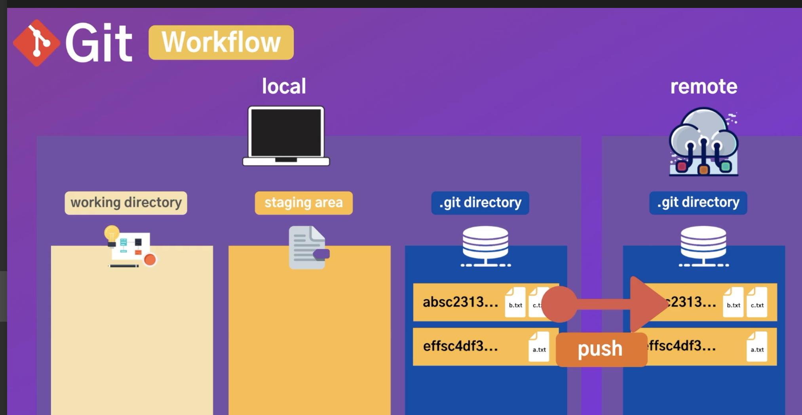
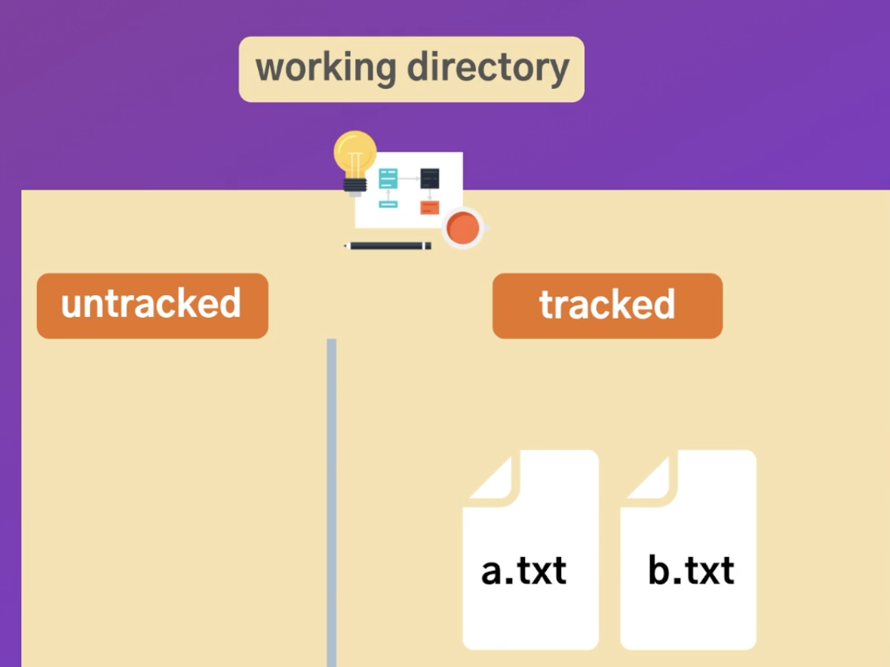
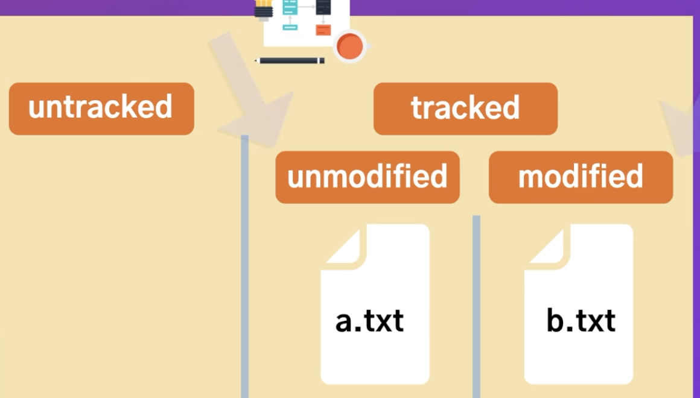

# 3. basic

- [3. basic](#3-basic)
	- [1. git `Workflow`](#1-git-workflow)
	- [2. git add](#2-git-add)
	- [3. git ignore](#3-git-ignore)
	- [4. git diff](#4-git-diff)
	- [5. git commit](#5-git-commit)
	- [6. commit tip](#6-commit-tip)
	- [7. useful tip when fileUpdate](#7-useful-tip-when-fileupdate)
	- [8. view version list](#8-view-version-list)
	- [9. make log prtty](#9-make-log-prtty)
	- [10. log deepening content](#10-log-deepening-content)

## 1. git `Workflow`

 - working directory : 작업하고 있는 파일들
 - staging area : 작업을 마치고 저장할 준비를 하고 있는 파일들
 - .git directory : staging area 에서 commit 명령어를 이요해서 깃버전 히스토리에 저장 하게 된다 checkout 명령어를 통해서 언제든 working directory로 돌아갈 수 있다.
 - remote directory :  local directory에서 push 명령어를 통해서 서버에 저장할 수 있다.
  각각의 스냅샷은 해쉬코드가 있어서 그걸 기준으로 되돌리고 올리고 사용할 수 있다

**워킹 디렉토리**

- 깃이 트랙하고 있는 tracked 영역
- 새로만들어지거나 git을 초기화 하게 되면 깃이 파일에 대한 정보가 없기 떄문에 아직 트래킹하고 있지 않은파일
  
***  


- 깃이 트래킹 하고 있는 파일 중에서도 수정된 파일과 수정되지 않은 파일 두가지 영역으로 나뉩니다.
수정이 되지 않은영역은 수정된 영역만 staging area로 옮겨 갈 수 있습니다. 


## 2. git add
```
austin@laonstory-mac-austinui-MacBookPro git % echo hello world >a.txt
austin@laonstory-mac-austinui-MacBookPro git % echo hello world >b.txt
austin@laonstory-mac-austinui-MacBookPro git % echo hello world >c.txt
austin@laonstory-mac-austinui-MacBookPro git % git st
현재 브랜치 master
커밋하도록 정하지 않은 변경 사항:
  (무엇을 커밋할지 바꾸려면 "git add <파일>..."을 사용하십시오)
  (use "git restore <file>..." to discard changes in working directory)
	수정함:        b.txt
	수정함:        c.txt

추적하지 않는 파일:
  (커밋할 사항에 포함하려면 "git add <파일>..."을 사용하십시오)
	a.txt

커밋할 변경 사항을 추가하지 않았습니다 ("git add" 및/또는 "git commit -a"를
사용하십시오)
austin@laonstory-mac-austinui-MacBookPro git % git add .
austin@laonstory-mac-austinui-MacBookPro git % git st
현재 브랜치 master
커밋할 변경 사항:
  (use "git restore --staged <file>..." to unstage)
	새 파일:       a.txt
	수정함:        b.txt
	수정함:        c.txt

austin@laonstory-mac-austinui-MacBookPro git % echo austin >> a.txt
austin@laonstory-mac-austinui-MacBookPro git % git st
현재 브랜치 master
커밋할 변경 사항:
  (use "git restore --staged <file>..." to unstage)
	새 파일:       a.txt
	수정함:        b.txt
	수정함:        c.txt

커밋하도록 정하지 않은 변경 사항:
  (무엇을 커밋할지 바꾸려면 "git add <파일>..."을 사용하십시오)
  (use "git restore <file>..." to discard changes in working directory)
	수정함:        a.txt

austin@laonstory-mac-austinui-MacBookPro git % git add .
austin@laonstory-mac-austinui-MacBookPro git % git st
현재 브랜치 master
커밋할 변경 사항:
  (use "git restore --staged <file>..." to unstage)
	새 파일:       a.txt
	수정함:        b.txt
	수정함:        c.txt
```

## 3. git ignore 
추가하고 싶지 않은 파일들
.gitignore 파일에 추가
-> 깃이나 깃허브에 올리고 싶지 않은 파일들 -> 트랙 되지 않음

## 4. git diff
어떠한 내용이 바꼈는지 확인

## 5. git commit 
git commit == staging area 애 있는 변경 사항을 git repository로 옮겨주는 역할 
보통 커밋메세지에 title description로 작성을 합니다
or
> git add .
> git commit -m(메세지명령어)	"[커밋 메세지]" 
> q를 눌러 밖으로 빠져나온 다음

## 6. commit tip
repository => histroy 의 창고 => 다만들고나서 커밋하면 큰 의미가 없습니다.
작은 단위로 만들어 나가는것이 좋음
but commit1, commit2, commit3, ..... 처럼 의미없는것은 하지말것
페이지나 작은 기능 단위로 하는것이 좋습니다. -> 원하는 작업단위로 볼 수 있고 원하지 않는 커밋을 지울수도 있도록

**주의점 : 커밋할때 겸사겸사 다른것도 수정하거나 추가해서 커밋하면 안됨

## 7. useful tip when fileUpdate
terminal 명령어 rm 을 이용하면 staging area에 포함 되지 않지만 
>git rm 명령어를 이용하면 바로 staging area에 포함됩니다.
mv(파일이름 변경) ->명령어또한 마찬가지
## 8. view version list
 >git log 

=> 위에 있을수록 최신
=> 방햘키로 아래로 이동
=> 커밋아이디, 누가 만들었는지, 시간, 타이틀
</br>
>git patch or git -p

=> 어떤내용이 바뀌었는지
</br>
>git log --onlinse

->해쉬코드 앞자리와 커밋 메세지 정도 볼 수 있음
</br>
원하는 커밋으로 돌아가기 
해쉬코드 복사한다음 
>git checkout  [해쉬코드]


사용하면 해당 commit 으로 head(현재 바락보고 있는 커밋)가 옮겨지게 됩니다
</br>
커밋의 순서를 역순으로(가장 최신것이 가장 밑에) 보고싶다면
>git log --online --reverse

## 9. make log prtty
> git --pretty=onlie 하면 해쉬 다 볼 수 있음

깃사이트에서 reference -> log -> 밑에내리면 포맷 명령어 많습니다

>git log --oneline(간단하게 보기) --graph(브랜치의 이동을보기) --all(전체브랜치를 보기)

쓰기편한 git pretty format :
>git log --graph --all --pretty=format:'%C(yellow)[%ad]%C(reset) %C(green)[%h]%C(reset) | %C(white)%s %C(bold red){{%an}}%C(reset) %C(blue)%d%C(reset)' --date=short

로그를 볼때마다 명령어를 쓰기 어려우니 alias로 등록해서 사용하자
>git config --global alias.[사용하고싶은 별칭] "log --graph --all --pretty=format:'%C(yellow)[%ad]%C(reset) %C(green)[%h]%C(reset) | %C(white)%s %C(bold red){{%an}}%C(reset) %C(blue)%d%C(reset)' --date=short"

## 10. log deepening content
> git log -3
> git log --online -3
> git log --author="H.austin"
> git log --before="2020-09-09"
> git log --gre="project"
> git log -S "about"
> git log -S "about" -p
> git log -p about.txt
> git log -s about .txt
> git log HEAD
> git log HEAD~1
> git show [해쉬코드]
> git show [해쉬코드]:user_repo.txt
> git show [해쉬코드] [해쉬코드]


