- [1. Why should I use branch?](#1-why-should-i-use-branch)
- [>git branch --all](#git-branch---all)
- [2. fast-forward merges](#2-fast-forward-merges)
    - [demo](#demo)
- [2.1. merge옵션 no-ff](#21-merge옵션-no-ff)
- [3. three-way merge](#3-three-way-merge)
    - [demo](#demo-1)
- [4. Conflict 해결](#4-conflict-해결)
    - [merge conflict? : git이 merge할 때 무언가 문제가 있어서 자동적으로 해결이 안된, 무언가 충돌이 났을때 즉, 두가지의 branch에서 같은 파일을 수정햇을떄 어떤 내용을 받아들여야 할지 모를때 발생하게 됩니다.](#merge-conflict--git이-merge할-때-무언가-문제가-있어서-자동적으로-해결이-안된-무언가-충돌이-났을때-즉-두가지의-branch에서-같은-파일을-수정햇을떄-어떤-내용을-받아들여야-할지-모를때-발생하게-됩니다)
        - [*merge conflic만 해결하는 commit은 mergeconflic만 해결 해야하는데 은근슬쩍 변경사항 끼워팔기 금지](#merge-conflic만-해결하는-commit은-mergeconflic만-해결-해야하는데-은근슬쩍-변경사항-끼워팔기-금지)
- [5. what`s the Rebase](#5-whats-the-rebase)
        - [*주의 : 다른개발자와 하게 되면 conflict가 발생할 수 있습니다.](#주의--다른개발자와-하게-되면-conflict가-발생할-수-있습니다)
    - [demo](#demo-2)
- [6. cherry pick](#6-cherry-pick)

## 1. Why should I use branch?


서비스 하고있는 제품의 branch는 master 브랜치에서
 새롭게 추가할 기능은 feature A라는 브랜치에서 작업한다면 
 feature A, feature B 등등 각기다른 개발자가 개발하기 떄문에
 협업을 위해서, 소스코드별로, bug fix별로 개발하기 위해서 필요ㅕ합니다.
 
 즉 제품에 추가될 준비가 되었다면 아래 그림처럼 master branch로 merge를 이용할 수 있습니다.
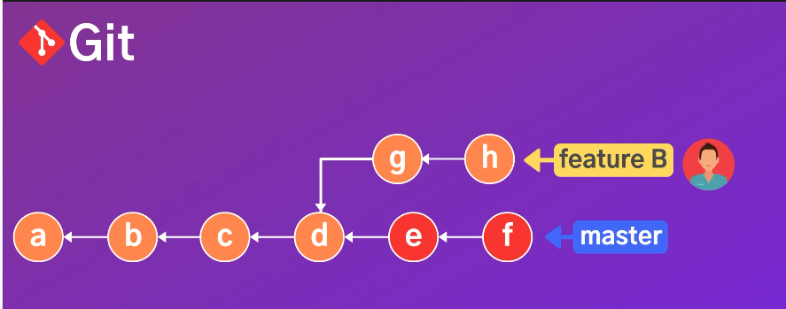
하지만 대부분은  feature A에서 작업했던 commit history가 더럽게 남겨지는걸 원치 않기 떄문에
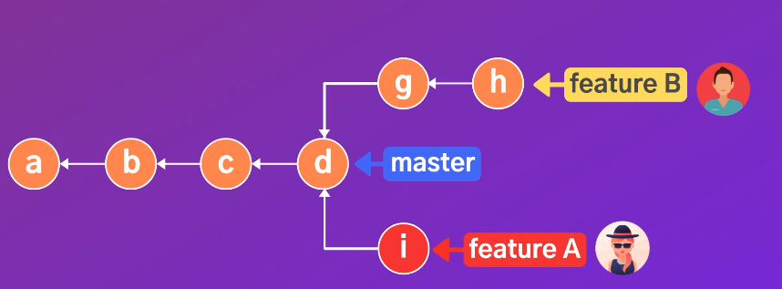
위 그림과 같이 새로운 커밋 I를 만들고 난 이후
i commit만 깔끔하게 master branch로 가져옵니다.

---
브랜치들을 보고싶다면 

>git branch
<hr>
서버의 있는 브랜치의 정보도 보고싶다면

>git branch --all
---
새로운 브랜치를 만들고 싶다면
>git brnach [브랜치이름]`

 브랜치를 만드는것은 새로운 무언가를 만드는게 아니라 새로운 포인터를 만드는 개념입니다.

---

새로만들면서 브랜치로 이동하고 싶다면
- >git switch -C [이동하기싶은 브랜치이름]

---
브랜치 별로 최신 커밋 확인

>git branch -v

---
현재 브런치에 머지된 브런치들을 확인 할 수 있습니다.
- >git brnach merge 

---
마스터 브랜치에 머지되지 않은 
즉 파생된 commit에 대한 정보가 나옵니다.
>git branch --no-merged
 
## 2. fast-forward merges

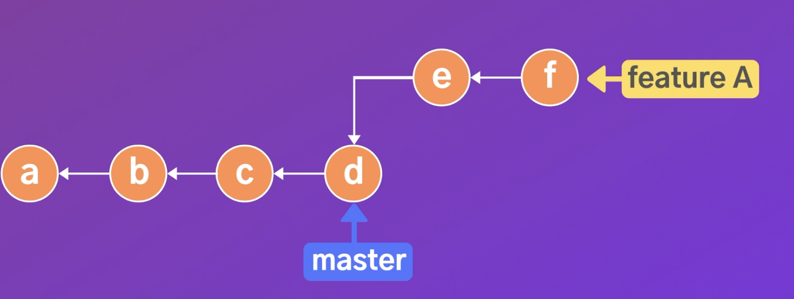
master브랜치의 변경사항이 없을경우 
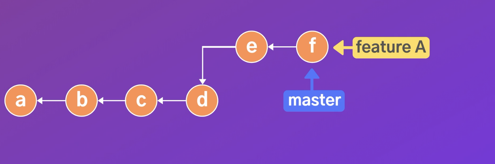
merge할때 단순히 master브랜치가 가리키고 있는 포인터를 d가 아닌 f로 옮겨 놓고 branch를 삭제하면 된다

**단점 : 히스토리에 머지 되었다는 사실이 남지 않는다**

모든 커밋과 기록이 남길 원하는 것이라면 
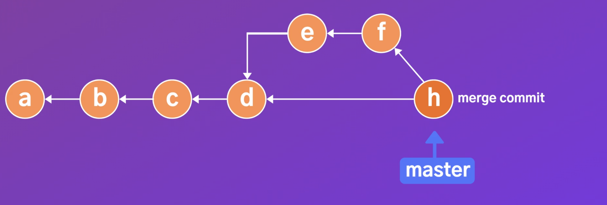
이렇게 d와 f 를 합한 h라는 커밋을 만들면 됩니다.

#### demo 
```
현재 브랜치 => master
git merge [merged branch name]       //브랜치에 있던 내용 마스터 브랜치에 병합
git ls(hist)                         //확인 - 마스터 브랜치에 다 병합 되었는지
git branch -d [merged branch name]   //마스터 브랜치에 병합 되었으니 기존에 있던 브랜치 삭제
```

## 2.1. merge옵션 no-ff
ffm(fast-forward-merge)이 싫다 무조곤 히스토리에 다 남기고 싶어요?
>git merge --no-ff [브랜치이름]

->commit message 입력후 종료하면
merge커밋이 완료됩니다. 

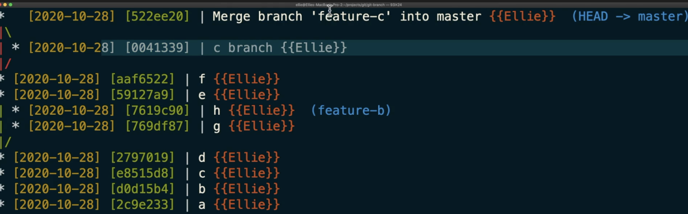


## 3. three-way merge


feature A의 포인터가 가리키는 d commit에서 변경사항이 있는 g커밋이 있다면

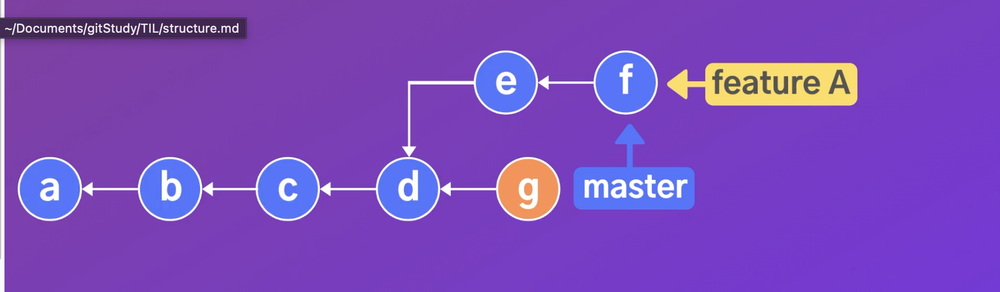

ffm을 하게 될 경우 g commit의 변경사항을 잃어버림
원래의 브랜치에서 새로운 커밋이 발생했다면 three-way-merge를 이용애햐 합니다
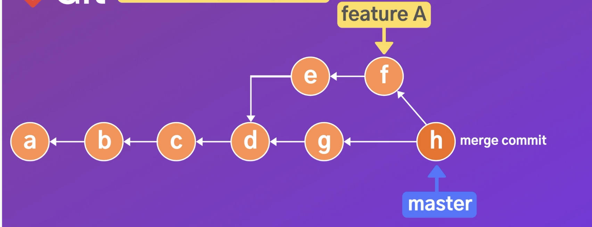
master브랜치 + 파생된 feature A=new commit

#### demo
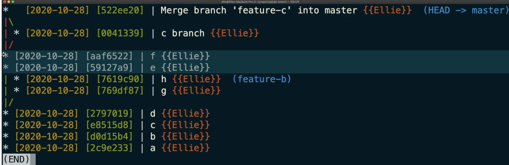
 d commit이 파생된 master브랜치에서 새로운 e, f commit이 발생 했기때문에 fast-forward-merge가 불가능
 이런경우에 
 >git merge featureB 동시에 묶어주는 merge commit이 만들어집니다.

 --> git merge의 경우 fast-forward가 가능하다면 이뤄지고 불가능하다면 따로 merge commit이 만들어집니다.
 절대 하고싶지 않다면 git merge --no-ff명령어를 통해서 할 수 있습니다.
 
 ## 4. Conflict 해결
#### merge conflict? : git이 merge할 때 무언가 문제가 있어서 자동적으로 해결이 안된, 무언가 충돌이 났을때 즉, 두가지의 branch에서 같은 파일을 수정햇을떄 어떤 내용을 받아들여야 할지 모를때 발생하게 됩니다.

이상황에서 merge를 하게되면 에러가 발생하게 됩니다.
그리고 파일의 내용등 수정된 곳을 살펴보면 새롭게 자동으로 삽입된 문자열 등이 잇는것을 확인할 수 있습니다.

__4-1. 수동으로 하는방법__ 
해당 파일을 열어 수동적으로 깃에서 추가해준 내용을 삭제 하면 됩니다.
###### *merge conflic만 해결하는 commit은 mergeconflic만 해결 해야하는데 은근슬쩍 변경사항 끼워팔기 금지
수정을 하고 저장을 하고 파일을 끄고 
merge를 취소하고 싶다면
>git merge --abort를 이용하면 되고
git st 확인
>git add [파일이름] .
git st 확인

>git ㅡmerge --continue

하면 commit message를 입력하고 다시
git log(hist)확인해보면
커밋이 잘 된것을 확인 할 수 있습니다.

__4-2.VScode를 이용해서 merge conflict를 해결하는 방법__

>git config --global -e 깃의 글로벌 세팅을 에딧모드로 열고

>[merge]
    tool = vscode
[mergetool "vscode"]
    cmd = code --wait $MERGED
이 네줄 추가해 주고
저장 + 종료ㅕ

git merge [병합하려는 브랜치 이름]
하면 수동으로 했을때처럼 에러가 나오고
>git mergetool 명령어를 입력하면 vscode가 열리고

버튼들이 활성화 되고
현재 있는 브랜치의 내용을 받아들인다. | 머지하고자 하는 브랜치의 변경사항을 받아들인다 | 둘다 받아들인다. | 간단하게 확인하겠다.
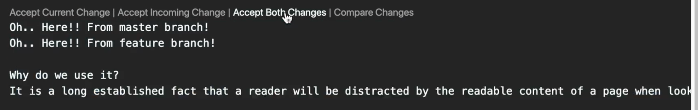
저장하고 파일을 끈후 git st를 확인해보면 
자동적으로 커밋할 준비가 되어있는것을 확인할 수 있지만

[병합하려고 했던 merge-conflict가 발생한 backup파일이 자동적으로 생성되어있다.]
오리지널 파일이 생성되는것이 맘에 안든다면 옵션을 꺼줘야 한다
>git config --global mergetool.keepBackup false
git merge --abort

git st
아직 남아있는것을 확인할 수있다.(옵션을 끄기전에 생성된 것이기 떄문)

>git clean -fd
디렉토리에 있느 ㄴ파일 정리가 됩니다. 
gitmerge --continue

## 5. what`s the Rebase
three-way-merge 하고도 히스토리 남기지 않는 방법
 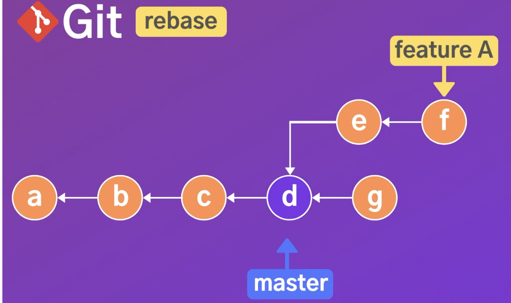
 feature A가 파생된 d commit에서 
 브런치가 수정되었다면 fast-forward가 아닌 three-way-merge가 일어나게 됩니다.
 
 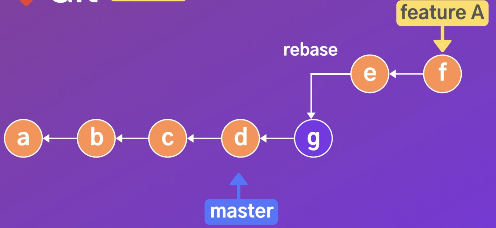
이렇게 참조의 방향을 바꾸면 fast-forward가 가능합니다.

###### *주의 : 다른개발자와 하게 되면 conflict가 발생할 수 있습니다.

#### demo

>git checkout [병합할 브랜치]
git rebase master
git checkout master
git merge [병합할 브랜치]
git branch -d [머지된것]
git st


## 6. cherry pick
 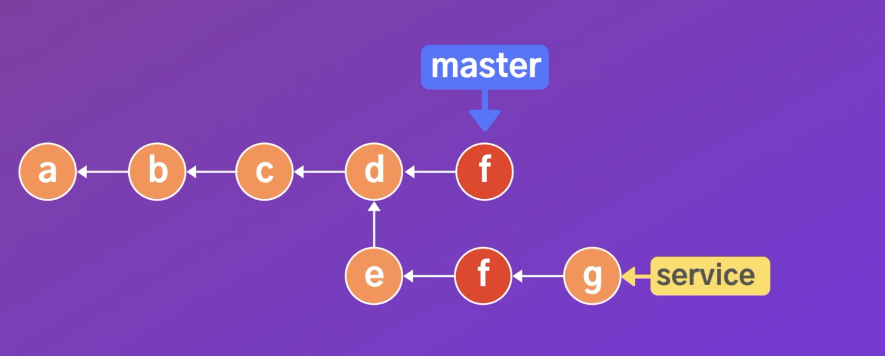
원하는 commit만 merge 하는 방법

해당커밋의 해쉬코드 복사후 

붙이고싶은 브랜치에서 
>git cherry-pick [해쉬코드]


