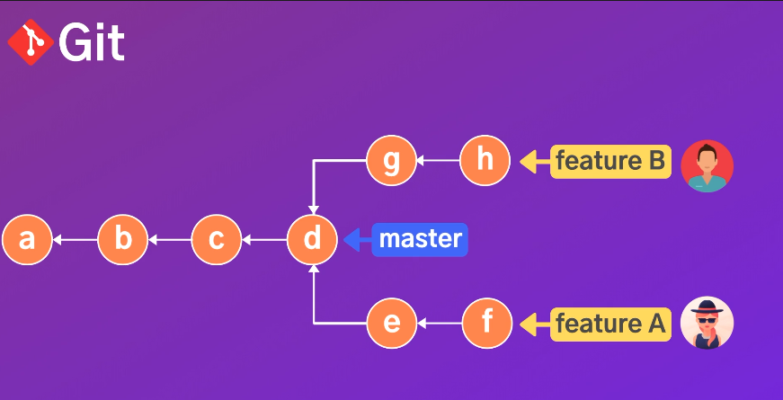

## 1. Why should I use branch?
서비스 하고있는 제품의 branch는 master 브랜치에서
 새롭게 추가할 기능은 feature A라는 브랜치에서 작업한다면 
 feature A, feature B 등등 각기다른 개발자가 개발하기 떄문에
 협업을 위해서, 소스코드별로, bug fix별로 개발하기 위해서 필요ㅕ합니다.
 
 즉 제품에 추가될 준비가 되었다면 아래 그림처럼 master branch로 merge를 이용할 수 있습니다.

하지만 대부분은  feature A에서 작업했던 commit history가 더럽게 남겨지는걸 원치 않기 떄문에

위 그림과 같이 새로운 커밋 I를 만들고 난 이후
i commit만 깔끔하게 master branch로 가져옵니다.

---
브랜치들을 보고싶다면 

>git branch
<hr>
서버의 있는 브랜치의 정보도 보고싶다면

>git branch --all
---
새로운 브랜치를 만들고 싶다면
>git brnach [브랜치이름]

 브랜치를 만드는것은 새로운 무언가를 만드는게 아니라 새로운 포인터를 만드는 개념입니다.

---

새로만들면서 브랜치로 이동하고 싶다면
- >git switch -C [이동하기싶은 브랜치이름]

---
브랜치 별로 최신 커밋 확인

>git branch -v

---
현재 브런치에 머지된 브런치들을 확인 할 수 있습니다.
- >git brnach merge 

---
마스터 브랜치에 머지되지 않은 
즉 파생된 commit에 대한 정보가 나옵니다.
>git branch --no-merged
 
## fast-forward merges


master브랜치의 변경사항이 없을경우 

merge할때 단순히 master브랜치가 가리키고 있는 포인터를 d가 아닌 f로 옮겨 놓고 branch를 삭제하면 된다

**단점 : 히스토리에 머지 되었다는 사실이 남지 않는다**

모든 커밋과 기록이 남길 원하는 것이라면 

이렇게 d와 f 를 합한 h라는 커밋을 만들면 됩니다.

#### demo 
```
현재 브랜치 => master
git merge [merged branch name]       //브랜치에 있던 내용 마스터 브랜치에 병합
git ls(hist)                         //확인 - 마스터 브랜치에 다 병합 되었는지
git branch -d [merged branch name]   //마스터 브랜치에 병합 되었으니 기존에 있던 브랜치 삭제
```

