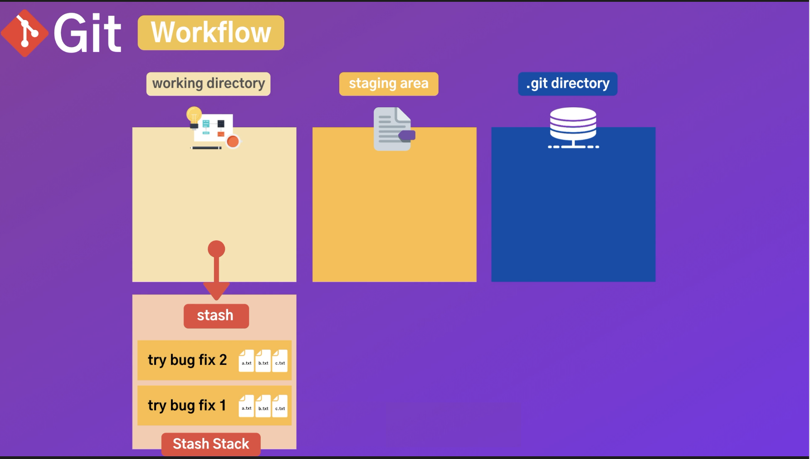

#stash

## 1. why is Stash important?
만약 working dirctory 에서 작업하다가 다른사람의 브랜치를 확인하고 오류검사등등 하기위해 브랜치를 전환해야 하는 상황이나 버그를 고치고 있을때 잘 안될때 각각의 시도를 잠시 저장하고 싶을때 
staging area에 넣기에는 애매할때 잠깐 저장할 수있는 공간입니다. 

__demo__
>git stash push -m "first try"

