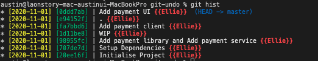

# UNDO

## 1. 실수를 만회하는 방법들
- 커밋을 성급하게 해서 모든 수정사항을 함께 commit하지 못했거나
- 커밋 메세지가 맘에 들지 않거나
- 커밋을 너무 많이해버려서 잘라서 다시하고싶다면
- 커밋을 너무 조금씩해서 하나로 묶고 싶다거나
- 실수로 버그를 도입했거나 
- 다시 되돌리고 싶다면
  
***다른 개발자와 협업하고 있다면 주의할것!**

__demo__

- WIP : Working In Progress
   - 아직 일이 진행중이다.
   - 어떤것에 대한것인지 모르겠음
   - 정확하게 그다음 어떤일이 진행되어야 하는지 모름
- .(dot) 이라는 의미없는 이름의 커밋이 마스터 브랜치에 올라와있음

## 2. cancel before commit
>git restore .
>git restore [파일명]

스테이징 에리어 에서 취소하고 working directory로 가져오고 싶다
>git restore --staged .
>git restore --staged [파일명]

git reset : 해당 버전에 맞게 초기화 해달라
내가 가고자하는 포인터를 가리킬수 있습니다.
>git reset HEAD .
스테이징에 있는 모든아이들이 다시 워킹디렉토리로 옮겨가게 됩니다.

어떤 커밋으로부터 파일을 초기화 할지

git restore --source=[헤드포인터]
git restore --source=GEAD~2 payment-ui.txt
git restore --source=[해쉬코드]
git restore --source=0ddd7ab

## 3. commit modify
커밋메세지 변경하기
>git commit --amend -m "[커밋메세지]" 

커밋 내용 변경하기
> git commit --amend

** 서버에는 변경사항을 입력하지 않았을떄 유용합니다

## 4. reset

>git reset [해쉬코드]

원하는 포인터를 가리키게 됩니다.
작업하고 있던 내용들도 초기화

>git restore .
>git clean -fd

>git reset --hard HEAD~2
>git reset --soft HEAD~2

다시 원상태로 돌아가고 싶다면?

## 5. honey TIP
>git reflog
(reference log)

git reset --hard [해쉬코드]
*언제든지 돌아갈 수 있지만 커밋이 이전에 된 상태에서만 가능합니다.

