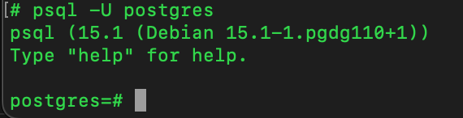

# PostgreSQL

 ## [1]. 설명 
postgresql 은 확장 가능성 및 표준 준수를 강조하는 객체- 관계형 데이터베이스 관리 시스템(ORDBMS)오픈소스 및 관련 회사들이 개발에 참여 하고 있습니다.

## [2]. postgresql VS mysql

### - {1}. postgresQL특징
- 오픈 소스: PostgreSQL은 무료이며 오픈 소스 개체 관계형 데이터베이스 관리 시스템(ORDBMS)입니다. RDBMS가 아닌 ORDBMS로서 PostgreSQL은 개체 지향적 기능과 관계형 데이터베이스 기능을 모두 허용합니다.
  <br/>
- 맞춤 구성 가능: DBMS가 요구 사항에 부합하도록 플러그인을 개발함으로써 PostgreSQL을 맞춤 구성할 수 있습니다. 또한 PostgreSQL을 사용하면 C/C++, Java 등 다른 프로그래밍 언어로 만들어진 사용자 지정 기능도 통합할 수 있습니다.
  <br/>
- 오랜 역사: PostgreSQL은 1988년에 처음 도입됐습니다.
 <br/>
- 높은 업데이트 빈도: 가장 최근에 이루어진 PostgreSQL 업데이트는 2019년 5월 9일에 릴리스된 버전 11.3입니다.
<br/>
- 자유로운 오픈 소스 라이선스: PostgreSQL에는 DBMS를 원하는 대로 자유롭게 사용, 수정, 배포할 수 있는 오픈 소스 라이선스가 있습니다.
<br/>
- MVCC 기능: PostgreSQL은 다중 버전 동시성 제어(MVCC) 기능을 구현한 첫 DBMS입니다.
<br/>
- 지원 커뮤니티: 헌신적인 개발자 및 지원자들로 구성된 커뮤니티가 필요할 때 도움을 제공합니다. 사설 외부 업체의 지원 서비스도 이용할 수 있습니다. 동일한 커뮤니티에서 PostgreSQL을 지원하고 PostgreSQL Global Development Group(PostgreSQL 글로벌 개발 그룹)을 통해 플랫폼을 업데이트합니다.
<br/>
- 별점 4.4: G2Crowd의 415개의 리뷰로부터 별점 4.4(5점 만점)를 받았습니다.

 <code>정리 : ostgreSQL은 오픈 소스 관계형 데이터베이스 분야에서 가장 흥미로운 옵션 중 하나입니다. 무료인데다가 요즘에는 다양한 고급 옵션을 제공하고 있습니다. 사실 오늘날 최첨단 데이터베이스 엔진으로 간주되고 있습니다. Postgres에서는 트랜잭션을 할 때 읽기 잠금을 사용할 필요가 없으므로 확장성이 크게 향상됩니다. 또한, 개인이나 회사가 아닌 개발자 커뮤니티가 관리하므로 쉽고 빠르게 작업할 수 있습니다. </code>

 ### - {2}. mysql 특징
- 오픈 소스: MySQL은 무료이며 오픈 소스 관계형 데이터베이스 관리 시스템(RDBMS)입니다.
- 오랜 역사: MySQL은 1995년에 처음 도입됐습니다.
- Oracle에서 유지 관리: Oracle에서 MySQL을 소유 및 유지 관리하고 있으며 추가 서비스, 독자적 플러그인, 확장 기능, 사용자 지원 등을 지원하는 프리미엄(유료) 버전의 MySQL을 제공합니다.
- 지원 커뮤니티: 필요한 경우 헌신적인 지원자 커뮤니티가 문제 해결을 지원합니다.
- 안정성 및 신뢰성: 데이터베이스를 "깔끔하게" 유지하고 정기적으로 유지 관리를 수행하면 MySQL은 매우 안정적인 RDBMS이라고 사용자가 입을 모아 이야기합니다.
- MVCC 기능: MySQL은 현재 다중 버전 동시성 제어(MVCC) 기능을 제공하고 있습니다. MVCC는 PostgreSQL에서 더 잘 알려진 기능입니다(아래에서 자세히 설명).
- 높은 업데이트 빈도: MySQL은 새 기능과 보안 개선 사항이 자주 업데이트되는 것이 장점입니다. 가장 최근에 이루어진 업데이트는 2019년 4월 25일에 릴리스된 버전 8.0.16입니다.
- 별점 4.3: MySQL은 G2Crowd에서 총 1,261개의 리뷰로부터 별점 4.3점(5점 만점)을 받았습니다. 

<code>
정리 : MySQL은 안정적인 무료 오픈 소스 데이터베이스 관리 시스템으로, 프로덕션 애플리케이션에서 사용할 수 있습니다. 개발자가 대규모 다중 계층 애플리케이션이 있는 프로덕션 애플리케이션 서버와 데스크톱에 설치해 사용할 수 있는 경량의 데이터베이스입니다. Windows, Linux, Mac 등 모든 플랫폼에 설치 가능합니다. 보안성이 뛰어나며 어떠한 보안 취약성에도 취약하지 않습니다.
</code>
  

### {3}. 세 가지 코딩 차이

 대소문자 구분
기본 문자 집합 및 문자열
IF 및 IFNULL 문과 CASE 문의 비교

- __(1). 대소문자 구분__

  -   MySQL은 대소문자를 구분하지 않습니다. 쿼리 작성 시 데이터베이스에 표시되는 대로 문자열을 대문자로 표기할 필요가 없습니다. PostgreSQL은 대소문자를 구분합니다. 데이터베이스에 표시되는 것과 동일하게 문자열을 대문자로 표기하지 않으면 쿼리가 실패합니다.

- __(2). 기본 문자 집합 및 문자열__

  -   특정 MySQL 버전의 경우 문자 집합과 문자열을 UTF-8로 변환해야 합니다. PostgreSQL 경우 문자 집합과 문자열을 UTF-8로 변환할 필요가 없습니다. 게다가 UTF-8 구문은 PostgreSQL에서 허용되지 않습니다.

- __(3). IF 및 IFNULL 문과 CASE 문의 비교__

  -   MySQL에서 IF 및 IFNULL 문을 사용해도 아무런 문제가 되지 않습니다. PostgreSQL에서는 IF 및 IFNULL 문은 사용할 수 없습니다. 대신 CASE 문을 사용해야 합니다.


### {4}. 결론

결론적으로 MySQL과 PostgreSQL 중 어느 것을 선택하느냐는 종종 다음과 같은 질문에 의해 결정됩니다.

복잡한 쿼리와 대규모 데이터베이스를 다룰 수 있는 기능이 풍부한 데이터베이스가 필요한가요? PostgreSQL이 선택지가 될 수 있습니다.
설치와 관리가 비교적 쉽고, 빠르고, 안정적이며, 파악이 어렵지 않은 간단한 데이터베이스가 필요한가요? MySQL이 선택지가 될 수 있습니다.


도커에서 

```
docker run --name austin-postgres 
-v/Users/austin/Documents/austin/private/project/back/docker-volumes
: // 앞과뒤를(↑↓) 연결할것이다
/var/lib/postgresql/data 
-p 5432:5432 //포트설정
-e POSTGRES_PASSWORD=austin //포스트그레 기본 패스워드 설정
-d postgres
```


명령어로 포스트그레스 이미지를 실행시킨다 
터미널로 접속해서 ('docker exec -it sr-postgres /bin/bash' 이지만 난 한번도 안해봤다 도커 데스크톱에서 터미널 버튼진입했다)

```
 # psql -U postgres 
 
 ```


```
postgres=# CREATE USER [userName] PASSWORD '[mypassword]' SUPERUSER; -- userName이란 이름의 mypassword를 비밀번호로 갖고 있는 슈퍼유저 생성
postgres=# \du  --유저 목록, 권한보기
postgres=# SELECT * FROM PG_SHADOW; -- 비밀번호 암호화 걸려있는 [userName] 있을꺼임
postgres=# ALTER ROLE [userName] CREATEDB  --DB생성권한부여
postgres=# ALTER ROLE [userName] REPLICATION  --복제가능권한부여
postgres=# CREATE DATABASE [dbName] OWNER [username];
postgres=# \c [dbName] [userName] -- 'userName'으로 'dbName' 디비 사용가능
[dbName]=# CREATE SCHEMA [schemaName] -- 스키마 만들기
[dbName]=# \dn  --schema별로 소유권 리스트
```