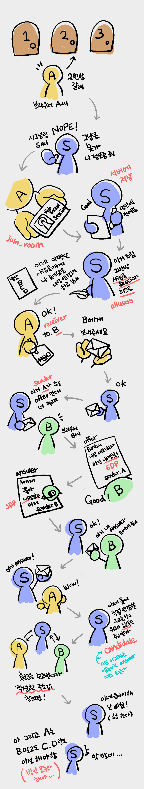
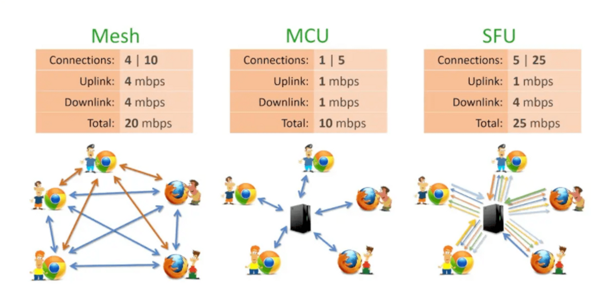
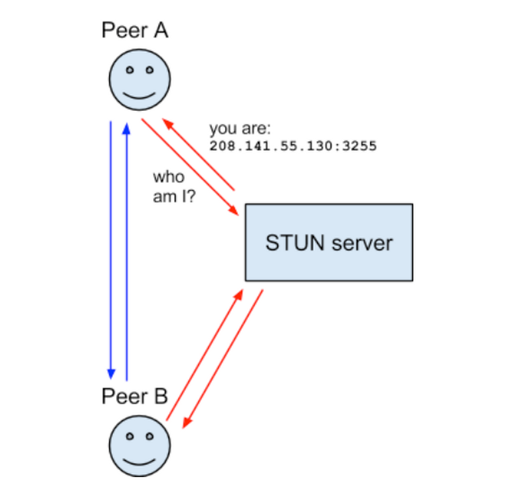

<h1>web-RTC</h1>

#### 📍HTTP는 브라우저와 서버가 소통하는 프로토콜로 인터넷 데이터 교환의 가장 기본이 된다.
그런데 Http는 요청 방식을 보면 단방향이다. 브라우저가 요청하면 서버가 응답하고 그리고 끝!
상태를 유지하지도 않고 금방 우리가 뭐했는지도 잊어버리는 stateless 무상태로 돌아간다. 심지어 브라우저의 요청에만 반응하기 때문에 단반향이라 실시간에 적합하지 않아 뭐가 새로 업데이트를 했는지 보려면 계-속 뭐가 새로 바뀌었니 하면서 서버에 요청을 해야한다. 
그래서 실시간성에 HTTP가 적합하지 않자 Websocket이 등장했다.
Websocket은 브라우저와 서버간의 연결이 유지한다. 서로 계속 연결할 뿐만 아니라 양방향으로 가능한 통신이라 브라우저는 물론이고 서버도 요청없이 변화가 생기면 바로바로 브라우저에게 메세지를 보낼 수 있게 되었고 그 연결은 누군가 끊기 전까지 계속 된다. 
하지만 웹소켓도 중개자인 서버가 필요하고 서버가 일일이 상대방을 포워딩해서 내용을 다른 사람에게 전달해야하다 보니 서버의 성능, 비용등의 많은 문제가 생긴다. 
그럼 중개자가 없어지고 브라우저들 끼리만 연결하면 어떨까?
이게 바로 WebRTC가 하는 기능이다. 이름도 Web Real Time Communication의 약자인 이유가 서버 없이 서로 메세지, 음성, 영상등을 주고 받아 중개자인 서버가 없으니 속력이 빨라 실시간에 적합하기 때문이다. 

#### 📍WebRTC (Web Real-Time Communication) 란?
웹과 앱에서 별 다른 드라이버나 플러그인 없이 실시간으로 데이터를 교환할 수 있어 카메라와 마이크를 사용해 P2P(Peer to Peer) 실시간 커뮤니케이션이 가능을 하게 하는 기술

WebRTC는 별개의 플러그인을 설치하는 등의 귀찮은 작업도 필요없이 브라우저만 있으면 되기 때문에 편리하다.
게다가 서버는 계속 전달해줘야 하는 역할에서 빠지니 서버가 가져야하는 부담이 줄어 좋다. 

그럼 잠깐 여기서 서버가 할일이 여기서 어딘데? 

바로 WebRTC 시작지점에서 서버가 해줘야 할일이 있다.  WebRTC는 그냥 이뤄지는 게 아니라 처음으로 서로에 대해 소개를 하는 시간이 필요하고,  이 부분에 있어서는 서버가 중개자로서의 역할을 해줘야 하는데 이를 시그널링 서버라고 한다.
 

 
#### 📍WebRTC에 필요한 시그널링(Signalling) 이란?
서로 다른 네트워크에 있는 미디어 포맷 등을 상호 연동하기 위해 협의 과정을 거치는 데 이를 시그널링 이라고 한다. 이 과정에서 네트워크 주소 변환 및 방화벽에 대응하게 된다. 이 협의과정에서 중간 단계 역할을 하는 시그널링 서버를 백엔드가 구현해줘야한다!
 

 #### 📍WebRTC 시그널링 서버의 "대략적인" 흐름을 만화로
 

#### 📍WebRTC 의 종류

 ##### Mesh

미디어 정보를 직접 peer끼리 connection을 맺어 주고 받는다.
peer끼리 connection을 맺기 위한 시그널 정보를 주고 받기 위한 시그널 서버 필요
시그널링 서버 구축을 위해 websocket, socket.io와 같은 양방향 통신을 지원하는 기술 사용
peer에 직접 미디어 정보를 주고 받기 때문에 peer(클라이언트)에 부하가 생김
1:1 구조에 적합
##### SFU

peer의 부하는 mesh에 비해서 줄어들지만 그만큼 서버의 부하가 있다.
1개의 upstream과 n개의 downstream을 갖는 구조
미디어 서버가 필요
대규모 연결에 적합
##### MCU

peer의 부하가 가장 적다.
서버의 부하는 가장 크다.
1개의 upstream과 1개의 downstream을 갖는 구조
서버에서 peer의 스트림을 모아 인코딩, 디코딩을 하기 때문에 서버에 큰 compute power가 필요
미디어 서버가 필요

### WebRTC 서버 구축을 위해 필요한 4가지
##### 1. 시그널링 서버 ( 만나서 무엇을 할지 ) 약속 잡기 서버

시그널링 서버는 약속을 잡기 위해서 sdp 프로토콜과 ice 프로토콜을 사용
sdp와 ice를 서로 주고 받으며 양방향 통신을 해야하기 때문에 socket 기술을 사용
##### 2. stun 서버 ( 어디서 만날지 ) 약속 자기 서버 2

ip를 알아봐주는 서버

##### 3. turn 서버 ( 우리만의 비밀 장소)

nat (public ip를 private ip와 매칭 시켜주는곳)
nat의 종류 또는 설정에 따라 접근을 허용하지 않을때도 존재 → 우회 필요
우회를 해주는게 turn 서버
구글의 coturn 사용
##### 4. 미디어 서버

mesh를 개발할땐 필요 없음
media 정보를 주고 받아야 하기 때문에 많은 트래픽 비용 발생
인코딩과 디코딩 필요

##### 시그널링 서버
시그널링 서버는 WebRTC 기반 애플리케이션에서 클라이언트 간의 연결 설정 및 메타데이터 교환을 담당하는 중개서버 입니다. WebRTC 자체는 미디어를 전송하기 위한 기술이며, 시그널링 서버는 그러한 미디어 전송을 위한 초기 연결을 설정하고 유지하기 위해 사용됩니다.