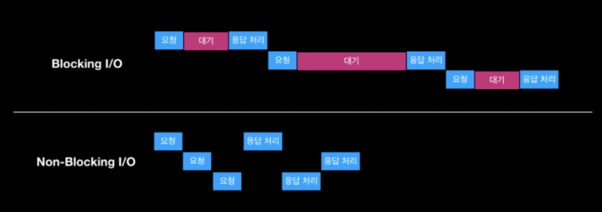

# Spring Batch

1. Spring WebFlux vs Spring MVC
__스프링 MVC는 아마 스프링을 다뤄봤다 하면 경험이 있을탠데
1 request : 1 thread
sync + blocking
이글에서 다루고자하는 Spring WebFlux는
many request : 1 thread
async + nonblock__

 
2. blocking nonBlocking?
   
  

## * Mono와 Flux

 
__Spring Webflux__ 에서 사용하는 __reactive library__ 가 __Reactor__ 이고 __Reactor__ 가 __Reactive Streams__ 의 구현체입니다.
**Flux와 Mono는 Reactor 객체이며**, 차이점은 발행하는 데이터 갯수입니다.
 
Flux : 0 ~ N 개의 데이터 전달
Mono : 0 ~ 1 개의 데이터 전달
보통 여러 스트림을 하나의 결과를 모아줄 때 Mono를, 각각의 Mono를 합쳐서 하나의 여러 개의 값을 여러개의 값을 처리할 떄 Flux를 사용합니다.

! 그런데 Flux도 0~1개의 데이터 전달이 가능한데, 굳이 한개까지만 데이터를 처리할 수 있는 Mono라는 타입이 필요할까요? 데이터 설계를 할때 결과가 없거나 하나의 결과값만 받는 것이 명백한 경우,  List나 배열을 사용하지 않는 것처럼, Multi Result가 아닌 하나의 결과셋만 받게 될 경우에는 불필요하게 Flux를 사용하지 않고 Mono를 사용하게 됩니다. 
  
  

