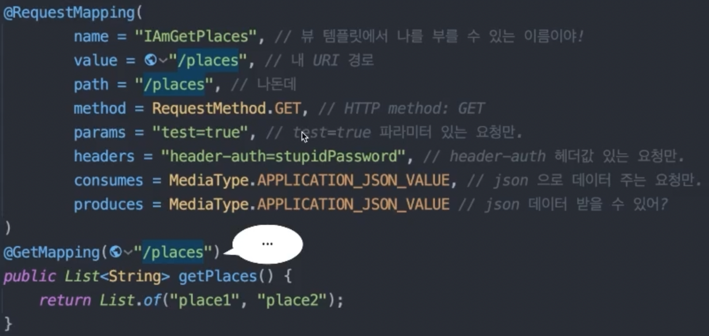
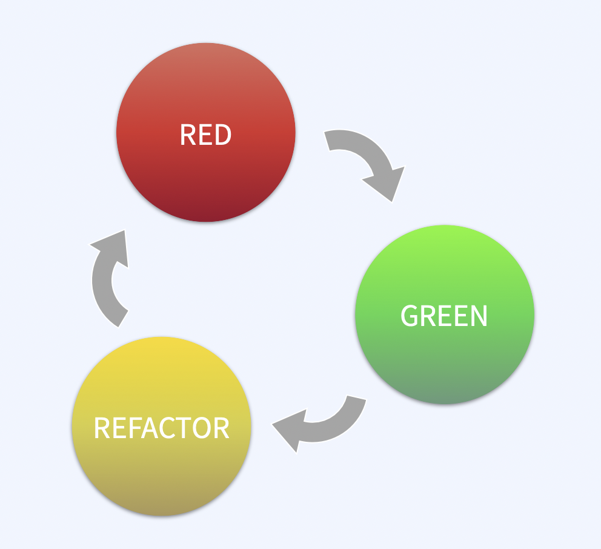

## [1]. 패키지 구조

#### {1}. 레이어 계층형

장점 : 해당 프로젝트에 대한 이해가 낮아도 전체적인 구조를 빠르게 파악
단점 : 디렉토리에 클래스들이 너무 많이 모이게 됨

#### {2}. 도메인형

장점 : 코드 응집
단점 : 구조파악 어려움
yeahyeahyeah
###### (2-1). 전체구조

/////

## [2]. Spring
### {1}. @Controller
@Controller - view와 연결지을수있다 
@RestController  controller + responseBody
컨트롤러에responseBody를 추가시켜 편리한 어노테이션
클래스레벨 메소드레벨
view를 리졸빙 하는게 아니고 body로 리턴해ㅜㅈㅁ

 ### {2}. 함수형 프로그래밍?
  - 특징
    - 상태가 엇음
    - 대입문이 없음
    - 부작용이(side effect) 없는 순수함수
    - 불변셩(immutability)
    - 역사가 오래됨
 - 함수형 엔드포인트
   - spring web 의 엔드포인트를 함수형 스타일로 작성하는 방버을 제공
   - webMvc.fn
   - routing, requestHandling
   - 불변성을 고려하여 설계됨
   - 기존의 DispatcherServket위에서 동작
   - 애노테이션 스타일과 함께 사용 가능
 - 주요 키워드
   - handler fuction == @RequestMapping
     - 입력 serverReqyest
     - 츌력 serverResponse
   - RouterFuntio == @RequestMapping
     - 입력 serverRequest
     - 출력 Optional<HandlerFuntion>
    - handlerfunction vs routerFunction
      - handlerFunction 의 결과 : data
      - routerFunction 의 결과 : data + behavior
 https://ko.wikipedia.org/wiki/함수형_프로그래밍
 https://en.wikipedia.org/wiki/Functional_programming
https://blog.cleancoder.com/uncle-bob/2012/12/22/FPBE1-Whats-it-all-
about.html
https://docs.spring.io/spring-framework/docs/current/reference/html/
web.html#webmvc-fn

### RequestMapping

</hp>
## [3]. TDD
### {1}. why?
테스트 주도 발기법 
• 프로그램의 설계와 구현, 사고의 흐름을 테스트 중심으로 생각하는 개발 방법 •개발순서의변화
• as-is: 구현한다 -> 테스트한다
• to-be: 테스트를 만든다 -> 구현한다
• 주요 키워드: 익스트림 프로그래밍 (XP), 애자일, 폭포수 모델, Test-First Programming

### {2}. 개발 사이클

    

        
1. RED: (실패하는) 테스트를 짠다. (요구사항의 명세)

        
2. GREEN: 테스트를 성공시킨다. (구현)

        
3. REFACTOR: 구현 코드를 고도화(리팩토링)한다.

    

    

        
    

### {3}. 작성요법

 __Given - When - Then__
테스트의 구조를 표현하는 방법 (a.k.a. 3A, Arrange - Act - Assert)
• Given (Arrange): 상태(state)의 정의 - 테스트를 수행할 때 전제 조건 • When (Act): 동작 - 테스트 실행
• Then (Assert): 검증 - 동작의 결과(actual) vs. 예상값(expected)

### {4}. WHY?
("협업(기업) 코딩" 환경에서) 왜 이걸 해야 할까?
• 내가 지금 뭘 하려는지 명확히 안다는 사실을, 스스로 지속적으로 확인한다.
• 개발이 지연되는 이유 중 하나는, 막막해서 멍때리기 때문
• 내가 지금 뭘 하려는지 명확히 안다는 사실을, 동료와 소스 코드로 공유하고 소통(코드 리뷰)한다.
• as-is 1: 개발 계획을 별도의 문서로 공유함 •as-is2:개발계획을구현코드로공유함
• to-be: 개발 계획을 테스트 코드로 공유함
<h4>★★★ 
 코드의 궁국적인 목표 : 원하는 기능이 잘 개발이 되었는가
-> 코드리뷰
테스트코드로 먼저 리뷰어가 어떤 목적의 코드인지 이해를 돕고 구현부를 통해 조금더 건설적인 조언을 들을 수 있다.
테스트코드 : 코드를통한 커뮤니케이션 기능

 
★★★
### {5}. 최고의 효율로 테스트 개발을 하려면
TDD가 기존 개발 방식보다 효율적이기 위해서는
• 테스트 설계 흐름에 익숙해야 합니다.
• 사람의 요구사항을 프로그램이 할 수 있는 기능으로 변환하기 • 기능을 단위 기능으로 세분화하기
• 기능의 관계와 상호작용을 설계하기
• 테스트 작성 기술에 익숙해야 합니다.
결론: 계속, 꾸준히, 많이, 동료와 함께 하세요.